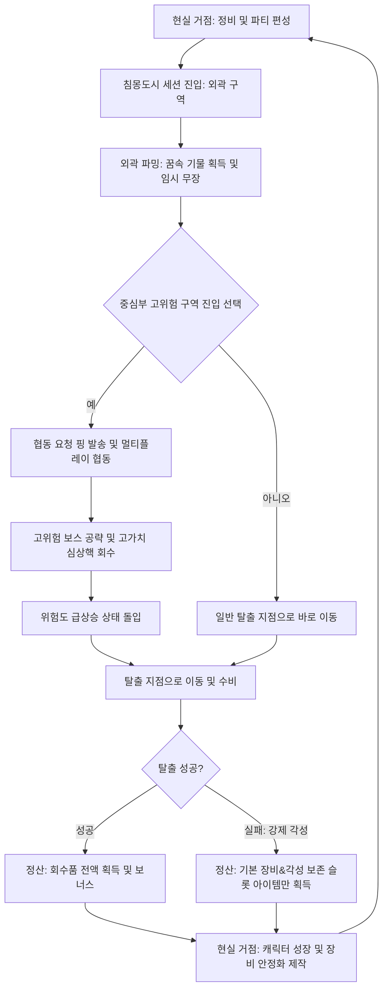

# 🌌 3차 프로젝트 게임 기획서 초안
# 《침몽도시: 루시드 다이버 (Lucid Diver in Dream-devoured City)》

---

## 1. 프로젝트 개요

### 1.1. 기본 정보
*   **프로젝트명**: 침몽도시: 루시드 다이버 (Lucid Diver in Dream-devoured City)
*   **대체 제목 후보 제안**:
    1. **《몽경회랑: 루시드 다이버 (Dreamscape Corridor: Lucid Diver)》** (공동몽의 왜곡된 공간 구조를 강조)
    2. **《루시드 세이비어 (Lucid Savior: Dream Heist)》** (각성과 회수, 대중적인 느낌 강조)
    3. **《다이브 인투 드림 (Dive into Dream: 침몽도시)》** (직관적인 액션성과 메커니즘 부각)
*   **장르**: 2.5D 라이트 PvE 익스트랙션 액션 RPG (2.5D Light PvE Extraction Action RPG)
*   **플랫폼**: PC (Windows) / Steam 빌드 타겟
*   **개발 환경**: Unity 6, 3D HDRP/URP 레벨 구성, 2D Spine/Sprite 애니메이션 캐릭터
*   **대상 타겟**: 서브컬처 액션 게임 선호층, 하드코어 탈출 슈터의 피로감을 피하고 라이트한 파밍과 협동 보스 공략을 즐기는 유저군.

### 1.2. 핵심 키워드 및 정의
| 키워드 | 정의 및 기획적 의도 |
| :--- | :--- |
| **2.5D 비주얼 스타일** | 3D로 정교하게 구축된 입체적 공간 레벨 위에 개성 넘치는 2D 서브컬처 스타일 캐릭터 스프라이트를 얹어 독창적이고 고급스러운 아트워크 구현. |
| **라이트 익스트랙션** | PvP 약탈 요소와 영구 사망을 배제하고, 사망 시 장비 보존 및 파밍한 기물 위주의 선택적 손실 구조를 취해 진입 장벽 완화. |
| **침몽도시 (Dreamscape)** | 현실 도시 위에 초월적 꿈이 덮여 내부 지형과 오브젝트가 꿈의 논리에 따라 왜곡되고 재구성되는 하이브리드 가상 공간. |
| **루시드 다이버 (Lucid Diver)** | 왜곡된 꿈속 침입 및 자각몽 제어가 가능하도록 훈련된 특수 탐사자(플레이어 캐릭터). |
| **1+2+1 파티 편성** | 메인 조작 캐릭터 1명, 스트라이커형 지원 캐릭터 2명, 백업 버프를 제공하는 오퍼레이터 1명으로 구성된 전략적 시너지 조합. |
| **꿈속 기물 무장** | 불안정한 꿈속에서는 현실 장비가 약화되므로, 필드에서 획득한 초현실적 기물(우산, 거울 등)을 실시간으로 무기 삼아 무장하는 현장 즉석 파워업 시스템. |
| **각성 보존 슬롯** | 플레이어가 쓰러져 강제 각성될 때도 절대 소실되지 않고 현실로 가져갈 수 있는 최소한의 안전 보존 인벤토리 상자. |

---

## 2. 한 줄 컨셉 (High Concept)
> **“현실과 왜곡된 꿈이 겹친 위험천만한 침몽도시에서 꿈속 기물을 수집하고 무장하여, 강제 각성되기 전에 심장부를 공략하고 무사히 탈출하라!”**

---

## 3. 세계관 설정 (Lore & Background)

### 3.1. 침몽 현상과 침몽도시
현대 문명이 고도로 발달한 어느 날, 정체불명의 초월적인 거대 의식이 투사한 꿈이 현실의 메트로폴리스 전체를 장악했다. 사람들은 이 현상을 **‘침몽 현상’**이라 칭했으며, 그 안에 갇힌 구역을 **‘침몽도시’**라 부르기 시작했다. 
도시 내부는 물리학적 법칙이 무너지고 인간의 무의식, 잊힌 기억, 폐기된 욕망이 실체화된 공간으로 변모했다. 현실의 대형 빌딩 내부가 깊은 심해나 지하 미로처럼 연결되며, 사라졌던 가전제품이나 버려진 물건들이 초현실적인 에너지원인 **‘심상기물(Psyche Object)’** 혹은 **‘몽유물’**로 재탄생한다.

### 3.2. 루시드 다이버와 회수 기업
현실 문명의 첨단 무기나 전자기기는 침몽도시 안에서 구조적/개념적으로 완전히 붕괴하거나 위력이 급감한다. 오직 정신적 동조율과 자각몽 제어 능력을 갖춘 특수 적합자, **‘루시드 다이버’**만이 침몽도시의 정신 오염에 저항하며 탐사를 진행할 수 있다.
이들은 거대 기업, 공공 기관, 혹은 불법 사설 조직의 의뢰를 받아 목숨 대신 정신력을 소모하는 다이브 기어에 탑승하여 침몽도시로 다이브한다. 이들의 목적은 단 하나, 현실 문명을 한 단계 도약시킬 수 있는 막대한 가치의 꿈속 유물과 에너지 코어인 **‘심상핵(Core)’**을 회수하는 것이다.

### 3.3. 강제 각성 (Forced Awakening)
다이버가 침몽도시 내부에서 심각한 손상을 입어 정신적 한계(체력 0)에 도달하면, 현실의 링크가 끊어지며 다이브 기어에서 물리적으로 튕겨 나가 눈을 뜨게 된다. 이를 **‘강제 각성’**이라 한다. 
사망하진 않지만, 각성 시 가해지는 강력한 정신적 충격(피드백 현상)으로 인해 안전 보존 슬롯에 넣지 않은 꿈속 기물과 일반 파밍 인벤토리의 데이터는 차원 저 너머로 흩어져 붕괴해버린다.

---

## 4. 핵심 플레이 루프 (Core Game Loop)



---

## 5. 멀티플레이 및 맵 구조

### 5.1. 3단계 구역 시스템
하나의 세션 맵은 단절된 공간이 아니라, 중심부로 진입할수록 위험도가 상승하고 보상이 극대화되는 유기적인 오픈 레이아웃 구조를 취합니다.

| 구역 구분 | 위험도 | 주요 출현 적 | 획득 가능 기물/자원 | 설계 목적 및 플레이 스타일 |
| :--- | :---: | :--- | :--- | :--- |
| **외곽 구역 (Outer)** | 낮음 | 하급 몽유체, 방황하는 그림자 | 소형 심상기물, 하급 안정화 재료 | **솔로 파밍 권장 구역**. 컨트롤에 큰 부담 없이 기본적인 생존과 기물 무장을 획득하며 탈출 경로를 사전 탐색하는 구간. |
| **중간 구역 (Mid)** | 보통 | 엘리트 몽유체, 경비 경비병 | 중형 몽유물, 중급 제작 레시피 | **진입/공동 협동 선택 구역**. 솔로 플레이 시 리스크가 커지기 시작하며, 중간 가치의 회수품을 두고 생존 투쟁 발생. |
| **중심부 고위험 구역 (Core)** | 매우 높음 | 구역 수호자 (보스 몬스터) | 고가치 심상핵, 안정화 장비 완제품 | **멀티플레이 협동 필수 구역**. 강력한 보스 기믹이 존재하며, 협동 핑을 통해 주변의 다른 플레이어들과 레이드를 수행해야 돌파 가능. |

### 5.2. 협동 요청 핑 & 공략 동기화
*   **자유 합류 구조**: 세션 시작 시 각 플레이어는 외곽의 서로 다른 포인트에서 스폰되어 독자적으로 파밍을 진행할 수 있습니다.
*   **협동 트리거**: 중심부 고위험 보스 룸 앞에 도달하면 플레이어는 전체 맵에 **[협동 요청 핑(Co-op Request)]**을 발송할 수 있습니다.
*   **보상 연계**: 핑을 듣고 합류하여 함께 보스를 클리어하면, 참여한 모든 인원에게 개인별로 고유한 **‘심상핵 루팅 권한’**과 협동 보너스가 주어져 트롤링이나 아이템 먹튀 스트레스를 원천 차단합니다.

---

## 6. 익스트랙션의 라이트화와 손실 구조

본 프로젝트는 전통적인 PvPvE 하드코어 슈터(예: 타르코프)의 가혹한 패널티를 낮춰 대중성을 확보하는 것을 최우선 과제로 삼습니다.

### 6.1. 라이트화를 위한 핵심 차별점
1.  **PvP 요소 완전 배제**: 플레이어 간 격돌이 아닌, 오직 환경 및 보스와의 연대(PvE)에 초점을 맞추어 유저 간 불쾌감을 방지합니다.
2.  **영구 사망/완전 손실 없음**: 육성한 캐릭터의 성장 수치와 현실에서 제작한 '안정화 장비'는 강제 각성 시에도 영구 보존됩니다.
3.  **세션 템포 단축**: 한 판당 평균 10~15분 내외의 타이트한 플레이 타임을 지향하여 모바일/PC 서브컬처 유저들의 일일 플레이 피로도를 감소시킵니다.

### 6.2. 강제 각성 시 패널티 및 각성 보존 슬롯
*   **패널티**: 세션 도중 체력이 0이 되어 강제 각성될 경우, 인벤토리에 파밍해 둔 몽유물 데이터와 재료의 약 80%가 소실됩니다. (나머지 20%는 기본 보험율에 의해 보존 가능)
*   **각성 보존 슬롯 (안전 금고)**: 
    *   총 4칸 크기의 그리드로 제공되는 특수 슬롯입니다.
    *   이 슬롯에 들어간 아이템은 강제 각성 시에도 **100% 보존**되어 현실 거점으로 이송됩니다.

#### 📦 각성 보존 슬롯 배치 규칙 (예시)
*   **소형 심상기물** (부피 1칸): 여러 개를 안전하게 파밍하는 솔로 유저에게 적합.
*   **중형 몽유물** (부피 2칸): 장비 제작 핵심 도면 등.
*   **보스 심상핵** (부피 4칸 전체 점유): 보스를 클리어한 뒤 탈출 지점까지 직접 들고 수송해야 하는 초고가치 전리품. 보존 슬롯을 꽉 채우므로 다른 물건을 포기해야 하는 선택 강요.

---

## 7. 꿈속 기물 무장 및 장비 시스템

꿈속에서는 현실의 정상적인 총기나 검이 위력을 잃는 대신, 기괴하게 변형된 일상 속 기물들이 고유한 이능력을 발휘합니다.

```
[현실 기본 장비] (영구 유지, 최약체 무기)
       ↓ (다이브)
[꿈속 기물 무장 파밍] (세션 내 즉석 파워업, 임시 무장, 내구도 낮음)
       ↓ (성공적 탈출 / 보존 슬롯 세이프)
[현실 거점 정비] (회수한 기물을 분해하여 꿈의 파편 및 핵심 재료 획득)
       ↓ (제작 및 가공)
[안정화 장비 제작] (현실에서도 꿈속 위력을 발휘하는 영구 성장 장비 완성)
```

### 7.1. 주요 기물 무장 분류 예시
| 기물명 | 기본 외형 | 인게임 전투 효과 | 유틸리티/기믹 활용 |
| :--- | :--- | :--- | :--- |
| **깨진 우산** | 찢어진 다크 톤 우산 | 우산을 펼쳐 투사체를 100% 방어하는 전방 실드 전개. | 일부 레이저 트랩 구역을 안전하게 통과 가능. |
| **거꾸로 가는 시계** | 초침이 역회전하는 금시계 | 사용 시 주변 5m 범위 내의 모든 적 움직임 둔화 (Slow). | 보스의 강력한 광폭화 패턴 지연. |
| **금 간 거울** | 프레임이 깨진 손거울 | 짧은 거리 순간 이동 및 피격 시 자신의 2D 환영 분신 생성. | 적의 타겟팅 분산 및 포위망 탈출. |
| **장난감 권총** | 조잡한 플라스틱 권총 | 꿈의 투사체를 난사하는 초고속 원거리 사격 무기. | 먼 거리의 스위치 작동 및 공중 적 견제. |
| **녹슨 가위** | 거대한 재단용 가위 | 근접 대상을 단숨에 절단하여 강한 경직과 출혈 피해 부여. | 질긴 덩굴이나 차단된 공간의 장애물 절단. |

---

## 8. 파티 편성 및 캐릭터 시스템

플레이어는 세션을 시작하기 전, 전략적인 **‘1 메인 + 2 지원 + 1 오퍼레이터’** 조합을 통해 시너지(심상 공명)를 극대화해야 합니다.

```
       [ 1 메인 캐릭터 (직접 조작) ]
                   ↑
                   ├─ [ 지원 1 (액티브 스트라이커) ] : 전투 중 수동 호출
                   ├─ [ 지원 2 (패시브 스트라이커) ] : 특정 상황 자동 발동
                   └─ [ 오퍼레이터 (현실 백업 관제) ] : 세션 룰 및 안전 슬롯 강화
```

### 8.1. 캐릭터 역할군 상세
1.  **메인 캐릭터 (Main Dynamic Diver)**:
    *   화면에 등장하여 직접 3D 공간을 종횡무진 달리는 조작 캐릭터.
    *   기본 스탯, 평타, 회피 기술을 지니며 필드에서 기물을 주워 직접 무장 및 스킬을 사용합니다.
2.  **지원 캐릭터 (Striker Support)**:
    *   직접 조작하진 않으나, 퀵키(Quick Key)나 조건 만족 시 전장에 **2D 스프라이트 연출과 함께 순식간에 난입**하여 스킬을 시전하고 퇴장하는 스트라이커.
    *   **지원 1 (액티브)**: 쿨타임마다 플레이어가 직접 버튼을 눌러 소환 (예: 광역 힐, 순간 무적 방막).
    *   **지원 2 (패시브)**: 플레이어가 피격당하거나, 보스 체력이 일정 이하로 내려갈 때 자동으로 발동 (예: 자동 반격 차징 샷, 버프).
3.  **오퍼레이터 (Operator - Backend Intel)**:
    *   인게임 월드에는 등장하지 않고 통신 보이스 및 UI 인터페이스를 통해 플레이어에게 유용한 시스템적 혜택을 지속적으로 제공.
    *   위험도 게이지 누적 속도 완화, 보존 슬롯 공간 확장, 탈출 헬기 대기시간 감소, 보급품 위치 해킹 등.

---

## 9. 심상 공명 시스템 (Psychic Resonance)

모든 캐릭터는 고유의 **[역할 태그]**, **[기물 태그]**, **[소속 태그]**를 지니며, 편성 시 해당 태그들의 결합 수치에 따라 특수 패시브 효과인 **‘심상 공명’**이 세션 전체에 발동합니다.

### 9.1. 대표 공명 시너지 효과 및 편성 예시
*   **[탐색 공명]** (태그 조합: 탐색 + 시간 + 연구소)
    *   *효과*: 미니맵에 숨겨진 비밀 방 위치 노출, 희귀 기물 파밍 확률 +15% 증가.
    *   *추천 조합*: 탐색형 메인 + 탐색 지원 1 + 시간 지원 2 + 정산 오퍼레이터
*   **[보스전 공명]** (태그 조합: 전투 + 절단 + 기업 파견)
    *   *효과*: 중심부 보스 및 엘리트 몬스터 대상 주는 피해 +20% 증가, 부위 파괴 게이지 축적 속도 상승.
    *   *추천 조합*: 전투형 메인 + 절단 지원 1 + 사격 지원 2 + 위험관리 오퍼레이터
*   **[보존 공명]** (태그 조합: 보존 + 방어 + 회수국)
    *   *효과*: 각성 보존 슬롯의 그리드 제한 1칸 완화, 강제 각성 시의 데이터 유실 확률 20% 경감.
    *   *추천 조합*: 생존형 메인 + 방어 지원 1 + 보존 지원 2 + 보험 오퍼레이터

---

## 10. 프로토타입 테마 맵: 꿈에 먹힌 상가 구역

*   **배경 비주얼**: 일반인의 출입을 차단하기 위해 설치된 거대한 격리 외벽으로 둘러싸여 있으며, 길가에 방치되어 버려진 차량과 붕괴된 상가 건물군이 흐트러진 음산한 밤거리 구조. 곳곳에 푸른빛의 꿈의 결정체와 거품 같은 심상 균열이 흐르고 있어 신비로우면서도 몽환적인 분위기 연출.
*   **레벨 구성도**:

```
[외곽 도보 상점가] (저위험 스폰 구역)
       │
       ▼
[야외 주차장] ─── [주유소 연결로] (기물 밀집 파밍 구역)
       │
       ▼
[중앙 분수대 광장] (보스룸: '상가 관리인' 몽유체 배치)
       │
       ▼
[육교 / 도로 차단 철문] (최종 탈출 포인트)
```

---

## 11. MVP 구현 범위 및 우선순위 명세

단기간의 프로토타입 빌드 및 포트폴리오 시연 영상 확보를 위해 기획 범위를 실용적으로 조율합니다.

| 개발 순위 | 시스템명 | 핵심 구현 스펙 | 비고 (네트워크 필요 여부) |
| :---: | :--- | :--- | :--- |
| **1** | **2.5D 캐릭터 컨트롤러** | 3D 지형 위에서 2D 빌보드 캐릭터의 이동, 대시, 기본 타격 및 피격 판정. | 로컬 및 네트워크 동기화 필수 |
| **2** | **기물 파밍 & 즉석 무장** | 필드 내 2D 기물 획득 시 즉시 메인 캐릭터의 무기 슬롯에 장착 및 공격 모션 변화. | 동기화 필수 |
| **3** | **네트워크 동기화 (PUN2)** | 2인 세션 매칭, 동시 진입, 서로의 움직임 및 기물 장착 상태 동기화. | 동기화 필수 |
| **4** | **지원 캐릭터 소환** | 액티브 키 입력 시 2D 스트라이커 캐릭터가 즉시 나타나 스킬 시전 후 사라지는 헬퍼 기능. | 클라이언트 로컬 연출 가능 |
| **5** | **각성 보존 슬롯 & 탈출** | 탈출 지점 상호작용 성공 시 세션 클리어 및 인벤토리 정산 연집 구현. | 데이터베이스 연계 |

---

## 12. 포트폴리오 핵심 소구력 (Portfolio Selling Points)
1.  **장르 융합의 논리적 해결**: 서브컬처 수집형 RPG(다양한 캐릭터를 많이 보유하고 활용하고 싶은 욕구)와 익스트랙션(내 캐릭터 하나에 몰입하여 생존해야 하는 절박함)의 충돌 문제를 **'1 메인 + 2 스트라이커 지원 + 1 관제 오퍼레이터'** 구조로 명쾌하게 풀어낸 기획력 증명.
2.  **아트 제작 단가 현실화**: 3D 배경 에셋의 높은 퀄리티와 2D 캐릭터 스프라이트의 대중성/수집 가치를 조합하여, 소규모 팀 단위에서도 높은 완성도의 결과물을 낼 수 있는 영리한 아트 파이프라인 설계 역량 어필.
3.  **네트워크 부하 최소화 기획**: 과도한 물리 동기화 대신, 2D 스프라이트 판정 및 인라인 기믹 트리거 기반으로 네트워킹 구조를 설계하여 저비용 고효율의 멀티플레이어 환경 구축 가능성 검증.
