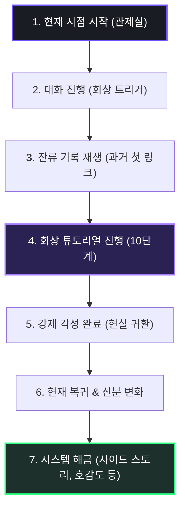

> [!WARNING]
> 본 문서는 검수 전 상태의 프롤로그 및 튜토리얼 시나리오 기획서이며, 송예찬 담당자의 검토 및 승인 대기 중인 수정 제안본입니다.
> v1.11에서는 멀티플레이어 환경과 관제사-다이버 팀(소대) 지휘 및 모집 개연성을 추가 반영하여 현재 복귀 프로필 데이터를 보완했습니다.

# 🎬 침몽도시: 루시드 다이버 (프롤로그 시나리오 기획 V1.11)

**프롤로그 시나리오 기획 V1.11 | 2026.06.17**

---

## 1. 프롤로그 서사 구조

프롤로그는 플레이어와 채린의 현재 시점 대화에서 출발하여 자연스럽게 과거 사건의 회상으로 이어지고, 튜토리얼 플레이를 거쳐 현재로 복귀하는 액자식 구성으로 진행된다.



### 1.1 현재 시점 시작
게임 타이틀 화면 이후, 로딩이 완료되면 즉시 어두운 관제실 모니터와 깜빡이는 홀로그램 UI가 페이드인된다.

*   **시스템 텍스트 연출**:
    ```text
    [SYSTEM] 국가소속 침몽도시 대응 기관 (NDMA)
    [SYSTEM] 루시드 링크 관제실 (LLCR-04)
    [SYSTEM] 관제자 등록명: 플레이어 (PLAYER)
    [SYSTEM] 메인 다이버: 채린 (CHAERIN)
    [SYSTEM] 링크 점검 준비 중... 파장 동조 개시.
    ```
*   **상황 설정**: 플레이어는 관제석에 앉아 채린과의 정기 링크 점검을 준비하고 있다. 통신 스피커를 통해 지직거리는 노이즈와 함께 채린의 건조한 목소리가 흘러나온다.

### 1.2 회상 트리거 대사 스크립트
두 사람의 사적인 대화가 깊어지며 과거의 기억을 강하게 이끌어낸다.

*   **채린**: "오늘 임무, 배정됐어?"
*   **플레이어**: "응. 청몽 외곽 쪽이야. 링크 준비하래."
*   **채린**: "...또 들어가야 하네."
*   **플레이어**: "무리할 필요는 없어. 상태 안 좋으면 보고 올릴게."
*   **채린**: "됐어. 네가 관제면 적어도 길 잃을 일은 덜하니까."
*   **플레이어**: "처음엔 내 목소리 듣는 것도 싫어했잖아."
*   **채린**: "싫었지. 아무 예고도 없이 머릿속에 남의 목소리가 끼어드는 거, 진짜 최악이었으니까."
*   **플레이어**: "나도 편하진 않았어. 네 시야가 한꺼번에 밀려 들어왔거든."
*   **채린**: "...기억나? 처음 연결됐던 날."
*   **플레이어**: "청몽 교차로."
*   **채린**: "그 이름 싫어. 너무 멀쩡해 보여서."
*   **플레이어**: "그럼 넌 뭐라고 불렀는데?"
*   **채린**: "탈출구 없는 곳. 내가 뭘 봤다고 말해도 아무도 안 믿어주던 곳."

> 화면 전체에 디지털 노이즈가 강하게 발생하며, 적색 시스템 경고등과 함께 잔류 로그가 출력된다.

*   **시스템 로그**:
    ```text
    [WARNING] 동조율 급증으로 인한 과거 데이터 역류 발생.
    [SYSTEM] 잔류 기록 재생: 첫 번째 링크 (First Link)
    [SYSTEM] 대상 지대: 청몽 교차로 테스트 돔 (Test Dome 01)
    ```
*   **연출**: 화면이 화이트아웃되며 차가운 연구 시설과 보랏빛 균열이 뒤섞인 과거의 회상 튜토리얼 스테이지로 진입한다.

---

## 2. 회상 튜토리얼 (Tutorial Stage)

### 2.1 회상 속의 개연성
회상 시점에서 플레이어는 아직 정식 관제자가 아닌 **'루시드 사고 생존자이자 특이 반응자'** 신분이다. 채린 역시 정식 다이버가 아닌 실험 대상에 가깝다. 플레이어는 관제 UI를 보며 연구원들의 지시에 따라 채린을 돕는 '테스트' 형태로 튜토리얼을 진행한다. 이를 통해 플레이어는 자신의 능력을 깨닫고, 채린은 최초로 타인(플레이어)의 인도에 의해 생존하게 된다.

### 2.2 튜토리얼 진행 10단계 및 게임 기능

| 단계 | 장면 (Scenario Scenario) | 학습 및 해금되는 게임 기능 | UI 및 연출 가이드 |
| :---: | :--- | :--- | :--- |
| **1** | **연구 시설 링크 테스트** | 관제 UI 소개 | 기본 화면 구성 요소(체력, 싱크율, 미니맵) 학습 |
| **2** | **채린과의 첫 통신** | 대화 선택지 시스템 | 채린의 날 선 태도와 신뢰도 반응을 결정하는 대사 선택 |
| **3** | **청몽 교차로 진입** | 이동 튜토리얼 | 화면 가상 패드 또는 WASD를 이용한 기초 이동 및 카메라 조작 |
| **4** | **시야의 어긋남 인지** | 관제자 시야 보정 | 실제 지형과 가상 지도가 어긋난 지점을 찾아 터치 보정하여 길 개척 |
| **5** | **꿈식자 출현** | 전투 튜토리얼 | 적의 출현에 대응하여 기본 공격 및 회피 타이밍 학습 |
| **6** | **드림 포지드 불안정** | 출력 보정 및 에임 가이드 | 동조 주파수 보정을 가동하여 채린의 에임 보정(Passive)을 활성화하고 유탄(Active) 격발 유도 |
| **7** | **깨진 렌즈 조각 발견** | 심상기물 회수 | 꿈속에 고체화되어 흩어진 채린의 기억 조각(렌즈) 파밍 |
| **8** | **오염 수치 상승** | 제한 시간 및 위험도 안내 | 상단의 오염도 게이지가 차오르기 전에 서둘러야 함을 인지시킴 |
| **9** | **전화부스 도달** | 탈출 튜토리얼 | 탈출 지점인 공중전화부스에 도달하여 3초간 수화기 링크 유지 |
| **10** | **강제 각성 성공** | 익스트랙션 완료 | 붕괴하는 교차로에서 동조율을 최대로 끌어올려 현실로 강제 인양 |
### 2.3 회상 튜토리얼 단계별 대사 스크립트
튜토리얼 각 단계별로 출력되는 시스템 및 인물 간 대사 가이드라인이다.

#### [1단계: 연구 시설 링크 테스트]
*   **연구원**: "특이 반응자, 장비 접속을 확인했다. 마인드 링크 동조율 15%... 아주 희미하지만 교신 채널은 확보되었다. 교차로 테스트 돔의 신호를 추적해라."
*   **플레이어**: "머리가... 깨질 것 같아. 이 스피커 소음들은 뭐지?"
*   **연구원**: "침몽도시 내부에서 역류하는 뇌파 노이즈다. 집중해라. 목표 대상의 생체 주파수를 매칭하겠다."

#### [2단계: 채린과의 첫 통신 (대화 선택지)]
*   **채린**: "윽... 아악! 누구야... 내 머릿속에서 시끄럽게 떠드는 거 누구냐고! 저리 가!"
*   **선택지 A [진정시키기]**: "진정해. 난 널 해치려는 게 아니야. 네 말을 믿고 도우러 왔어."
    *   *채린 A 반응*: "믿어...? 웃기지 마. 바깥 녀석들은 날 미치광이 취급했으면서, 이제 와서 뭘 도우러 왔다는 거야!"
*   **선택지 B [이성적으로 설명]**: "나는 바깥 연구실의 링크 적격자다. 지금 네 신경망이 붕괴하기 직전이야. 내 가이드에 집중해."
    *   *채린 B 반응*: "연구실...? 날 실험 쥐 취급하더니 이젠 머릿속까지 들여다보시겠다? 맘대로 해봐, 난 꼼짝도 안 할 테니까!"

#### [3단계: 청몽 교차로 진입]
*   **연구원**: "교신 성공. 다이버 채린, 테스트 구역으로 진입을 유도해라. 링크 앵커가 끊어지지 않게 전진시켜라."
*   **플레이어**: "채린, 내 말 들려? 일단 거기서 벗어나야 해. 보라색 균열이 있는 큰길 쪽으로 움직여."
*   **채린**: "하... 억지로 내 다리를 움직이게 만드는 기분이네. 싫어도 갈 수밖에 없잖아, 이거!"

#### [4단계: 시야의 어긋남 인지 (관제자 시야 보정)]
*   **채린**: "잠깐, 길이 없어! 눈앞이 온통 무너진 절벽이야. 더 가면 떨어진다고!"
*   **플레이어**: "아니, 내 모니터 지도로는 거긴 낭떠러지가 아니라 곧게 뻗은 도로야. 안개에 속지 마. 내가 노이즈를 걷어낼 테니 내 지시대로 가."
*   **채린**: "내 눈으로 직접 낭떠러지를 보고 있는데 가라고? 헛소리 마!"
*   **플레이어**: "(시야 터치 보정 집행) ...보정 완료. 이제 다시 봐."
*   **채린**: "어...? 절벽이... 도로로 바뀌었어? 대체 뭘 한 거야?"

#### [5단계: 꿈식자 출현 (전투 튜토리얼)]
*   **채린**: "안개 속에서 괴물들이 오고 있어! 나보고 이 소총 하나로 저걸 다 잡으라고?"
*   **플레이어**: "유탄발사기가 달린 돌격소총이야. 기본 사격과 하단의 유탄 폭발을 섞어 침식체들을 밀쳐내고 제압해봐!"
*   **채린**: "하, 밑져야 본전이지! (발사)... 윽, 빗나갔어!"
*   **플레이어**: "침착하게 돌격소총으로 거리를 벌리고 사격해!"

#### [6단계: 출력 보정 및 에임 가이드]
*   **채린**: "무기가 갑자기 흔들려...! 프리즘 조준선이 겹쳐 보여서 타겟을 못 맞추겠어!"
*   **플레이어**: "내가 동조 주파수를 정렬해서 자동 에임 보정을 켜줄게. (출력 보정 프로세스 진행) ...보정 완료! 채린, 하단 유탄발사기를 트리거해!"
*   **채린**: "좋아, 조준선이 고정됐어! 먹어라! (유탄 발사 및 꿈식자 광역 처치) ...전부 날려버렸어."

#### [7단계: 깨진 렌즈 조각 발견 (심상기물 회수)]
*   **플레이어**: "적 퇴치 확인. 채린, 바닥에 반짝이는 유리 파편이 있어. 네 파장과 반응하고 있으니 회수해."
*   **채린**: "이건... 내가 고등학교 때 쓰던 안경 렌즈 조각...? 왜 이런 게 꿈속에 있는 거지?"
*   **플레이어**: "네 기억이 루시드 입자와 엉겨 붙어 기물이 된 거야. 그게 널 현실로 이끌어줄 단서가 될 거야."

#### [8단계: 오염 수치 상승]
*   **연구원**: "경고! 다이버의 뇌파 오염 수치 80% 돌파. 오염 한계까지 남은 시간 60초. 관제사, 즉시 탈출 경로를 개방해라!"
*   **플레이어**: "채린, 서둘러! 몸에 루시드 입자가 과다 침투하고 있어. 정신 차려!"
*   **채린**: "머리가 흐려져... 온 사방에서 이상한 말소리가 들려..."

#### [9단계: 전화부스 도달 (탈출 튜토리얼)]
*   **플레이어**: "저기 깜빡이는 주황색 공중전화부스가 보여? 저게 현실 인양 노드야. 전화 수화기를 들어!"
*   **채린**: "전화기...? 안개 속에서 벨이 울리고 있어..."
*   **플레이어**: "수화기를 들고 내 목소리에 뇌파를 100% 동기화해! 링크 채널링 개시!"

#### [10단계: 강제 각성 성공 (익스트랙션 완료)]
*   **연구원**: "한계 돌파! 뇌파 붕괴 직전! 관제사, 링크를 강제 차단하고 각성 장치를 집행해라!"
*   **플레이어**: "아직 안 돼, 채린을 꽉 잡아야 해! ...각성 안전장치 기동! 채린, 눈을 떠!"
*   **채린**: "아... 네 목소리가... 끊어지려고..."
*   **시스템**: `[SYSTEM] 강제 각성 집행. 신경 인양 프로세스 완료.`

---

## 3. 현재 복귀 및 시스템 해금

### 3.1 현재 복귀 및 신분 변화
튜토리얼이 완료되면 다시 눈부신 백색 광원과 함께 현재 시점의 세련되고 조용한 관제실로 카메라가 복귀한다.

*   **현재 상태 데이터 동기화**:
    ```text
    [COMPLETED] 잔류 기록 재생 종료. 현실 동기화 완료.
    [PROFILE] 소속: 국가 침몽 대응 기관 (NDMA) 제4 특수 탐사 소대
    [PROFILE] 직책: 소대 지휘관 겸 전담 루시드 링크 관제자
    [PROFILE] 메인 다이버: 채린 (CHAERIN)
    [PROFILE] 현재 동조율: 71% (상태: 작전 대기 가능)
    [SYSTEM] 과거 기록 분석을 통해 일부 데이터 권한이 해금되었습니다.
    ```
*   **의의**: 회상 속 불안정했던 실험체와 반응자가 아니라, 이제 두 사람이 하나의 공식 탐사 소대로 묶여 서로를 신뢰하고 함께 팀을 키워나가는 정식 파트너 관계가 되었음을 시각적으로 보여준다.

### 3.2 현재 복귀 시점 대사 스크립트
현실로 복귀한 후 관제실에서 나누는 두 사람의 최종 결속 대사이다.

*   **플레이어**: "하아... 하아..." (관제석에서 거친 숨을 내쉬며 이마의 땀을 닦는다)
*   **통신 스피커 (채린)**: "...지직. 수고했어. ...그때 기록 재생해보니까 기분이 좀 묘하네."
*   **플레이어**: "그러게. 우리 첫 번째 동조가 기록된 날이었으니까. 네가 날 엄청 싫어했었지."
*   **채린**: "지금이라고 딱히 엄청 신뢰하는 건 아냐. ...그래도 이 소대 안에서, 네 목소리만큼은 계속 들을 생각이니까."
*   **플레이어**: "나도 네 눈을 믿을게. 앞으로 잘 부탁해, 채린."
*   **채린**: "내 판단을 방해하지만 마. 이제 진짜 실전 임무를 준비해야 하니까, 소대 지휘관답게 얼른 추가 대원 정비나 해."
*   **플레이어**: "그래, 팀을 보강해야겠어." (화면이 메인 로비 UI로 연출되며 로비 대기 자세의 채린이 배치됨)

### 3.3 해금 시스템 상세 명세
프롤로그가 종료되는 즉시 로비 화면으로 전환되며, 아래의 핵심 시스템 해금 팝업이 순차적으로 발생한다.

```text
★ SYSTEM UNLOCKED ★
- 채린 사이드 스토리: '불신의 몽흔' 개방
- 채린 호감도 시스템 활성화
- 개인 심상 기록 보관소 오픈
```

#### ① 채린 사이드 스토리 (불신의 몽흔)
*   **설명**: 채린이 가진 트라우마와 불신의 원인을 추적하는 외전 시나리오.
*   **기능**: 메인 스토리 진행 및 특정 몽유물 회수를 통해 에피소드가 열리며, 클리어 시 채린의 능력치가 상승한다.

#### ② 호감도 시스템
*   **설명**: 관제사(플레이어)와 다이버(채린) 간의 유대 강도를 나타내는 수치.
*   **기능**: 로비 대화 선택지, 선물하기, 임무 동행 등을 통해 호감도 포인트를 획득하며, 단계별로 로비 보이스 및 비밀 프로필이 해금된다.

#### ③ 개인 심상 기록 (관찰 로그)
*   **설명**: 제3자(NDMA 수석 연구원, 현장 구조대원, 동료 관제사 등)의 관점에서 채린의 행적, 특화 심상무장의 운용 방식, 침식체 대응 행동, 타인을 대하는 태도(경계심 및 독단적 성향) 등을 기록해 놓은 극비 보고서 데이터베이스.
*   **기능**: 플레이어는 침몽도시 탐사 중 획득한 '파손된 오디오 로그', '관찰 일지 파편' 등의 특수 기물을 획득하여 기록을 해금한다. 열람을 통해 채린의 고유 능력 기원과 트라우마에 대한 제3자의 객관적 분석(그녀의 의심이 실제 공간 왜곡을 어떻게 감지했는지 등)을 수집하고 입체적으로 분석하는 추리형 정보 수집 콘텐츠 역할을 한다.

#### ④ 로비 대화 & 몽흔 정보
*   **설명**: 관제실 로비에 상주하는 채린과 터치 및 일상 대화가 가능해지며, 그녀의 프리즘/유리 속성에 따른 '몽흔 정보' 도감이 개방된다.

---

## 📜 Revision History

| 날짜 | 버전 | 내용 | 작성자 |
| :---: | :---: | :--- | :---: |
| 2026.06.12 | v1.00 | 최초 시나리오 문서 기안 및 등록 | 김남해 |
| 2026.06.17 | v1.11 | - 현재 관제실 ➡️ 과거 회상 튜토리얼 ➡️ 현재 복귀 및 시스템 해금의 오프닝 구조 확립<br>- 튜토리얼 10단계 및 연동 게임 기능 기획 수록<br>- 제4 특수 탐사 소대 공식 전담 편제에 맞춘 복귀 데이터 표기 보정<br>- 사용자 피드백 반영: 싱크 보정 미니게임 삭제 및 단순 출력 보정 프로세스로 변경<br>- 채린의 주무기를 유탄발사기 부착 소총으로 변경함에 따라 튜토리얼 5단계 대사 수정<br>- 사용자 피드백 반영: 튜토리얼 6단계 출력 보정을 에임 보정(패시브) 활성화 및 유탄 발사(액티브) 트리거로 변경 및 대사 개정<br>- 사용자 피드백 반영: 전용 심상무장 명칭을 특화 심상무장으로 변경 | 송예찬 |


