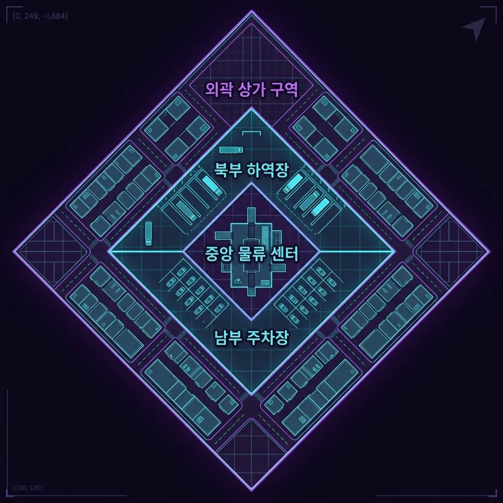

# 프로토타입 맵 "꿈에 먹힌 상가 구역" 레벨 디자인 기획서

> [!IMPORTANT]
> 이 문서는 AI(Antigravity)가 작성한 초안입니다.
> 기획자/PM의 검토 및 승인 후 이 배너를 제거하면 '확정 사양'으로 인정됩니다.

---

## 0. 기획 의도 (Design Intent)

- **목표**: 1차 프로토타입 핵심 게임 루프(파밍 ➡️ 보스전 협동 ➡️ 탈출)가 작동할 수 있는 첫 공간인 '꿈에 먹힌 상가 구역'의 공간 구조와 시각적 에셋 배치를 정의한다. 2.5D 아이소메트릭 쿼터뷰 시점에서의 가시성을 확보하고, 외곽에서 중심부로 갈수록 난이도가 체계적으로 상승하는 수평적 레벨 설계를 지향한다.
- **핵심 가치**: 
  - **K-상점가 테마의 단일화**: 플레이어에게 친숙한 한국의 지극히 평범한 상점가 거리(편의점, 국밥집, 분식점, PC방, 노래방 등)로 도로 양옆을 채워 일상 공간이 왜곡된 꿈속 유령 도시의 기괴한 몰입감을 극대화한다. 
  - **중앙 관리 & 물류 지원 센터 배치**: 맵 정중앙에는 주변 상가의 관리, 인프라 통제 및 물류 유통을 총괄하는 거대 단일 건물인 **'상가 통합 관리 및 물류 지원 센터(본관)'**를 중앙 구역으로 배치한다. 플레이어는 최종 보스전을 치르기 위해 이 빌딩의 1층 로비와 무너진 화물 분류 기지 구역으로 진입하여 긴박한 실내 CQB 보스전을 경험한다.
  - **4지점 분산 스폰 및 교차 탈출**: 동서남북 4대 꼭짓점 구역에 플레이어가 분산 스폰되어 겹침을 방지하고, 자신이 스폰된 꼭짓점의 전화부스(탈출구)는 이용할 수 없도록 강제하여 자연스럽게 중앙 물류 센터 본관으로 향하거나 타 구역으로 동선이 얽히도록 설계한다.

---

## 1. 개요 (Overview)

| 항목 | 내용 |
|------|------|
| **기능명** | 1차 프로토타입 테마 맵: 꿈에 먹힌 상가 구역 (격리된 청몽 교차로) |
| **담당자** | 기획: 장수영 (레벨 디자인) / 개발: 3차 프로젝트 개발팀 |
| **우선순위** | P0 (프로토타입 핵심 맵) |
| **상태** | 기획 검토 대기 (초안) |

---

## 2. 상세 로직 및 프로세스 (Core Logic)

### 2.1 다이아몬드 동심원 구조 및 공간 배치 (Diamond Layer Layout)

본 맵은 동서남북 외곽 경계선이 일반인 통제 목적의 **거대한 콘크리트 격리 외벽(격벽)과 철망**으로 완전히 둘러싸인 **다이아몬드(마름모) 형태**로 설계되며, 바깥쪽부터 안쪽으로 동심원처럼 구역이 겹쳐져 있습니다.

{width=85%}

#### 1. 외곽 구역 (Outer Zone - 평범한 한국식 상가 도로 및 스폰/탈출)
- **위치 및 역할**: 다이아몬드 맵의 최외곽 경계 테두리 구간. 남/북/동/서 꼭짓점은 각각 플레이어의 스폰 포인트이자 최종 탈출용 공중전화부스가 배치된 격벽 한계선입니다.
- **상가 구역 테마**: 친숙한 한국 동네 골목 상점가로 단일 통일.
  - **배치 상가**: 편의점, 24시 국밥집, 분식점, 2층 PC방, 코인 노래방, 부동산, 미용실, 카페 등.
  - **파밍 방식**: 플레이어는 아스팔트 대로변을 따라가며 쓰레기 더미나 방치된 차량을 수색하고, 건물 실내로 진입하여 K-상가 골목 내부에서 꿈에 잠식되어 이상 변질된 기초 기물(기이한 형상이 일렁이는 액자, 이상한 온도를 내는 라이터, 만지면 속삭임이 들리는 지폐 등 변질된 사물)을 획득합니다.
- **주요 배치 에셋**: 무너진 편의점 온수기 매대, 식당 테이블/의자, PC방 컴퓨터 데스크, 길가에 버려진 택시/승용차 차량, 4대 꼭짓점 공중전화부스.

#### 2. 중반부 구역 (Mid Zone - 물류 하역 및 차량 주차 구역)
중앙 본관 건물을 기점으로 다이아몬드 영역의 허리를 가로질러 **북부**와 **남부**로 양분됩니다. 이 구역은 강력한 몬스터들과 순찰조의 엄밀한 감시가 이루어지는 고위험 구역이지만, 그만큼 탐사되지 않은 고품질 몽유물 파밍 기회를 제공합니다.
- **북부 중반부 (North Mid Zone - 복합 물류 하역장)**: 
  - **역할 및 비주얼**: 중앙 센터로 유입되는 대형 화물을 하역하는 공간입니다. 도크(Dock)에 멈춰 서 있는 다수의 물류 탑차(택배 트럭), 컨테이너, 수하물 롤테이너, 지게차 등이 어지럽게 널려 있습니다.
  - **파밍 및 개연성**: 탑차 내부나 화물 상자들을 수색하여 **'고가치 몽유물(고급 무장, 희귀 의약품 등)'**을 획득할 수 있습니다. 몬스터들의 리스크가 매우 높은 지역으로, 일반 루시드 다이버들이 쉽게 진입하지 못해 파밍되지 않은 채 고스란히 몽유물들이 보존되어 있습니다.
- **남부 중반부 (South Mid Zone - 직원 및 방문객 주차 구역)**:
  - **역할 및 비주얼**: 지상 및 지하 주차 공간입니다. 촘촘한 격자 주차선 사이로 부서진 세단/SUV 승용차 에셋들과 주차 요금 정산소, 나선형 지하 주차장 진입 램프(경사로)가 존재합니다.
  - **전술 기동**: 지상 차량들을 엄폐물 삼아 대로변 순찰조의 시야를 피하는 지그재그 기동이 핵심입니다. 또한, 지하 램프로 진입하면 지상의 위협을 완전히 우회하여 중앙 센터 지하를 통해 보스룸 측면으로 은밀하게 진입하는 다각적 라우팅이 가능합니다.

#### 3. 중앙 구역 (Center Core Zone - 최고 고위험군 보스룸 및 관리 본관)
- **위치 및 역할**: 다이아몬드 맵의 정중앙에 위치한 거대 독립 건물. 보스 괴이인 '상가 관리인'이 1층 로비 홀 및 화물 분류 기지에서 스폰됩니다.
- **랜드마크 이미지**: **'상가 통합 관리 및 물류 지원 센터 (본관)'**.
  - 깨진 회전문 입구, 무너져 내린 인포메이션 데스크가 있는 1층 메인 로비, 그리고 뒤편으로 멈춰버린 거대한 수하물 분류용 컨베이어 벨트 설비가 길게 늘어서 있습니다.
  - 벽면 곳곳에 붉은색 비상용 유도등과 청색 꿈의 결정체 덩굴이 뒤엉켜 기괴한 분위기를 자아내며, 보스의 광역 공격으로부터 몸을 숨길 수 있는 대형 사각 콘크리트 기둥 및 철제 화물 팔레트 잔해들이 엄폐물로 배치되어 있습니다.
- **주요 배치 에셋**: 로비 안내 데스크, 부서진 대형 소파, 콘크리트 원형/사각 기둥, 고장난 회전문, 화물 컨베이어 벨트, 대형 팔레트 적재물.

---

## 2.2 레벨 구조 및 흐름도 (Mermaid Diagram)

```mermaid
graph TD
    subgraph 4대 꼭짓점 분산 스폰 (Spawn Points)
        SpawnSouth[남쪽 꼭짓점 스폰: 플레이어 A]
        SpawnNorth[북쪽 꼭짓점 스폰: 플레이어 B]
        SpawnWest[서쪽 꼭짓점 스폰: 플레이어 C]
        SpawnEast[동쪽 꼭짓점 스폰: 플레이어 D]
    end

    subgraph 외곽 상점가 수색 및 기초 파밍 (K-Commercial Street)
        SpawnSouth --> RoadSouth[남쪽 상가 도로 - 편의점/카페]
        SpawnNorth --> RoadNorth[북쪽 상가 도로 - 국밥집/노래방]
        SpawnWest --> RoadWest[서쪽 상가 도로 - PC방/부동산]
        SpawnEast --> RoadEast[동쪽 상가 도로 - 분식점/미용실]
        
        RoadSouth -->|실내 진입| InSouth[편의점 내부 수색: CQB]
        RoadNorth -->|실내 진입| InNorth[국밥집 주방/룸 수색: CQB]
        RoadWest -->|실내 진입| InWest[PC방 데스크/구석 수색: CQB]
        RoadEast -->|실내 진입| InEast[분식점 매대 수색: CQB]
    end

    subgraph 중반부 하역 및 주차 구역 (Mid Zone - 전술적 진입)
        InSouth --> SouthParking[남부 주차장 구역 - 차량 엄폐 및 지하 램프]
        InNorth --> NorthDock[북부 물류 하역장 - 탑차 수색 및 고가치 파밍]
        InWest --> NorthDock
        InWest --> SouthParking
        InEast --> NorthDock
        InEast --> SouthParking
    end

    subgraph 중앙 물류 본관 수렴 (Center Core - 보스전)
        SouthParking -->|남부 출입구/지하 통로| MainBuilding[상가 통합 관리 및 물류 지원 센터]
        NorthDock -->|북부 하역 입구| MainBuilding
        MainBuilding -->|1층 로비 & 화물 분류소| BossBattle[보스 '상가 관리인' 레이드]
        BossBattle -->|처치 및 탐색 완료 상태| PhaseMid[세션 진행 중/후반 상태]
    end

    subgraph 교차 탈출 진행 (Escape Check)
        PhaseMid -->|남은 3개 전화부스 추적| SearchExits{공중전화부스 탐색}
        SearchExits -->|벨소리 울림 감지| PhoneSouth[남쪽 전화부스]
        SearchExits -->|벨소리 울림 감지| PhoneNorth[북쪽 전화부스]
        SearchExits -->|벨소리 울림 감지| PhoneWest[서쪽 전화부스]
        SearchExits -->|벨소리 울림 감지| PhoneEast[동쪽 전화부스]
        
        PhoneSouth -->|본인 스폰지가 남쪽인 경우| Denied([탈출 거부 - 벨 안울림])
        PhoneSouth -->|타 구역 스폰자 상호작용| ExitSuccess([각성 탈출 성공])
        PhoneNorth -->|본인 스폰지가 북쪽인 경우| Denied
        PhoneNorth -->|타 구역 스폰자 상호작용| ExitSuccess
        PhoneWest -->|본인 스폰지가 서쪽인 경우| Denied
        PhoneWest -->|타 구역 스폰자 상호작용| ExitSuccess
        PhoneEast -->|본인 스폰지가 동쪽인 경우| Denied
        PhoneEast -->|타 구역 스폰자 상호작용| ExitSuccess
    end
```

---

### 2.3 도로망 설계 및 도로 순찰조 경보 시스템 (Road Warning & Patrol)

플레이어가 미로에 갇힌 불쾌감 없이 맵을 직관적으로 탐색하도록 유도하면서도, 도로 자체의 위험성을 높여 건물 실내 수색(CQB) 및 엄폐 이동의 재미를 끌어올립니다.

1. **아스팔트 2차선 도로망 및 교차로**:
   - 4대 꼭짓점(동서남북 스폰/탈출구)들을 원형과 격자형으로 정직하게 연결해 주는 현실적인 **아스팔트 2차선 차도 및 인도**가 존재합니다.
   - 도로망 중간에는 삼거리와 사거리가 명확하게 형성되어 있으며, 교차로 중심에 **교통 이정표 표지판**과 **부러진 신호등** 에셋을 배치하여 텍스트/기호만 보고도 현재 방향을 100% 직관적으로 식별할 수 있습니다.
2. **도로 노출 위험도 가중 (High Exposure Area)**:
   - 도로 위는 시야 가림 장애물이 없어 몬스터의 **인식 시야(Cone of Sight) 각도 및 거리가 건물 내부 대비 2.5배 상향 적용**됩니다. 유저가 도로 위를 대놓고 지나다니면 사방의 적들에게 즉각 발각됩니다.
3. **도로 순찰조 (Patrol Group) 로밍**:
   - 4차선 대로 및 주요 삼거리/사거리 교차로 구간에는 3인 1조로 구성된 **'수호 경비병 순찰대'** 몽유체들이 상시 고유 경로를 배회합니다.
   - 이들은 스펙이 강력하며, 플레이어를 감지하는 순간 요란한 경보 기계음을 울려 주변 상가 내에 있는 괴이들까지 도로 한가운데로 소환하는 위험 요인입니다.
4. **유저 플레이 선택지**:
   - **엄폐 기동**: 도로를 통해 빠르게 직선 이동할 때는 도로변에 방치된 엄폐 차량이나 가판대 뒤에 숨어 순찰조의 동선을 살핀 뒤 **징검다리식으로 전진**해야 합니다.
   - **실내 우회**: 순찰조의 정찰을 안전하게 회피하기 위해 도로 양옆의 상가 건물 문을 열고 들어가, **상점 내부의 CQB 루트를 관통하여 전진**합니다.

---

### 2.4 탈출구(공중전화부스) 상호작용 규칙 명세 (Escape Conditions)

| 규칙 항목 | 세부 작동 원리 | 기획 의도 및 레벨 디자인적 효과 |
| :--- | :--- | :--- |
| **탈출구 단일화** | 세션 내 탈출 오브젝트는 4개 꼭짓점에 배치된 **'공중전화부스(Telephone Booth)'**로 통일한다. | 현실 복귀를 위해 공중전화를 매개체로 각성한다는 세계관적 몰입감 제공 및 개발 구현 복잡도 최소화. |
| **스폰 꼭짓점 비활성** | 플레이어는 본인이 스폰된 꼭짓점 구역(남/북/동/서)에 있는 전화부스는 탈출구로 이용할 수 없다. | 플레이어가 강제적으로 맵 중앙이나 타 구역을 횡단하게 만들어, 외곽 파밍 후 바로 런하는 단조로운 플레이 방지 및 동선 교차 유도. |
| **전화벨 청각 힌트** | 탈출이 활성화된 공중전화부스 근처(반경 15m)에 접근 시 **'따르릉—' 하는 전화벨 소리**가 지속적으로 울린다. | 2.5D 카메라 사각지대나 어둠 속에서도 벨소리 방향을 듣고 탈출구를 찾아갈 수 있도록 직관적인 탐색 보조 장치 역할 수행. |
| **탈출 시퀀스 (채널링)** | 조건에 맞는 활성화된 전화부스에 상호작용 시 **3초간 수화기를 귀에 대는 동작(채널링)**을 유지하면 성공적으로 각성 탈출한다. | 탈출을 위한 마지막 채널링 중 무방비 상태가 되어, 주변 몬스터 리스크나 긴박함을 최후까지 유지하도록 만듦. |

---

## 3. 데이터 명세 (Data Specification)

### 3.1 구역 속성 및 동선 테이블 (Zone & Spawn Property)

| 구역 ID (ZoneId) | 구역 명칭 (ZoneName) | 시간 차감 가속 배율 | 배치 에셋 테마 | 스폰 및 탈출 속성 |
|-----------------|---------------------|:-----------------:|---------------|------------------|
| `ZONE_OUTER_SOUTH` | 남쪽 외곽 (Outer) | `1.0` | K-상가 거리 (편의점, 국밥집) | **플레이어 A 스폰 지점** / **남쪽 공중전화부스** (플레이어 A 비활성) |
| `ZONE_OUTER_NORTH` | 북쪽 외곽 (Outer) | `1.0` | K-상가 거리 (부동산, 약국, 차단막) | **플레이어 B 스폰 지점** / **북쪽 공중전화부스** (플레이어 B 비활성) |
| `ZONE_OUTER_WEST` | 서쪽 외곽 (Outer) | `1.0` | K-상가 거리 (PC방, 코인노래방) | **플레이어 C 스폰 지점** / **서쪽 공중전화부스** (플레이어 C 비활성) |
| `ZONE_OUTER_EAST` | 동쪽 외곽 (Outer) | `1.0` | K-상가 거리 (분식집, 카페) | **플레이어 D 스폰 지점** / **동쪽 공중전화부스** (플레이어 D 비활성) |
| `ZONE_MID_NORTH_DOCK` | 북부 물류 하역장 (Mid) | `1.5` | 하역장 도크, 수송 탑차, 화물 팔레트, 컨테이너 | **고가치 몽유물 파밍지** (높은 몬스터 리스크 / 밀집 엄폐) |
| `ZONE_MID_SOUTH_PARK` | 남부 주차장 (Mid) | `1.5` | 지상/지하 주차장, 버려진 차량, 요금 정산소 | **전술 우회 지대** (지하 주차장 진입 램프 / 차량 엄폐 기동) |
| `ZONE_CORE_01` | 중앙 관리&물류 센터 (Center) | `2.0` | 1층 로비 홀 및 대형 택배 분류 설비, 컨베이어 벨트 | **보스룸 (최고 오염 / 최고 시간가속 / 대형 철제 엄폐)** |

### 3.2 핵심 환경 에셋 리스트 (Environment Asset Spec)

| 에셋 이름 (AssetName) | 프리랩 매핑 ID | 콜라이더 속성 | 파괴 가능 여부 | 비고 |
|---------------------|---------------|--------------|:-------------:|------|
| 편의점 쇼윈도 매대 | `PROP_STORE_SHELF` | Box Collider (엄폐용) | ❌ | 편의점 실내 파밍용 은폐물 |
| 식당 테이블 및 의자 | `PROP_RESTAURANT_TABLE` | Box Collider | ❌ | 국밥집/분식집 실내 엄폐물 |
| PC방 컴퓨터 데스크 | `PROP_PCBANG_DESK` | Box Collider | ❌ | PC방 실내 엄폐 파밍 오브젝트 |
| 버려진 차량 (택시/승용차) | `PROP_CAR_RUINED` | Mesh Collider (대형 엄폐) | ❌ | 야외 주차장 및 길거리 내 도로 엄폐물 |
| 로비 안내 데스크 | `PROP_LOBBY_DESK` | Box Collider | ❌ | 관리 빌딩 로비 중앙 엄폐물 |
| 콘크리트 기둥 | `PROP_LOBBY_PILLAR` | Mesh Collider | ❌ | 관리 빌딩 내 대형 엄폐물 (보스전용) |
| 수송 탑차 (트럭) | `PROP_TRUCK_LOGISTICS` | Mesh Collider (대형) | ❌ | 북부 하역장 고가치 파밍 및 대형 엄폐물 |
| 수하물 분류 컨베이어 | `PROP_CONVEYOR_BELT` | Mesh Collider | ❌ | 중앙 로비 보스전 구역 엄폐 및 사선 방해 에셋 |
| 화물 철제 팔레트 | `PROP_CARGO_PALLET` | Box Collider | ❌ | 하역장 및 로비 홀 내 엄폐물 |
| 주차 요금 정산소 | `PROP_PARKING_BOOTH` | Box Collider | ❌ | 남부 주차장 내 소형 엄폐물 |
| 격리 외벽 차단막 | `PROP_OUTER_WALL` | Box Collider | ❌ | 맵 외곽을 봉쇄하는 거대 콘크리트 장벽 |
| 공중전화부스 | `PROP_TELEPHONE_BOOTH` | Box Collider | ❌ | 꼭짓점 탈출 상호작용 오브젝트 (활성화 시 전화벨 효과음 재생) |
| 도로 이정표 표지판 | `PROP_ROAD_SIGN` | Box Collider | ❌ | 교차로(삼거리/사거리) 네비게이션 가이드 |

---

## 4. UI/UX 연동

- **세션 타이머 표시**: 화면 상단 중앙에 디지털 시계 형태의 세션 타이머 UI가 상시 노출됩니다.
- **시간 가속 알림**: 플레이어가 중반 구역이나 중앙 구역에 진입할 경우, 타이머 숫자의 색상이 노란색(중반) ➡️ 빨간색(중앙)으로 변하고 깜빡이는 시각적 연출과 미세한 경고 사운드를 통해 시간이 가속 차감되고 있음을 경고합니다.
- **조건 불충족 안내**: 플레이어가 자신이 스폰된 꼭짓점의 전화부스와 상호작용 시, 화면 중앙에 경고 팝업이 출력됩니다 (예: `❌ 본인의 진입용 회선으로는 각성 전화를 수신할 수 없습니다! (타 꼭짓점 전화부스로 이동 요구)`).
- **도로 경보 연출**: 플레이어가 아스팔트 대로(차선 안쪽)로 들어서면 화면 테두리가 은은하게 붉은빛으로 블러 처리되어 자신이 도로에 완전히 노출되었음을 즉각 피드백합니다.

---

## 5. 연동 시스템 (Dependencies)

| 연동 대상 | 관계 | 비고 |
|-----------|------|------|
| **세션 타임 매니저** | 플레이어가 위치한 구역(Trigger Box 검사)에 따라 매 프레임 타이머 감소 속도 가속 계수 연산 | 로컬 C# 타이머 스크립트 |
| **탈출 매니저 (Escape Mgr)** | 각 플레이어의 최초 스폰 Zone ID 정보와 상호작용한 전화부스 Zone ID 정보를 대조하여 탈출 승인 처리 및 전화벨 입체음향 재생 제어 | C# 로직 매니저 |
| **PUN2 동기화 시스템** | 멀티플레이 세션 내 두 플레이어의 로컬 타이머 오차 방지를 위해 마스터 클라이언트 기준으로 남은 시간 동기화 패킷 전송 | 네트워크 동기화 |

---

## 6. 주의 사항 및 제약

- **카메라 사각지대**: 쿼터뷰 아이소메트릭 시점의 특성상 지상 상가 건물의 코너 벽 뒤쪽이나 중앙 관리동 내부의 기둥 뒤쪽이 보이지 않아 몬스터나 파밍 아이템이 묻히는 사각이 발생할 수 있습니다. 플레이어 캐릭터가 대형 장애물 및 벽 뒤로 들어가면 오브젝트가 반투명해지는 **'쉐이더 투명화(Occlusion Transparency)'** 기능 연동을 기술 파트에 미리 요청해야 합니다.
- **URP 야외 맵 라이팅 설계**: HDRP를 사용하지 않으므로, 어둡고 음산한 밤거리와 왜곡된 꿈의 분위기를 연출할 때 라이팅의 베이킹 부하를 억제하기 위해 정적 가로등 라이트 위주로 설계하되, 불타오르는 자동차 에셋이나 네온사인 결정체 등 핵심 오브젝트에만 제한적으로 동적 포인트 라이트를 배치하도록 주의해야 합니다.

---

## 📜 Revision History

| 날짜 | 버전 | 내용 | 작성자 |
|------|------|------|--------|
| 2026-06-12 | v1.0 | - 《침몽도시: 루시드 다이버》 프로토타입 맵 '꿈에 먹힌 지하상가' 1차 레벨 디자인 기획안 초안 작성 | 장수영 |
| 2026-06-12 | v1.1 | - 유저 요구에 따라 환경 기믹 요소를 제거하고 구역별 배치 에셋(주유소, 편의점, 주차장 등) 세부 내용 추가 | 장수영 |
| 2026-06-12 | v1.2 | - 탈출구의 산개 스폰 규칙(북쪽 외곽 밀집 및 중간구역 간이 탈출구 분산) 반영 및 사각형 맵 남단 스폰-북단 탈출 수평 배치 적용 | 장수영 |
| 2026-06-12 | v1.3 | - 맵 구조를 다이아몬드(마름모) 형태로 전면 개편하고, 외곽 경계선의 완전 밀폐 차단 룰을 명문화했습니다.<br>- 정중앙으로 갈수록 위험도가 집중 상승하는 가중치 반영 및 동/서 중간구역에 서브 탈출구 배치 수립 | 장수영 |
| 2026-06-12 | v1.4 | - 구현 복잡도가 높은 실시간 위험도 축적 게이지 대신 세션 타이머(강제 각성 제한 시간) 시스템으로 변경<br>- 중앙 구역으로 진입할수록 시간 감소 속도가 빨라지는 '시간 차감 가속 배율' 룰 반영 | 장수영 |
| 2026-06-12 | v1.5 | - 다이아몬드 구조의 텍스트 그림 영역을 고해상도 그래픽 도표 이미지로 생성하여 교체 삽입<br>- 정중앙 진입에 따른 몬스터 난이도 상승(기초 스펙 상승) 및 종류 다각화 규칙 구체화 | 장수영 |
| 2026-06-12 | v1.6 | - 탈출구 종류(외곽 서브, 중반 서브, 북단 메인)별 상세 해금/상호작용 조건(가방 여유 공간, 엘리트 카드키, 보스 심상핵 소지) 명세화 추가 | 장수영 |
| 2026-06-12 | v1.7 | - **기획 테마 변경**: 지하상가 ➡️ 지상 야외 "상가 구역" 전면 개편<br>- **격리 외벽 설정 추가**: 맵 전체를 통제하는 '콘크리트 격리 장벽' 도입하여 맵 경계 차단 개연성 확보 및 관련 에셋(육교, 도로 차단막 철문, 배기구, 맨홀 등) 지상형으로 전면 치환 | 장수영 |
| 2026-06-12 | v1.8 | - **레벨 디자인 관점 스폰/탈출 규칙 개편**: 4대 꼭짓점(동서남북) 분산 스폰 및 공중전화부스 탈출구 배치<br>- **교차 탈출 룰 도입**: 본인이 스폰된 꼭짓점의 전화부스는 탈출로 작동하지 않는 제약 적용하여 맵 횡단 및 조우 유도<br>- **청각 힌트 연동**: 탈출 활성화된 전화부스 주변에 전화벨 사운드 출력 연동 명세 반영 | 장수영 |
| 2026-06-12 | v1.9 | - **도로구획 위험 가중 및 도로 순찰조 로직 상세화**: 대로변/교차로에서 몹 시야 2.5배 증가 및 3인 1조 로밍 순찰대 배치<br>- **구역별 상세 상가 테마 규정**: 남서/남동/서/동/북 각 영역별 상세 상가 테마 구획 지정 | 장수영 |
| 2026-06-12 | v2.0 | - **K-상점가 단일 테마 통일**: 맵 내 상점가 구획을 편의점, 식당, PC방, 노래방 등 친숙한 한국식 상가 에셋으로 통일 규정<br>- **중앙 보스룸 구역 랜드마크화**: 개방된 광장 대신 통째로 1개 구역을 차지하는 거대 빌딩인 **'통합 상가 관리 빌딩' 본관 1층 로비 홀**로 중앙 보스룸 전면 개편 | 장수영 |
| 2026-06-12 | v2.1 | - **물류 센터 및 하역장/주차장 개편**: 중앙 건물을 '상가 통합 관리 및 물류 지원 센터'로 확장<br>- **중반부 구역 북/남 양분**: 북부 물류 하역장(고가치 파밍) 및 남부 주차장(우회 및 차량 엄폐) 설계 반영<br>- 고위험 지역 내 몽유물 보존 개연성 설정 및 관련 에셋(탑차, 컨베이어, 정산소 등) 사양 추가 | 장수영 |
