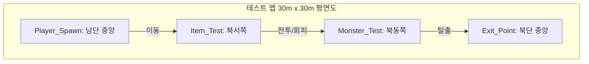

> [!IMPORTANT]
> 이 문서는 AI(Antigravity)가 작성한 초안입니다.
> 기획자/PM의 검토 및 승인 후 이 배너를 제거하면 '확정 사양'으로 인정됩니다.

# 🗺️ 《침몽도시: 루시드 다이버》 프로토타입 테스트 맵 레벨 디자인 기획서

## 0. 기획 의도 (Design Intent)
- **목적**: 1차 프로토타입(스프린트 1) 단계에서 캐릭터 조작, 권총 사격, 몬스터 FSM 추적, 아이템 즉시 획득 및 전화부스 즉시 탈출로 이어지는 **최소 플레이 루프(Core Play Loop)를 원활하게 테스트할 수 있는 최소 규모의 샌드박스 맵** 구조를 규정합니다.
- **핵심 가치**: 복잡한 K-상점가나 통합 관리동의 입체적인 동선을 배제하고, 모든 요소를 한눈에 파악할 수 있는 단일 평면의 테스트 공간을 제공하여 물리적 충돌 및 기본 기능 구동의 예외 없는 안정성을 검증합니다.

---

## 1. 개요 (Overview)

| 항목 | 내용 |
| :--- | :--- |
| **기능명** | 1차 프로토타입 전용 테스트 맵 레벨 디자인 |
| **담당자** | 레벨 기획: 장수영 (PM) / Co-PM (Antigravity) |
| **우선순위** | P0 (프로토타입 필수 구현 사양) |
| **상태** | 초안 (Draft) |

---

## 2. 상세 로직 및 프로세스 (Core Logic)

### 2.1 테스트 맵 기본 구조 및 동선
- **맵 규모**: 가로 30m $\times$ 세로 30m 크기의 평평한 단일 층 사각형 샌드박스 맵.
- **이동 제한**: 플레이어 캐릭터가 테스트 맵 외부로 이탈하지 못하도록 외곽 4개 면에 Collider가 부착된 펜스(또는 단순 장벽)를 둘러 통제합니다.
- **동선 시퀀스**:
  1. 플레이어는 맵 최남단에서 스폰됩니다.
  2. 맵 북서쪽 구역으로 이동해 테스트 아이템(`Item_Test`)을 접촉하여 즉시 획득합니다.
  3. 맵 북동쪽 구역에 위치한 테스트 몬스터(`Monster_Test`)가 플레이어를 인식하고 추적하기 시작하며 전투(권총 사격)를 검증합니다.
  4. 몬스터 처치(선택) 또는 회피 후, 맵 북단 중앙에 위치한 탈출 전화부스(`Exit_Point`)에 도달하여 접촉 즉시 탈출을 완료합니다.

---

## 3. 데이터 명세 (Data Specification)

### 3.1 맵 좌표 및 오브젝트 배치 데이터
테스트 맵의 원점(0, 0, 0)을 맵 정중앙으로 설정하며, 각 요소의 월드 스페이스 좌표와 사양은 다음과 같습니다.

| 오브젝트 ID | 오브젝트 명칭 | 배치 좌표 (X, Y, Z) | Collider 형태 | 역할 및 특징 |
| :--- | :--- | :--- | :--- | :--- |
| `Player_Spawn` | 플레이어 스폰 포인트 | `(0, 0, -12)` | N/A (Transform) | 맵 하단 중앙. 씬 진입 시 플레이어가 최초 소환되는 위치. |
| `Monster_Spawn` | 테스트 몬스터 스폰 | `(10, 0, 10)` | Box Collider (적 부착) | 맵 북동쪽. 잔몽체 1종 배치. 플레이어 감지 시 FSM 작동. |
| `Item_Spawn` | 테스트 아이템 스폰 | `(-10, 0, 10)` | Box Collider (Trigger) | 맵 북서쪽. 접촉 시 즉시 획득 처리 및 데이터 인벤토리 누적. |
| `Exit_Point` | 탈출 전화부스 | `(0, 0, 13)` | Box Collider (Trigger) | 맵 북단 중앙. 접촉 시 `isEscaped = true` 처리 및 결과 UI 활성화. |
| `Test_Pillar_01` | 중앙 엄폐용 기둥 1 | `(-5, 0, 0)` | Cylinder Collider | 맵 중앙 좌측에 배치된 원통형 장애물 (이동 및 사격 투사체 차단). |
| `Test_Pillar_02` | 중앙 엄폐용 기둥 2 | `(5, 0, 0)` | Cylinder Collider | 맵 중앙 우측에 배치된 원통형 장애물 (이동 및 사격 투사체 차단). |

---

## 4. UI/UX 흐름 (HUD)
- **미니맵 및 복잡한 HUD 비활성화**: 본 맵은 프로토타입 검증용이므로 복잡한 미니맵과 타이머 게이지를 출력하지 않습니다.
- **상호작용 피드백**: 
  - 플레이어가 `Item_Test` 영역에 닿으면 즉시 우측 상단 획득물 카운트가 `0 ➡️ 1`로 상승합니다.
  - 플레이어가 `Exit_Point` 영역에 접촉하면 다른 딜레이 없이 즉시 세션 결과창(성공/Retry 버튼) 팝업이 중앙에 렌더링됩니다.

---

## 5. 연동 시스템 (Dependencies)
- **플레이어 캐릭터 컨트롤러**: 플레이어 스폰 포인트 좌표를 참조하여 씬 로드 시 메인 다이버 캐릭터를 인스턴스화합니다.
- **적 AI FSM**: 테스트 몬스터는 스폰 위치에서 대기하다가, `Player_Spawn`에서 생성되어 움직이는 플레이어의 실시간 좌표를 감지(감지 거리 12m)하여 추적을 시작합니다.
- **UI 매니저**: 탈출 전화부스 충돌 이벤트(`OnTriggerEnter`) 수신 즉시 결과 UI 화면을 표출합니다.

---

## 6. 주의 사항 및 제약 (Constraints)
- **임시 리소스 사용**: 맵 바닥은 단순 회색 플레인(Plane), 기둥은 하얀색 실린더(Cylinder)를 사용하여 그래픽 리소스 수급 부하를 최소화합니다.
- **물리 레이어 설정**: 
  - 바닥 레이어: `Default` (이동 허용)
  - 장애물(기둥, 외벽) 레이어: `Obstacle` (이동 불가, 탄환 충돌 파괴 처리)
  - 아이템 및 탈출구 레이어: `Trigger` (물리 충돌은 하지 않되 이벤트를 통과시키는 IsTrigger 활성화)

---

## 📜 Revision History

| 날짜 | 버전 | 내용 | 작성자 |
| :---: | :---: | :--- | :---: |
| 2026-06-15 | v1.0 | - 1차 프로토타입 최소 플레이 루프 검증을 위한 30x30 단일 평면 테스트 맵 레벨 디자인 기획서 최초 작성 | Antigravity |
