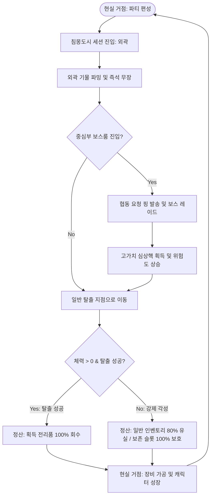

# 침몽도시: 루시드 다이버 핵심 기획 명세서

> [!IMPORTANT]
> 이 문서는 AI(Antigravity)가 작성한 초안입니다.
> 기획자/PM의 검토 및 승인 후 이 배너를 제거하면 '확정 사양'으로 인정됩니다.

---

## 0. 기획 의도 (Design Intent)

- **목표**: 기존 하드코어 탈출 슈터(익스트랙션)의 가혹한 패널티(영구 사망, 장비 완전 손실)를 제거하여 진입 장벽을 낮추고, 서브컬처 캐릭터 수집형 RPG의 전략적인 편성 재미를 결합한 새로운 PvE 라이트 익스트랙션 액션을 창출한다.
- **핵심 가치**: "따로 파밍하고 보스전에서 뭉친다"는 협동 중심의 세션 레이드와 안전 금고(각성 보존 슬롯)를 통한 리스크 관리로 플레이어에게 지속적인 생존과 도전 동기를 부여한다.

---

## 1. 개요 (Overview)

| 항목 | 내용 |
|------|------|
| **기능명** | 침몽도시: 루시드 다이버 핵심 게임 루프 및 기본 시스템 |
| **담당자** | 기획: Co-PM (Antigravity) / 개발: 3차 프로젝트 개발팀 |
| **우선순위** | P0 (핵심 시스템) |
| **상태** | 기획 검토 대기 (초안) |

---

## 2. 핵심 로직 (Core Logic)

### 2.1 플레이 플로우 (Core Game Loop)

1. **현실 거점 (Lobby)**: 캐릭터를 정비하고, **1 메인 + 2 지원 + 1 오퍼레이터** 파티를 편성하여 다이브 기어에 탑승합니다.
2. **세션 진입 (Dive)**: 2.5D 침몽도시 세션(예: 꿈에 먹힌 상가 구역)의 외곽 구역에 스폰됩니다.
3. **기물 파밍 및 즉석 무장**: 도시를 탐사하며 2D '심상기물'을 획득하여 실시간으로 무장(드림 포지드)을 전환하고 괴이를 퇴치합니다.
4. **중심부 진입 선택**: 
   - **솔로 탈출**: 안전하게 외곽에서 일반 탈출 지점으로 가거나,
   - **보스 공략 (Co-op)**: 중심부 고위험 구역으로 향하여 전체 플레이어에게 **협동 요청 핑(Co-op Request)**을 발송하고 보스를 퇴치합니다.
5. **정산 및 강제 각성**:
   - **탈출 성공**: 수집한 모든 꿈속 자원과 보스 '심상핵'을 현실로 이관합니다.
   - **강제 각성 (체력 0)**: 튕겨 나가 현실로 돌아오며 일반 인벤토리 내 자원의 80%가 차원에서 붕괴하여 유실됩니다. 단, **각성 보존 슬롯**의 물품은 100% 안전하게 보호됩니다.



### 2.2 3단계 구역 시스템 및 멀티플레이 협동

| 구역 | 위험도 | 출현 적 | 획득 가능 기물/자원 | 설계 목적 및 플레이 스타일 |
|------|:---:|-------|------------------|-------------------------|
| **외곽 구역 (Outer)** | 낮음 | 하급 몽유체 | 소형 심상기물, 하급 안정화 재료 | **솔로 파밍**. 안전한 장비 수급 및 탐색 경로 탐색 구간. |
| **중간 구역 (Mid)** | 보통 | 엘리트 몽유체 | 중형 몽유물, 중급 제작 도면 | **협동 선택**. 솔로 플레이 시 리스크 상승, 긴장감 강화. |
| **중심부 (Core)** | 매우 높음 | 구역 수호자 (보스) | 고가치 심상핵, 장비 완제품 | **멀티 협동**. 강력한 기믹 보스, 전체 맵 핑을 통해 뭉쳐야 돌파 가능. |

- **루팅 권한 동기화**: 협동 핑을 타고 들어온 세션 유저들이 보스를 퇴치하면 각각 개인 전용 보상 상자가 드롭되어, 아이템 먹튀 현상을 방지합니다.

### 2.3 라이트 익스트랙션 및 각성 보존 슬롯

- **영구 사망 없음**: 육성한 캐릭터의 성장 수치와 현실에서 제작한 '안정화 장비'는 영구 보존됩니다.
- **각성 보존 슬롯 (2x2 그리드, 총 4칸)**: 강제 각성(사망) 시에도 100% 안전하게 유지되는 보존 공간입니다.
  - **소형 기물**: 부피 1칸 (여러 개의 제작 재료)
  - **중형 몽유물**: 부피 2칸 (주요 도면 및 유물)
  - **보스 심상핵**: 부피 4칸 (보스 처치 시 드롭되는 최고가치 전리품. 보존 시 다른 아이템 보관 불가)

### 2.4 파티 편성 시스템 (1+2+1 구조)

플레이어는 리스크와 리워드를 효율적으로 관리하기 위해 전략적으로 캐릭터들을 조합하여 시너지를 창출합니다.

```
       [ 메인 다이버 (직접 조작) ]
                   ▲
                   ├─ [ 지원 1: 액티브 스트라이커 ] (수동 호출 및 2D 컷인 연출)
                   ├─ [ 지원 2: 패시브 스트라이커 ] (특정 조건 시 자동 난입)
                   └─ [ 오퍼레이터: 백엔드 관제 ] (미니맵 해킹, 보존 슬롯 버프)
```

1. **메인 다이버 (Main Diver)**: 직접 필드를 이동하고 기물을 즉석 장착하여 사격 및 액션을 가하는 캐릭터.
2. **지원 1 (액티브 스트라이커)**: 쿨타임마다 수동 소환되어 순간 회복 장막이나 광역 속박 등 강력한 기술을 사용하고 퇴장하는 헬퍼.
3. **지원 2 (패시브 스트라이커)**: 메인 다이버가 피격되거나 보스가 그로기 상태일 때 자동 소환되어 반격이나 추가 연타 버프를 부여하는 헬퍼.
4. **오퍼레이터 (Operator)**: 전투 필드에는 보이지 않으며 무선 통신 UI를 통해 보존 슬롯 확장, 탈출 헬기 유도 대기시간 단축, 위험도 게이지 누적 속도 완화 등의 버프를 제공하는 현실 거점 관제원.

- **심상 공명 (Psychic Resonance)**: 캐릭터들의 **[역할/기물/소속] 태그** 조합에 따라 세션 전체에 상시 패시브 효과를 부여합니다.
  - *탐색 공명 (탐색 + 시간 + 연구소)*: 미니맵에 비밀 구역 노출, 희귀 기물 파밍 확률 +15%
  - *보스전 공명 (전투 + 절단 + 기업)*: 보스 및 엘리트 몬스터 대상 데미지 +20%, 부위 파괴 게이지 증가
  - *보존 공명 (보존 + 방어 + 회수국)*: 각성 보존 슬롯 그리드 제한 1칸 완화, 각성 시 아이템 소실률 경감

---

## 3. 데이터 구조 (Data Structure)

### 3.1 아이템 객체 (Item Object Data)

| 필드명 | 타입 | 설명 | 기본값 |
|--------|------|------|--------|
| `itemId` | `string` | 아이템의 고유 식별자 | `""` |
| `itemName` | `string` | 아이템 이름 (예: 깨진 우산) | `""` |
| `itemType` | `enum` | `FarmingObject` / `Equip` / `Core` | `FarmingObject` |
| `gridWidth` | `int` | 인벤토리/보존 슬롯 가로 크기 | `1` |
| `gridHeight` | `int` | 인벤토리/보존 슬롯 세로 크기 | `1` |
| `isResonanceTag` | `string[]` | 심상 공명용 속성 태그 리스트 | `[]` |

### 3.2 캐릭터 데이터 (Character Data)

| 필드명 | 타입 | 설명 | 기본값 |
|--------|------|------|--------|
| `characterId` | `string` | 캐릭터 고유 식별자 | `""` |
| `characterName`| `string` | 캐릭터 이름 | `""` |
| `roleType` | `enum` | `MainDiver` / `ActiveStriker` / `PassiveStriker` / `Operator` | `MainDiver` |
| `resonanceTags`| `string[]` | 캐릭터 고유 공명 태그 ([역할], [기물], [소속]) | `[]` |

---

## 4. 연동 시스템 (Dependencies)

| 연동 대상 | 관계 | 비고 |
|-----------|------|------|
| **드림 포지드 무장 시스템** | 메인 다이버가 획득한 기물 아이템 데이터를 실시간 무기 장착 상태로 파싱 및 적용 | [드림_포지드_무장_시스템_명세서](file:///c:/Users/jang9/OneDrive/Desktop/작업/3차 프로젝트/01.기획_문서/시스템_명세/드림_포지드_무장_시스템_명세서.md) 참조 |
| **PUN2 동기화 시스템** | 멀티플레이 2인 세션 매칭, 협동 핑, 보스 그로기 및 보상 권한 동기화 | 기술 문서 연동 |
| **인벤토리 & UI 매니저** | 안전 보존 슬롯(2x2 그리드) 배치 및 강제 각성 시 유실 규칙 처리 | 로컬 클라이언트 및 백엔드 데이터베이스 연동 |

---

## 5. 주의 사항 및 제약

- **그리드 배치 규칙**: 보스 심상핵은 2x2(총 4칸) 부피를 차지하므로, 2x2 보존 슬롯의 한 부분이라도 다른 아이템이 차지하고 있다면 정리가 불가능합니다. 드래그 앤 드롭을 통한 정리 편의성과 우선순위 처리가 UI 측면에서 중요합니다.
- **스트라이커 호출 최적화**: 2D Spine/Sprite 애니메이션 컷인은 호출 시 버벅임이 없도록 리소스 프리로드 캐싱 구조가 보장되어야 합니다.

---

## 📜 Revision History

| 날짜 | 버전 | 내용 | 작성자 |
|------|------|------|--------|
| 2026-06-12 | v1.0 | - `침몽도시_루시드_다이버_기획서_초안.md`을 기반으로 SSOT 규격에 맞춘 핵심 기획 명세서 초판 작성 | Antigravity |
