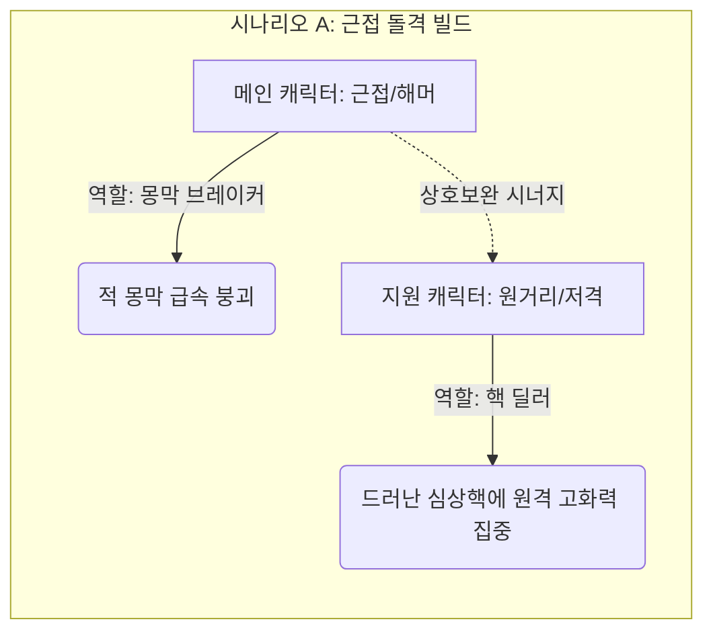
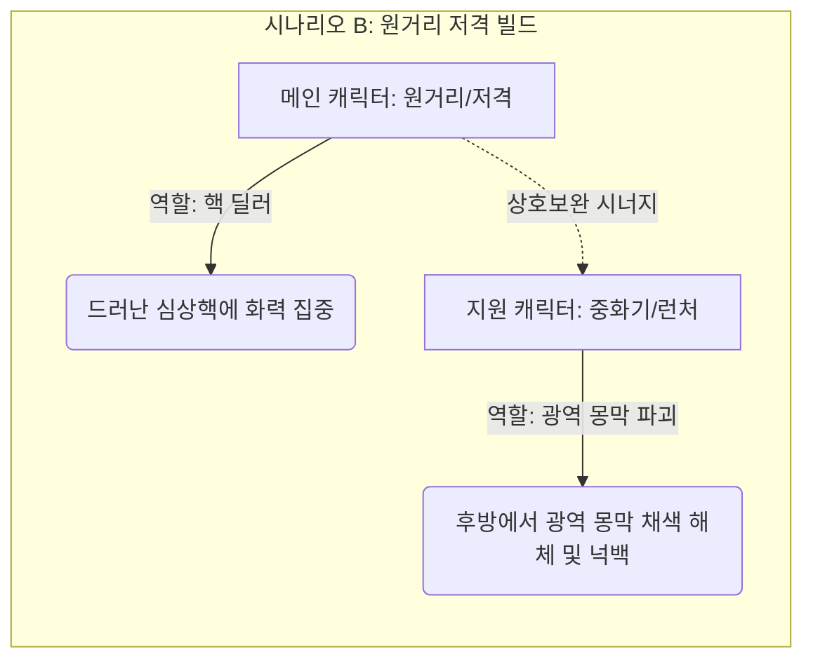

> [!IMPORTANT]
> 이 문서는 AI(Antigravity)가 작성한 초안입니다.
> 기획자/PM의 검토 및 승인 후 이 배너를 제거하면 '확정 사양'으로 인정됩니다.

# 📄 [요약본](./침몽도시_루시드_다이버_컨셉_기획_요약본_v0.5.md) | [프로토타입 초안](./프로토타입_기획서_초안.md) | **[캐릭터 컨셉 (현재)]** | [기본(전용) 무장](./기본_전용_무장_컨셉_기획서.md) | [몬스터 컨셉](./몬스터_컨셉_기획서.md) | [아이템 컨셉](./아이템_및_오브젝트_컨셉_기획서.md)

---

# 👤 《침몽도시: 루시드 다이버》 캐릭터 컨셉 기획서

## 1. 개요 (Overview)
- **목적**: 꿈속 세계에 진입하여 침식체에 맞서고 심상기물을 회수하는 주체인 플레이어블 캐릭터(메인/지원)들의 개성과 역할을 정의합니다.
- **프로토타입 대상**: `Player_Test` (루시드 다이버 테스트 캐릭터 1종)
- **최종 MVP 대상**: 메인 캐릭터 2명, 지원 캐릭터 3명

---

## 2. 역할군 및 전투 포지션 (Roles)
멀티플레이 협동과 솔로 탐사 시 효율적인 대응을 위해 루시드 다이버들은 각자의 역할이 명확히 구분됩니다.

| 역할군 | 설명 | 특화 무기 풀 | MVP 예시 포지션 |
| :--- | :--- | :--- | :--- |
| **브레이커 (Breaker)** | 침식체의 단단한 몽막을 빠르게 붕괴시키는 역할 | 해머, 샷건 | 메인 캐릭터 1 (에단) |
| **딜러 (Striker)** | 몽막이 붕괴되어 드러난 심상핵을 직접 공격해 치명적인 타격을 주는 역할 | 저격 소총, 지정사수 소총 | 메인 캐릭터 2 (레이라) |
| **서포터 (Supporter)** | 아군의 체력을 회복하거나 디버프를 해제하며 안전한 이동을 지원하는 역할 | 지정사수 소총, 에너지 권총 | 지원 캐릭터 A (헬레나) |
| **컨트롤러 (Controller)** | 침식체의 진형을 무너뜨리거나 행동 불능(스턴, 이속 감소)을 유도하는 역할 | 로켓 런처, 기관단총 | 지원 캐릭터 B (채린) |
| **디펜더 (Defender)** | 방막을 형성하고 거점을 방어하며 아군의 안정성 회복 및 위기 생존을 지원하는 역할 | 방패 권총, 샷건 | 지원 캐릭터 C (하선) |

### 2.1 캐릭터 편성 및 시너지 조합 구조 (Synergy & Deck Building)
본 게임은 메인 캐릭터(직접 조작) 1명과 지원 캐릭터(액티브 스킬 호출)들을 편성하여 진입합니다. 메인 캐릭터의 무장 및 전투 스타일에 따라 지원 캐릭터의 역할을 상호보완적으로 매칭하는 것이 핵심 전략입니다.

- **상호보완 규칙**:
  - **근접/충격 특화 메인**은 몽막을 잘 깨지만 심상핵 노출 시 안전거리를 확보하며 누킹(집중 딜링)을 하기 어렵습니다. 따라서 **원거리 저격 및 화력 보조형 지원 캐릭터**를 동반하여 몽막 붕괴 즉시 화력을 쏟아부어야 합니다.
  - **원거리/저격 특화 메인**은 몽막이 쳐진 상태의 적을 밀어내거나 몽막을 효율적으로 깨기 어렵고 적의 돌격에 취약합니다. 따라서 **광역으로 적의 몽막을 붕괴시키며 적들을 밀어내어(넉백) 안전거리를 벌려주는 중화기/제어형 지원 캐릭터**가 필수적입니다.

### 2.2 캐릭터 특화 무기 풀 시스템 (Link)
다이버들의 각 특화 무기군 장착 시 발동하는 시너지 규칙 및 사망/강제 각성 시 비소실 보존 규칙은 **[무장 체계 및 캐릭터 특화 풀 컨셉 기획서](./기본_전용_무장_컨셉_기획서.md)**와 연계하여 확인하십시오.

---

## 3. 캐릭터 명세 (Characters)

### 3.1 [프로토타입] 루시드 다이버 테스트 (Player_Test)
- **비주얼 컨셉**: 기본 방호복 스타일의 수트를 입은 신입 다이버.
- **조작 스펙**:
  - 이동: 가상 조이스틱을 통한 8방향 2.5D 평면 이동.
  - 기본 공격: 지정 방향으로 에너지 권총 **'희미한 잔상 (REM Tracker)'** 탄환 발사.
- **스펙(임시)**:
  - 체력(Hp): 100
  - 이동속도: 보통
  - 공격 데미지: 10

### 3.2 [MVP 확장] 메인 캐릭터 후보군
1. **메인 캐릭터 1 - 에단 (Ethan)**:
   - **타입**: 근접 돌격 브레이커 (Breaker)
   - **특화 무기 풀**: **해머 (Hammer) / 샷건 (Shotgun)**
   - **성격/컨셉**: **"얼른 자러 가고 싶어 하는 천재 귀차니스트"**
     - 평소에는 잠에 찌들어 있어 방호복 위에 수면 바지를 입거나 귀여운 애착 안대를 쓰고 베개를 안고 다닙니다. 꿈속 장벽을 부수는 유일한 동기는 "귀찮은 적을 빨리 치우고 다시 자러 가는 것"입니다.
   - **대사 목록**:
     - *로비/대기*: "하아... 피곤해라... 나 한숨만 잘 테니까 회의 시작하면 베개 찔러줘..."
     - *세션 진입*: "어서 끝내고 자러 갑시다. 이불이 날 기다린다고."
     - *탈출 성공*: "드디어 끝났네. 깨우지 마라, 다들 안녕..."
     - *세션 실패*: "하아... 기분 잡쳤어... 억지로 깨우는 모닝콜 같은 기분이네..."

2. **메인 캐릭터 2 - 레이라 (Layla)**:
   - **타입**: 원거리 치명타 스트라이커 (Striker)
   - **특화 무기 풀**: **저격 소총 (SR) / 지정사수 소총 (MR)**
   - **성격/컨셉**: **"어둠이 무서운 중2병 허세 저격수"**
     - 검은색 롱코트를 휘날리며 냉혹하게 핵을 꿰뚫는 '심연의 심판자'인 척 폼을 잡지만, 실상은 괴기스러운 꿈속 환경을 극도로 무서워해 앞을 든든하게 지켜주지 않으면 징징대는 겁쟁이입니다. (MVP 스코프 최적화를 위해 타 다이버 지칭 배제)
   - **대사 목록**:
     - *로비/대기*: "어둠을 헤매는 가련한 영혼들이여... 내 드림시커가 너희의 기만을 정화하리라..."
     - *세션 진입*: "내 저격 범위 안에 들어온 것을 후회하게 해 주지. 흐흐..."
     - *탈출 성공*: "흥, 나의 완벽한 저격 앞에 침식은 무력할 뿐. (안도의 한숨을 몰래 쉬며)"
     - *세션 실패*: "내, 내 어둠의 힘이 잠시 억눌렸을 뿐이야...! 절대 무서워서 놓친 게 아니라고!"

### 3.3 [MVP 확장] 지원 캐릭터
1. **지원 캐릭터 A - 헬레나 (Helena) (정밀 사격 및 아군 보조)**:
   - **타입**: 서포터 (Supporter)
   - **특화 무기 풀**: **지정사수 소총 (MR) / 에너지 권총 (Pistol)**
   - **성격/컨셉**: **"부드러운 미소의 해부 매니아 (차분하지만 잔잔하게 맛이 간 맑눈광)"**
     - 존댓말 캐릭터로 생긋생긋 웃으며 늘 상냥한 태도를 보이지만, 적의 '심상핵' 단면을 깔끔하게 자르고 해부하고 싶어 하는 섬뜩하고 잔잔한 광기를 띠고 있습니다.
   - **대사 목록**:
     - *로비/대기*: "어머, 침식체의 체액은 꿈의 구성 성분에 따라 아주 다채로운 색을 띠는군요... 정말 흥미로워요."
     - *세션 진입*: "오늘 실험 대상들은 어떤 구조를 하고 있을까요? 궁금하네요."
     - *탈출 성공*: "성공적인 연구 세션이었습니다. 수집한 샘플은 깨끗하게 분해해서 보관할게요."
     - *세션 실패*: "아쉬워라... 기형적인 핵 표본을 획득할 기회였는데 말이에요, 후훗."

2. **지원 캐릭터 B - 채린 (Chae-Rin) (광역 몽막 제어 및 화력 지원)**:
   - **타입**: 컨트롤러 (Controller)
   - **특화 무기 풀**: **로켓 런처 (Rocket Launcher) / 기관단총 (SMG)**
   - **성격/컨셉**: **"꿈의 색채를 런처로 색칠하는 징크스풍 아티스트 광기"**
     - 꿈속의 감정을 다채로운 색채로 식별하는 이능을 가졌으며, 중화기 로켓 런처로 온 전장을 알록달록하게 낙서하여 파괴하는 폭발형 광기 소녀입니다.
   - **대사 목록**:
     - *로비/대기*: "(런처를 쓰다듬으며) 헤이, 화가 씨! 오늘은 꿈속 캔버스를 무슨 색으로 칠해줄까? 침식체의 피비린내 나는 빨간색? 아니면 몽막이 찢어질 때의 쨍한 보라색? 꺄하핫!"
     - *세션 진입*: "이야~! 전시장 오픈이다! 화가 씨, 물감 장전하고 출발~!"
     - *탈출 성공*: "아쉽다~ 캔버스가 아직 잔뜩 남아있는데 깨어날 시간이라니."
     - *세션 실패*: "안 돼... 내 색깔들이... 흐릿해져... 하얗게... 지워져 버리잖아..."

3. **지원 캐릭터 C - 하선 (Ha-Seon) (디펜더형 아군 보호 및 거점 사수)**:
   - **타입**: 디펜더 (Defender)
   - **특화 무기 풀**: **샷건 (Shotgun) / 방패 권총 (Shield Pistol)**
   - **액티브 스킬**: **현실의 닻 (Reality Anchor)**
     - 전방 지정 지점에 물리 앵커 디바이스를 투척하여 강력한 현실 고정 구역을 전개합니다.
     - **스킬 상세 효과**: 
       - **아군 지원**: 투척 장치가 설치된 원형 영역 내부의 아군은 안정도(Hp)가 지속해서 회복되고 슈퍼아머 상태(넉백 및 둔화 면역)를 얻습니다.
       - **적군 제어**: 영역 내로 진입하는 적 침식체는 80% 이동 속도 감소(감속) 디버프를 받습니다.
   - **성격/컨셉**: **"과로에 찌든 전술 관제 출신 디펜더 (츤데레 멘토)"**
     - 무뚝뚝하고 냉정하게 대하지만, 현장에서 동료들이 위기에 처하면 무거운 방패 권총과 전술 장비를 챙겨 선두에 서며, 현실의 닻 장치를 가동하여 아군을 수호합니다.
   - **대사 목록 (현장 서포트형)**:
     - *로비/대기*: "(한숨을 쉬며 방패를 점검하고) ...지원 캐릭터 C 하선이다. 내 전술 구역에 들어왔으면 다들 장난치지 말고 무장 점검 확실히 하도록."
     - *세션 진입*: "현실의 닻(Reality Anchor) 가동 준비 완료. ...바보같이 죽지나 마라. 엄호는 확실히 해 줄 테니까."
     - *탈출 성공*: "탈출 확인. 다행히 내 방패 뒤에서 얌전히 버텼군. 검사실로 이동해라."
     - *세션 실패*: "(다급하게 전방에 방패를 세우며) 뒤로 물러나! 현실의 닻 투척! 앵커 버텨라, 어떻게든 살려서 나간다!"

---

## 📜 Revision History
| 날짜 | 버전 | 내용 | 작성자 |
| :---: | :---: | :--- | :--- |
| 2026-06-14 | v0.1 | - 최초 캐릭터 컨셉 기획서 템플릿 생성 | Antigravity |
| 2026-06-14 | v0.2 | - 메인-지원 캐릭터 간의 상호보완 덱 빌딩 규칙 및 상세 예시 추가 | Antigravity |
| 2026-06-14 | v0.3 | - 한글 및 한자어를 활용한 감성 작명(희미한 잔상, 몽경의 투영, 몽마의 종식, 보랏빛 떨림)에 맞춰 캐릭터 무장 정보 동기화 | Antigravity |
| 2026-06-14 | v0.4 | - 사용자 피드백 반영: 저격 무장 명칭을 '드림시커 (Dream-Seeker)'로 롤백 적용 | Antigravity |
| 2026-06-14 | v0.5 | - 무장 기획서 독립 복원에 따라 상세 명세를 이관하고 기본(전용) 무장 기획서 상호 연결 링크 적용 | Antigravity |
| 2026-06-14 | v0.6 | - 사용자 피드백 반영: 지원 캐릭터 B '카이(남)'를 '채린(여, 꿈의 색채 인지 및 런처 사용)'으로 컨셉 변경 | Antigravity |
| 2026-06-14 | v0.7 | - 사용자 피드백 반영: 채린의 징크스풍 아티스트 광기 대사 명세 리스트 추가 | Antigravity |
| 2026-06-14 | v0.8 | - 사용자 피드백 반영: 메인 캐릭터(에단, 레이라) 및 지원 캐릭터(헬레나)의 서브컬처적 개성 성격과 보이스 대사 리스트 대규모 갱신 (에단: 귀차니즘, 레이라: 허세 겁쟁이, 헬레나: 맑은 눈의 광기 해부매니아) | Antigravity |
| 2026-06-14 | v0.9 | - 사용자 피드백 반영: 오퍼레이터 하선 상세 스펙 및 전용 가젯 '현실의 닻' 추가, MVP 개발 스코프 최적화를 위해 타 캐릭터를 지칭하는 모든 상호작용 대사를 범용 무전 통신형으로 정제 | Antigravity |
| 2026-06-14 | v1.0 | - 사용자 피드백 반영: 타 캐릭터 호출 및 전투 연출 상호작용 관련 모든 액티브 대사를 스코프에서 제외하고 단독 독백/이벤트형 대사(로비, 진입, 성공, 실패) 4종으로 일관화 | Antigravity |
| 2026-06-14 | v1.1 | - 사용자 피드백 반영: 전용 무장 가챠 BM 도입에 맞춰 헬레나의 전용 무장을 '드림 메스'로 구체화하여 캐릭터 명세 동기화 | Antigravity |
