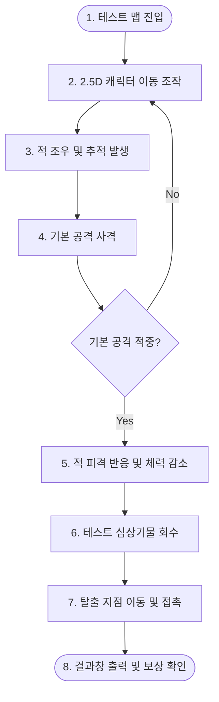
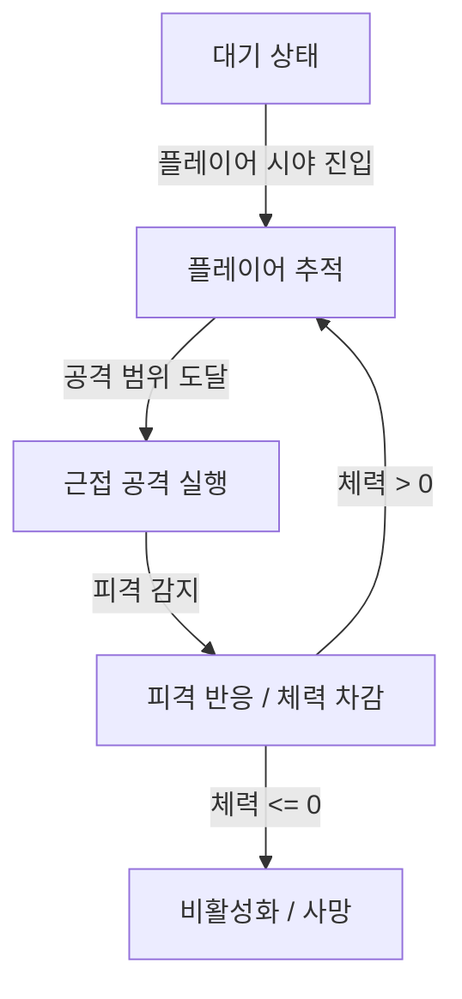

> [!IMPORTANT]
> 이 문서는 AI(Antigravity)가 작성한 초안입니다.
> 기획자/PM의 검토 및 승인 후 이 배너를 제거하면 '확정 사양'으로 인정됩니다.

# 📄 [컨셉 기획 요약본](./침몽도시_루시드_다이버_컨셉_기획_요약본_v0.5.md) | **[프로토타입 기획서 초안 (현재)]**

---

# 🎮 《침몽도시: 루시드 다이버》 프로토타입 기획서 초안

## 0. 기획 의도 (Design Intent)
- **목적**: 《침몽도시: 루시드 다이버》의 1차 프로토타입 구현 범위와 핵심 플레이 루프를 정의하여 개발 가능성을 조기 검증합니다.
- **핵심 가치**: 전체 시스템(멀티플레이, 보존 슬롯 등)을 구현하기 전에 플레이어가 2.5D 전장에 진입하여 조작하고, 적을 조우 및 처치하고, 아이템을 회수하여 탈출하는 최소 단위의 순환 재미와 물리적 조작 안정성을 확보합니다.

---

## 1. 개요 (Overview)
- **기능명**: 루시드 다이버 1차 프로토타입 기획
- **담당자**: 기획팀 / Antigravity
- **우선순위**: 상 (High)
- **현재 상태**: 초안 (Draft)
- **핵심 목표**: 진입 ➔ 이동 ➔ 전투 ➔ 아이템 회수 ➔ 탈출 ➔ 결과 확인의 6단계 루프 검증.

---

## 2. 상세 로직 및 프로세스 (Core Logic)

### 2.1 핵심 플레이 루프
- **트리거**: 플레이어가 로비/결과 화면에서 [시작]을 선택해 테스트 맵에 진입할 때 실행됩니다.
- **프로세스 시퀀스**:

### 2.2 몬스터 AI 상태 처리
- **트리거**: 몬스터가 활성화된 상태에서 상시 실행되는 상태 머신(FSM)입니다.
- **AI 시퀀스**:

### 2.3 주요 세부 로직
1. **플레이어 이동 및 공격**: 가상 조이스틱 또는 키보드 방향키를 통해 2.5D 평면 상에서 움직이며, 사격 버튼 입력 시 지정한 방향으로 기본 탄환(투사체)을 발사합니다.
2. **아이템 회수**: 필드 내 배치된 테스트용 심상기물 오브젝트에 플레이어가 가까이 접근하여 상호작용 또는 직접 접촉을 수행하면 인벤토리에 임시 획득 데이터가 기록되고 해당 필드 기물은 비활성화됩니다.
3. **세션 탈출**: 맵의 특정 구역에 도달하여 탈출 지점 트리거에 접촉하면 실시간 전투 세션이 즉시 종료되고 결과 UI창이 활성화됩니다.

---

## 3. 데이터 명세 (Data Specification)

### 3.1 세션 상태 제어 데이터
| No. | 필드명 | 타입 | 설명 | 기본값 |
| :--- | :--- | :--- | :--- | :--- |
| 1 | `playerHp` | `int` | 플레이어 캐릭터의 현재 체력 수치 | 100 |
| 2 | `monsterHp` | `int` | 테스트 몬스터의 현재 체력 수치 | 50 |
| 3 | `acquiredItems` | `list<string>` | 현재 세션에서 회수 완료된 아이템 리스트 | `[]` |
| 4 | `isEscaped` | `bool` | 탈출 성공 여부를 판정하는 상태 값 | `false` |

### 3.2 프로토타입 등장 요소 목록
| 구분 | 명칭 | 변수명/ID | 역할 및 설명 |
| :--- | :--- | :--- | :--- |
| **플레이어** | 루시드 다이버 테스트 캐릭터 | `Player_Test` | 2.5D 이동, 기본 공격, 아이템 회수, 탈출 상호작용 수행 |
| **몬스터** | 테스트 침식체 (잔몽체) | `Monster_Test` | 플레이어를 감지 및 추적하며 물리적인 전투 환경 제공 |
| **아이템** | 테스트 심상기물 | `Item_Test` | 필드에 스폰되며 회수 성공 시 결과에 반영되는 기물 |
| **탈출지점** | 탈출 지점 오브젝트 | `Exit_Point` | 세션을 종료시키고 결과창 UI를 호출하는 골라인 |

---

## 4. UI/UX 흐름

### 4.1 프로토타입 HUD
- **체력 UI**: 화면 좌측 상단에 `Player_Test`의 `playerHp`를 바(Bar) 형태로 표시합니다.
- **아이템 UI**: 화면 우측 상단에 현재까지 `acquiredItems`에 담긴 개수를 표시합니다. (예: `획득한 기물: 0개`)
- **조작 UI**: 모바일 환경에 대응하기 위해 가상 조이스틱과 공격/상호작용 가상 버튼을 화면 하단 양측에 배치합니다.

### 4.2 결과 화면 (Result UI)
- 세션 종료(`isEscaped = true`) 시 팝업 형태로 화면 중앙에 활성화됩니다.
- **성공 메시지**: "탈출 성공!" 문구 및 회수된 아이템 목록(`acquiredItems`)을 텍스트로 출력합니다.
- **동작 제어**:
  - `다시 시작(Retry)` 버튼: 현재 씬을 재로드하여 프로토타입 플레이 루프를 처음부터 다시 진행합니다.
  - `종료(Exit)` 버튼: 테스트 씬을 종료하고 이전 로비 또는 프로그램 종료를 수행합니다.

---

## 5. 연동 시스템 (Dependencies)
- **컨셉 기획서**: [침몽도시_루시드_다이버_컨셉_기획_요약본_v0.5.md](./침몽도시_루시드_다이버_컨셉_기획_요약본_v0.5.md) 문서의 **13. 최소 플레이 루프 검증** 항목과 직접 대응되며, 본 기획서는 해당 검증 항목을 개발 가능하도록 구체적으로 상세화한 스펙입니다.

---

## 6. 주의 사항 및 제약 (Constraints)
- **멀티플레이 제외**: 프로토타입 범위 내에서는 1인 로컬 플레이만 지원합니다. 2인 협동 등 멀티플레이 동기화는 다음 단계(MVP)에서 검토합니다.
- **간소화된 성장/파밍**: 제한시간 시스템, 각성 보존 슬롯, 캐릭터 편성 및 오퍼레이터 호출 등 컨셉 문서 상의 게임 시스템은 제외됩니다.
- **임시 리소스 사용**: 그래픽 및 사운드 에셋은 개발 검증용 임시(Placeholder) 리소스를 우선 사용합니다.

---

## 📜 Revision History

| 날짜 | 버전 | 내용 | 작성자 |
| :---: | :---: | :--- | :---: |
| 2026-06-12 | v0.1 | - `루시드 다이버 프로토타입 기획서 초안 V0.1.docx` 내용을 기반으로 마크다운 변환 및 연동 규격 설계 - 핵심 플레이 루프 및 몬스터 AI 상태 머신 Mermaid 다이어그램 시각화 - `SPEC_WRITING_GUIDE.md`를 바탕으로 데이터 명세 및 표준 목차 구조화 | Antigravity |
