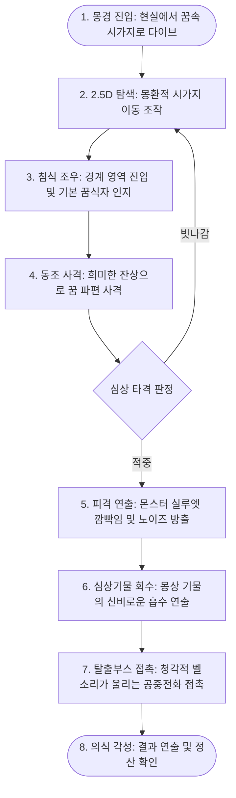
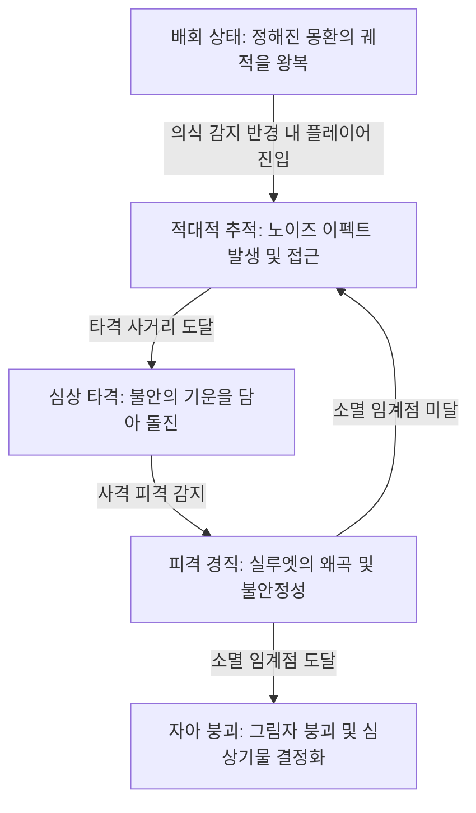

> [!IMPORTANT]
> 이 문서는 AI(Antigravity)가 작성한 초안입니다.
> 기획자/PM의 검토 및 승인 후 이 배너를 제거하면 '확정 사양'으로 인정됩니다.

# 📄 [요약본](./침몽도시_루시드_다이버_컨셉_기획_요약본_v0.5.md) | **[프로토타입 초안 (현재)]** | [캐릭터 컨셉](./캐릭터_컨셉_기획서.md) | [무장 체계 및 캐릭터 특화 풀](./기본_전용_무장_컨셉_기획서.md) | [몬스터 컨셉](./몬스터_컨셉_기획서.md) | [아이템 컨셉](./아이템_및_오브젝트_컨셉_기획서.md)

---

# 🎮 《침몽도시: 루시드 다이버》 프로토타입 컨셉 기획서 초안

## 0. 기획 의도 (Design Intent)
- **목적**: 《침몽도시: 루시드 다이버》의 핵심 플레이 루프인 **'진입 ➔ 탐색 ➔ 교전 ➔ 회수 ➔ 탈출'** 과정에서 유저가 느끼는 **공간적 긴장감, 조작 반응성, 타격/피격 연출 및 각성을 통한 복귀** 등의 핵심 플레이 경험을 검증합니다.
- **핵심 가치**: 멀티플레이나 성장 요소 등의 심화 시스템을 구현하기 앞서, 2.5D 쿼터뷰 전장 환경에서의 캐릭터 이동이 꿈속 특유의 부드럽고 가벼운 부유감을 주는지, 기본 무장의 투사체 발사 및 피격이 감각적인 글리치 이펙트로 다가오는지 등 **'플레이 경험의 질적 재미와 연출 안정성'**을 최우선으로 확보하는 데 있습니다.

---

## 1. 개요 (Overview)

| 구분 | 내용 | 비고 |
| :--- | :--- | :--- |
| **기능명** | 루시드 다이버 1차 프로토타입 플레이 경험 검증 | - |
| **담당자** | 기획팀 / Antigravity | - |
| **우선순위** | 상 (High) | - |
| **현재 상태** | 초안 (Draft) | PM 검토 대기 |
| **핵심 경험 목표** | 몽경 진입부터 전투, 기물 회수 후 공중전화부스로 탈출하기까지의 정서적 흐름 검증 | 6단계 흐름 검증 |

---

## 2. 상세 로직 및 프로세스 (Core Logic)

### 2.1 핵심 플레이 루프 (Player Experience Journey)
프로토타입 플레이는 아래와 같은 기획 시나리오 흐름에 따라 진행됩니다. 플레이어는 로비에서 진입을 선택하여 몽경으로 빠져들고, 아래 단계를 거쳐 현실로 깨어나게 됩니다.

#### [경험 단계별 상세 묘사]
1. **몽경 진입 (Dive)**: 로비 화면에서 테스트 시작 시, 화면이 물에 잠기듯 굴절되며 2.5D 침몽도시 테스트 맵으로 공간이 전환됩니다.
2. **2.5D 탐색 및 조작 (Exploration)**: 중력이 다소 약화된 듯한 꿈속의 독특한 움직임을 구현합니다. 부드럽고 미끄러지는 듯한 조작감을 느낄 수 있습니다.
3. **침식 조우 (Confrontation)**: 시야 바깥 어둠 속에서 실루엣 형태로 나타난 기본 꿈식자(몬스터)가 플레이어의 존재를 감지하면, 붉은 빛의 노이즈 이펙트를 뿜으며 추적해 옵니다.
4. **동조 사격 및 피격 (Combat Feedback)**: 기본 무장 '희미한 잔상' 발사 시 빛의 궤적을 그리며 뻗어나가는 탄환이 발사됩니다. 탄환이 적중하면 찌릿한 스파크 형태의 글리치(Glitch) 효과와 사운드가 출력되어 "꿈을 타격한다"는 감각을 제공합니다.
5. **심상기물 회수 (Retrieval)**: 처치한 몬스터가 먼지처럼 분해되며 제자리에 빛나는 심상기물을 떨어뜨립니다. 플레이어가 이에 근접하면 기물이 가볍게 흔들리다 플레이어 몸속으로 슈우욱 흡수되며 획득 사운드가 연출됩니다.
6. **전화부스를 통한 탈출 (Escape & Wake Up)**: 저 멀리서 아스라이 전화벨 소리가 울려 퍼집니다. 소리가 나는 방향으로 이동하면 네온 블루 톤으로 빛나는 공중전화부스가 있습니다. 이에 접촉하면 "딸깍"하는 수화기 내려놓는 소리와 함께 화면 전체가 밝은 빛으로 페이드아웃 되며 현실로의 복귀(각성)가 이루어집니다.

---

### 2.2 몬스터 AI 상태 개념 (Monster Behavioral AI Concept)
프로토타입에 등장하는 몬스터는 단순한 AI 로봇이 아닌, 과거 침몽도시에 살았던 시민들이나 그 안에서 미처 깨어나지 못하고 갇히거나 죽어간 사람들의 흩어진 꿈과 악몽이 빚어낸 그림자(기본 꿈식자)로 연출됩니다.

---

### 2.3 핵심 연출 피드백 정의
1. **이동/조작 피드백**: 캐릭터 발밑에 잔잔한 물결이 퍼지는 듯한 파동(Ripples) 이펙트를 주어 꿈길을 걷는 듯한 비주얼을 제공합니다.
2. **피격 피드백**: 다이버가 적에게 공격받을 시 화면 테두리가 순간적으로 붉게 일그러지는 **색수차(Chromatic Aberration) 효과**가 연출되며, 고유의 서늘한 바람 소리가 배경음 위로 재생됩니다.
3. **각성 복귀 연출**: 탈출 전화부스와 접촉하는 즉시 몽환적인 화이트아웃(White-out) 효과가 발생하고, 심장 박동음이 점차 커지다 멈추며 로비로 돌아갑니다.

---

## 3. 데이터 명세 (Data Specification)

### 3.1 프로토타입 연출 파라미터 (Conceptual Parameters)
시스템 내부에서 처리되는 데이터 대신, 플레이어에게 제공되는 **컨셉형 수치 및 비주얼 피드백 형태**로 파라미터를 정의합니다.

| 기획 명칭 | 표현 개념 | 기획 수치 | 인게임 연출 및 UI 표현 방식 |
| :--- | :--- | :---: | :--- |
| **의식 안정도** | 다이버가 꿈속에 머무는 의식의 양 | 100 / 100 | 화면 좌상단의 네온 블루 게이지 바. 데미지를 입으면 붉게 깜빡이며 일그러짐. |
| **침식 응집력** | 기본 꿈식자가 유지되는 Nightmare 질량 | 50 | 기본 꿈식자 머리 위의 불투명한 보라색 실루엣 게이지. |
| **회수된 심상 조각** | 세션 내에서 회수한 몽상 에너지 결정 | 0 ~ N | 화면 우상단에 기하학적인 아이콘과 함께 디지털 폰트로 개수 표시. |
| **동조 해제 여부** | 현실과의 연결 장치인 탈출부스와의 접촉 | `동조(안정)` / `차단(탈출)` | 접촉하는 순간 화면 하단에 '의식 강제 동조 해제(현실 각성)' 연출 텍스트 출력. |

### 3.2 프로토타입 등장 요소 비주얼 컨셉
기본 테스트 에셋(Placeholder)을 사용하더라도, 각 요소가 지녀야 할 감성적 지향점을 명시하여 아트 방향성을 유지합니다.

| 구분 | 명칭 | 컨셉 및 연출적 역할 | 비주얼 지향 형태 (Placeholder 레벨) |
| :--- | :--- | :--- | :--- |
| **플레이어** | 테스트 다이버 | 몽경 깊숙이 다이브하여 잃어버린 기억을 회수하는 탐색자 | 후드를 뒤집어쓴 어두운 톤의 2.5D 캐릭터. 이동 시 파동 잔상이 남음. |
| **몬스터** | 테스트 기본 꿈식자 | 과거 침몽도시 시민들의 왜곡된 일상적 기억이나 미련, 공포가 형상화된 경계 개체 | 반투명한 검은 연기와 보라색 안개가 뒤섞인 듯한 기괴한 인형 형태. |
| **아이템** | 테스트 심상기물 | 잃어버린 중요한 감정이나 추억의 물리적 파편 | 네온 옐로우 빛을 뿜으며 공중에 둥둥 떠서 시계 방향으로 회전하는 결정체. |
| **탈출지점** | 몽경 탈출 전화부스 | 현실로 정신을 강제 견인하는 닻 역할을 하는 공중전화부스 | 빗방울이 맺힌 듯한 반투명 텍스처에 내부의 네온사인이 밝게 깜빡이는 retro 부스. |

---

## 4. UI/UX 흐름 및 연출 컨셉

### 4.1 프로토타입 HUD 비주얼 컨셉
- **홀로그래픽 레이아웃**: 모든 인게임 UI 정보는 다이버의 시야 렌즈(고글)에 직접 투사되는 듯한 옅은 반투명 청록색(Cyan) 홀로그램 스타일로 연출합니다.
- **안정도 위험 알림**: 의식 안정도가 30% 이하로 내려가면, 화면 가득 아날로그 노이즈(글리치 라인)가 지나가며 HUD 텍스트가 깨져 보이는 연출을 제공하여 현실 각성(강제 추방) 직전의 다급함을 정서적으로 표현합니다.

### 4.2 결과 화면 (Result Visual Concept)
- **성공적 복귀 (Awakening)**: 화면에 "안정적 의식 각성 성공" 텍스트가 타자기로 치는 듯이 한 글자씩 타이핑되며 등장하고, 정화된 심상기물의 복원율이 청각적 비프음과 함께 차오릅니다.
- **강제 각성 (Forced Awakening - 실패)**: 화면이 붉은색 글리치 노이즈로 덮이며 지직거리는 소리와 함께 "의식 강제 차단 및 추방" 경고가 출력됩니다. 이내 검은 화면으로 암전된 후 심장 박동 소리가 크게 들리며 종료됩니다.

---

## 5. 연동 시스템 (Dependencies)
- **컨셉 기획 요약본**: [침몽도시_루시드_다이버_컨셉_기획_요약본_v0.5.md](./침몽도시_루시드_다이버_컨셉_기획_요약본_v0.5.md)의 **13. 최소 플레이 루프 검증**과 일치하며, 상세 메카닉 대신 플레이어 정서 및 연출 방향성의 뼈대가 됩니다.
- **무장 체계 및 캐릭터 특화 풀 컨셉**: [기본_전용_무장_컨셉_기획서.md](./기본_전용_무장_컨셉_기획서.md) 내 '8대 표준 무기군' 및 캐릭터별 특화 무기 풀 규칙을 준수하여, 프로토타입 단계의 무기 작동 및 시너지 연출의 일관성을 가집니다.

---

## 6. 주의 사항 및 제약 (Constraints)
- **일반적인 슈팅 게임과의 차별화**: 프로토타입 개발을 위한 임시 리소스를 사용하더라도, 단순한 밀리터리 슈팅이나 판타지 좀비물로 느껴지지 않아야 합니다. 반드시 **'비현실적인 공간(꿈)', '정서적 노이즈', '글리치 이펙트'**가 타격/피격/이동 전반에 깔려 있도록 연출 연동에 신경 써야 합니다.
- **감각적 피드백 우선**: 세부 데이터 밸런싱(데미지 값 등)보다 타격 시 손맛(화면 흔들림, 피격 플래시)과 탈출 시의 안도감(전화벨 소리 등 사운드 효과) 등의 감각 피드백 연출에 집중해 기획 및 사운드를 수배합니다.
- **오퍼레이터 시스템 배제**: 프로토타입 및 최종 MVP 검증 스펙에서 오퍼레이터 역할군 및 실시간 원격 지원 관제 연출은 완전히 배제됩니다. 이에 따라 모든 지원 캐릭터는 전장에서의 직접 호출(스트라이커) 액티브 스킬 방식으로만 기획 및 연출을 설계해야 합니다.

---

## 📜 Revision History

| 날짜 | 버전 | 내용 | 작성자 |
| :---: | :---: | :--- | :---: |
| 2026-06-12 | v0.1 | - `루시드 다이버 프로토타입 기획서 초안 V0.1.docx` 내용을 기반으로 마크다운 변환 및 연동 규격 설계 | Antigravity |
| 2026-06-14 | v0.2 | - 상세 컨셉 기획서 연동에 따라 몬스터 순찰대 행동 패턴 정의 | Antigravity |
| 2026-06-14 | v0.3 | - 최소 플레이 루프 검증 목적에 맞춰 프로토타입 범위 대폭 최적화 및 단순화 | Antigravity |
| 2026-06-15 | v0.4 | - **기술적인 데이터 타입 및 변수 스펙 중심의 초안을 플레이어 경험, 비주얼 연출, 게임플레이 판타지 중심의 '프로토타입 컨셉 기획서'로 전면 개편** - 몬스터 AI 및 데이터 명세를 감성적 명칭과 연출 파라미터로 전환 - 단계별 플레이어 여정 시나리오 및 UI 연출(색수차, 화이트아웃, 수화음 등) 보강 | Antigravity |
| 2026-06-15 | v0.5 | - 오퍼레이터 제외 제약 추가 및 하선의 지원 캐릭터 C 편입, 무장 체계 개편에 따른 연동 문서 명칭 갱신 | Antigravity |
