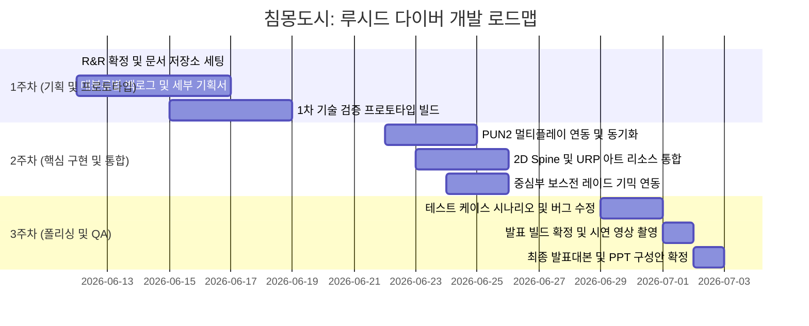

# 🗺️ 3차 프로젝트 마일스톤 및 개발 로드맵

> **본 로드맵은 《침몽도시: 루시드 다이버》 개발을 위한 전체 일정표 및 팀원별 마일스톤입니다.**
> 1차 기획 및 프로토타입 검증부터 최종 발표용 빌드 구축까지의 과정을 관리합니다.

---

## 📅 전체 마일스톤 (Milestones)

### 1주차 주요 마일스톤 목표 (06.12 ~ 06.19)
*   **[P0] 필수 기획 완료**: 6월 17일(수) 퇴근 시까지 각 역할별 세부 기획서 1차 완료.
*   **[P0] 1차 프로토타입 구축 및 기획 확정**: 6월 19일(금) 퇴근 시까지.
    *   *프로토타입 스펙*: Unity 3D 기본 프리미티브(오브젝트)를 사용한 캐릭터 조작, 실시간 기물 획득 및 무장 변형, 안전 보존 슬롯 인벤토리 룰 검증 빌드.

---

## 🧑‍💻 팀원별 세부 로드맵 & R&R (Role & Responsibility)

| 팀원 | 역할 | 1주차 (기획 및 검증) | 2주차 (구현 및 동기화) | 3주차 (디버깅 및 폴리싱) | 최종 산출물 경로 |
|:---:|:---:|:---|:---|:---|:---|
| **강다영** | Git & 개발 세팅 | Unity 2022.3.62f3 및 URP 초기 세팅, 브랜치 전략 확립, 씬 구조화 | PUN2 로비 매칭 및 세션 룸 입장 로직 구현 | 네트워크 트래픽 최적화, 빌드 및 배포 자동화 | `02.기술_문서/` |
| **송예찬** | 컨셉 기획 | 게임 월드 톤앤매너, 캐릭터 원화 컨셉, 1차 기물 무기(우산/시계/거울) 아트 요구사항 작성 | 추가 기물 아트 리소스 팩 수급, 2D 스프라이트 시각 효과 레퍼런스 정리 | UI/UX 비주얼 이펙트 리소스 가공 및 폴리싱 | `01.기획_문서/컨셉_기획/` |
| **김남해** | 시나리오 기획 | 침몽도시 배경 시나리오, 루시드 다이버 및 에너지 코어 내러티브 설정, 시스템의 개연성 보완 | 튜토리얼 스크립트 작성, 퀘스트 대화 로그 구성 | 시연용 스토리 컷씬 구성 보조 및 오타 교정 | `01.기획_문서/시나리오_및_세계관/` |
| **우성혁** | 시스템 기획 | 1+2+1 파티 편성 시너지(공명), 각성 보존 슬롯(안전 금고) 로직 설계, 기물 무장 내구도 밸런스 수립 | PUN2 기반 아이템 루팅 및 내구도 동기화 설계, 보스전 그로기/부위파괴 시스템 구체화 | 인게임 전투 밸런스 데이터 튜닝, QA 버그 대장 리포팅 및 검수 | `01.기획_문서/시스템_명세/` |
| **장수영** | 레벨 기획 (팀장) | 프로토타입 테마 맵 '꿈에 먹힌 상가 구역' 구역별 레이아웃 동선 설계 및 장애물 배치 규칙 작성 | 외곽-중간-중심부 보스룸 레벨 구현, 난이도별 적 리스폰 트리거 배치 | 맵 라이팅(URP), 포스트 프로세싱 연출 조정, QA 최종 검수 진행 | `01.기획_문서/레벨_기획/` |

---

## 📢 일정 및 산출물 관리 원칙
1. **SSOT(Single Source of Truth) 원칙**: 로드맵 및 일정의 진행 현황은 Notion에 1차 기록하되, 최종 확정된 기술 및 기획 명세서는 반드시 본 저장소의 마크다운(.md) 파일 형태로 이관하여 버전 관리를 수행합니다.
2. **AI Co-PM 활용**: 문서가 업데이트되거나 일정이 수정될 경우, `PROJECT_CONTEXT.md`와 본 `프로젝트_로드맵.md`를 갱신하여 Antigravity가 팀의 진행도를 실시간으로 추적할 수 있도록 지원합니다.

---

## 📜 Revision History

| 날짜 | 버전 | 내용 | 작성자 |
|------|------|------|--------|
| 2026-06-12 | v1.0 | - 《침몽도시: 루시드 다이버》 1~3주차 전체 일정 및 팀원 R&R 로드맵 수립 | Antigravity |
| 2026-06-12 | v1.1 | - 프로토타입 테마 맵 명칭 변경 반영 (꿈에 먹힌 지하상가 ➡️ 꿈에 먹힌 상가 구역) | Antigravity |
