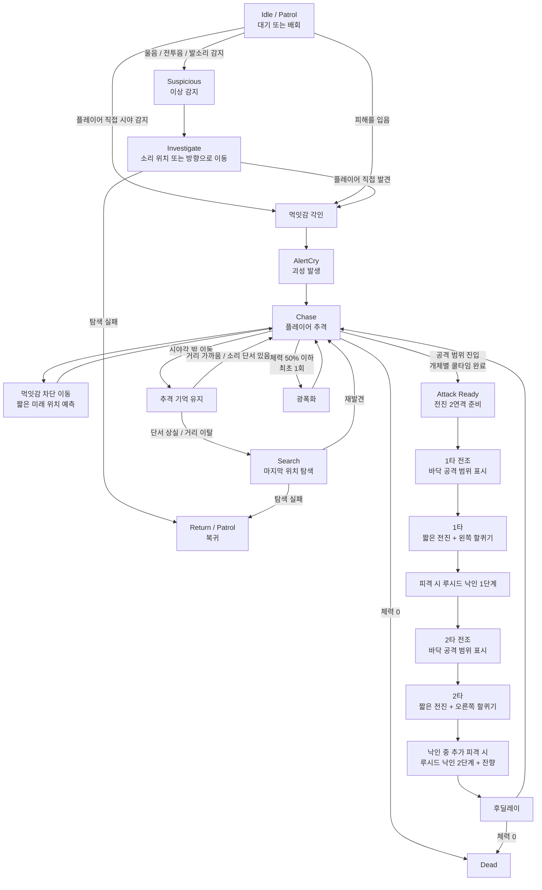

# P0.5 꿈식자 에너미 AI 및 컨셉 기획서 (v1.0.1)

> [!IMPORTANT]
> 이 문서는 검토 및 승인 전 단계의 최종 초안입니다.
> 기획자/PM의 검토 및 승인 후 이 배너를 제거하면 P0.5 확정 사양으로 인정합니다.

---

## 0. 기획 의도 (Design Intent)

- **목적**: 《침몽도시: 루시드 다이버》의 P0.5 기본 에너미인 꿈식자의 컨셉, AI 행동 구조, 감지 규칙, 전투 방식, 무리 반응 규칙을 정의하기 위한 기획서이다.
- **핵심 가치**: 꿈식자는 한 구역에 2~3마리 배치되었을 때 소리, 탐색, 추격 기억, 먹잇감 차단 이동, 루시드 낙인을 통해 긴장감을 형성하는 기본 위협체다.
- **설계 방향**: 플레이어의 정확한 좌표를 즉시 공유하지 않고, 소리와 이상 상황에 반응해 위치를 탐색한다. 단, 일단 먹잇감으로 각인되면 단순 직선 추격이 아니라 짧은 예측 기반 차단 이동으로 압박감을 높인다.

---

## 1. 개요 (Overview)

| 항목 | 내용 |
|------|------|
| 기능명 | 꿈식자 에너미 AI 및 컨셉 |
| 대상 빌드 | P0.5 프로토타입 |
| 담당자 | 기획: 송예찬 / 개발: 송예찬 |
| 우선순위 | P0.5 |
| 상태 | 검토 대기 |
| 에너미 수 | 기본 에너미 1종 |
| 핵심 시스템 | 좁은 직접 인지, 넓은 소리 반응, 먹잇감 각인, 먹잇감 차단 이동, 전진 2연격, 루시드 낙인, 광폭화 |

---

## 1.5 P0 대비 확장 및 변경 명세 (P0 vs P0.5 Comparison)

| 기능 분류 | P0 기준 사양 (기존) | P0.5 확장 사양 (현재) | 변경 사유 및 기획 의도 |
| :--- | :--- | :--- | :--- |
| **타겟 탐색 및 인지** | 정면 부채꼴 시야 직접 탐지만 존재 | 좁은 시야 직접 감지, 넓은 소리 감지, 근접 기척 인지 보정 | 스텔스와 탐색 플레이 압박 강화 |
| **추격 품질** | 플레이어 현재 위치를 단순 추적 | 먹잇감 차단 이동으로 짧은 미래 위치 예측 추격 | 적이 허공만 따라다니지 않게 하여 추격 압박 개선 |
| **피격 압박** | 대미지만 받고 종료 | 루시드 낙인 부여, 낙인 강화, 잔향 조사 유도 | 대미지를 과하게 올리지 않고도 "맞기 싫다"는 감정 형성 |
| **무리 반응 규칙** | 단독 또는 개별 반응 | 괴성, 소음, 루시드 잔향을 주변 적이 조사 | 구역 단위의 위험 확산 유도 |
| **전투 패턴** | 공격 사거리 진입 시 즉시 1회성 제자리 공격 | 바닥 전조 후 직선 1타 및 방향 보정 2타 전진 연속 공격 | 회피와 반격 타이밍 제공 |

---

## 2. 상세 로직 및 프로세스 (Core Logic)

### 2.1 동작 플로우 (Flowchart)

### 2.2 규칙 및 조건 (Rules & Conditions)

#### 2.2.1 감지 및 인지 규칙 (Perception Rules)

- **직접 시야 감지**: 플레이어를 정확히 인지하여 `먹잇감 각인`을 활성화하는 조건으로, 감지 거리는 짧고 정면 기준 제한된 각도를 사용하며 Raycast로 벽 뒤 감지를 차단한다.
- **소리 감지**: 플레이어를 직접 추격하지 않고 이상 감지(`Suspicious`/`Investigate`) 상태로 전이시킨다. 소리의 성격에 따라 반응 범위가 달라지며, 플레이어의 좌표 대신 소리 발생지 좌표만을 제공하여 해당 방향을 탐색하게 한다.
- **근접 인지**: 플레이어가 꿈식자의 후방이나 측면에 있더라도 일정 근접 반경(`proximityAwarenessRange`) 이내에 진입하면 기척을 인지하여 적 주변을 돌며 어그로를 해제하는 꼼수를 차단한다.

#### 2.2.2 먹잇감 각인 및 추격 기억 규칙 (Target Locking & Chase Memory)

- **먹잇감 각인**: 플레이어 발견 또는 피해 시 대상이 각인되며, 일시적으로 시야를 벗어나거나 뒤쪽으로 돌아가더라도 즉시 추격이 해제되지 않는다.
- **추격 유지**: `추격 유지 거리 이내`, `마지막 위치 추적 중`, `추가 소리 단서 발생`, `근접 인지 범위 유지`, `지속 피해` 조건 중 하나라도 만족하면 추격을 지속한다.
- **추격 해제**: 일정 시간 직접 시야 상실, 추격 유지 거리 밖 이탈, 추가 소리 단서 부재, 마지막 위치 탐색 실패가 모두 누적되었을 때에만 추격을 해제하고 복귀한다.

#### 2.2.3 먹잇감 차단 이동 규칙 (Intercept Movement Rules)

- **기능 정의**: 꿈식자가 `Chase` 상태에서 플레이어의 현재 위치만 따라가지 않고, 플레이어의 최근 이동 방향과 속도를 바탕으로 짧은 미래 위치를 예측해 접근하는 AI 보정 기능이다.
- **목적**: 적이 플레이어의 현재 위치만 뒤늦게 따라가 허공을 맴도는 느낌을 줄이고, 추격의 품질과 압박감을 높인다.
- **적용 조건**: 직접 시야를 유지 중이고, 플레이어가 일정 속도 이상으로 이동 중일 때만 적용한다.
- **제한 조건**: 예측 시간은 짧게 제한하고, 예측 목표점의 최대 오프셋 거리를 제한한다. 조사 상태나 탐색 상태에서는 적용하지 않는다.
- **의도된 인상**: "앞을 막으러 들어온다"는 느낌을 주되, 예지 능력처럼 보이지 않을 정도의 보정만 허용한다.

#### 2.2.4 루시드 낙인 규칙 (Lucid Mark Rules)

- **기능 정의**: 꿈식자의 공격에 피격된 플레이어에게 일정 시간 동안 `루시드 낙인`을 부여하는 피격 디메리트 시스템이다.
- **목적**: 꿈식자의 대미지를 과하게 높이지 않고도, 플레이어가 "맞기 싫다"는 감정을 느끼게 만든다.
- **1단계 낙인**: 꿈식자의 공격에 피격된 플레이어는 `루시드 낙인 1단계` 상태가 된다. 낙인 지속 중에는 꿈식자가 플레이어를 더 오래 기억하며 추격 해제가 어려워진다.
- **2단계 강화**: 낙인 지속 중 추가 피격을 받으면 `루시드 낙인 2단계`로 강화된다.
- **루시드 잔향**: 2단계 강화 시 피격 위치에 `루시드 잔향`이 발생하며, 주변 꿈식자는 이 위치를 소리 단서처럼 조사한다.
- **비의도 효과 금지**: 루시드 낙인은 이동 속도 감소, 긴 경직, 상호작용 강제 취소를 발생시키지 않는다. 플레이어 조작권을 빼앗지 않고, 반복 피격 시 구역 위험을 높이는 압박 요소로만 사용한다.

#### 2.2.5 전투 및 공격 규칙 (Combat Rules)

- **공격 쿨타임**: 군집 단위로 공격권을 공유하지 않으며, 각 개체별로 완전히 독립적인 쿨타임을 관리하고 범위 진입 시 시도한다.
- **전진 2연격 (기본 공격)**: 플레이어 방향으로 1타(왼쪽 할퀴기) 및 2타(오른쪽 할퀴기)를 각각 짧은 전진과 바닥 전조 범위를 표시하며 연속으로 수행한다.
- **호밍 금지 및 2타 보정 제한**: 공격이 시작되면 전조 표시 방향으로만 전진하며 플레이어 추적(호밍)은 차단된다. 단, 2타 시작 전 플레이어 위치에 맞춰 제한된 각도(최대 25도) 내에서 방향을 보정할 수 있다.
- **광폭화**: 체력이 50% 이하가 되면 개체별 최초 1회 발동하며, 이동 속도 증가, 전조 시간 단축, 전진 거리 증가, 후딜레이 감소 효과를 적용한다.

---

## 3. 데이터 명세 (Data Specification)

### 3.1 기본 스탯 및 감지 데이터

| 기획 명칭 | 변수명 | 타입 | 기본값 | 비고 |
|-----------|-------------|-----------------|--------|------|
| 체력 | `maxHp` | `float` | 100.0 | 에너미 최대 체력 |
| 이동 속도 일반 | `normalMoveSpeed` | `float` | 3.2 | 플레이어보다 느리게 설정 |
| 이동 속도 광폭 | `berserkMoveSpeed` | `float` | 3.8 | 약 18% 증가 |
| 시야 감지 거리 | `sightRange` | `float` | 5.5 | 직접 인지 범위 |
| 시야 감지 각도 | `sightAngle` | `float` | 100.0 | 전방 기준 |
| 근접 인지 반경 | `proximityAwarenessRange` | `float` | 1.8 | 후방/측면 근접 보정 |
| 광폭화 체력 임계값 | `berserkHpThreshold` | `float` | 0.5 | 체력 50% 이하 |

### 3.2 소리 및 추격 기억 데이터

| 기획 명칭 | 변수명 | 타입 | 기본값 | 비고 |
|-----------|-------------|-----------------|--------|------|
| 걷기 소리 감지 범위 | `walkNoiseRange` | `float` | 2.5 | 조용한 이동 |
| 달리기 소리 감지 범위 | `runNoiseRange` | `float` | 6.0 | 빠른 이동 |
| 총격 소리 감지 범위 | `gunNoiseRange` | `float` | 16.0 | 구역 단위 반응 |
| 괴성 전파 범위 | `alertCryRange` | `float` | 13.0 | 침식 울림 반경 |
| 소리 반응 딜레이 | `soundReactionDelay` | `float` | 0.4~1.2 | 개체별 랜덤 적용 |
| 추격 유지 거리 | `chaseMemoryRange` | `float` | 11.0 | 시야각 밖이어도 추격 유지 |
| 최대 추격 거리 | `leashRange` | `float` | 17.0 | 이탈 시 복귀 판단 |
| 시야 상실 유예 시간 | `lostSightGraceTime` | `float` | 2.5 | 즉시 어그로 해제 방지 |
| 마지막 위치 탐색 시간 | `searchDuration` | `float` | 4.0 | 마지막 위치 주변 탐색 |
| 소리 기억 추가 시간 | `noiseMemoryAddTime` | `float` | 1.5 | 소리 단서 발생 시 연장 |

### 3.3 먹잇감 차단 이동 데이터

| 기획 명칭 | 변수명 | 타입 | 기본값 | 비고 |
|-----------|-------------|-----------------|--------|------|
| 예측 시간 | `interceptPredictionTime` | `float` | 0.35 | 짧은 미래 위치 예측 시간 |
| 최대 차단 오프셋 거리 | `maxInterceptOffsetDistance` | `float` | 1.8 | 예측 위치의 최대 전방 보정 거리 |
| 적용 최소 속도 | `interceptMinTargetSpeed` | `float` | 1.5 | 플레이어가 이 속도 이상일 때만 적용 |
| 차단 갱신 주기 | `interceptUpdateInterval` | `float` | 0.2 | 예측 위치 갱신 주기 |
| 시야 중에만 사용 | `useInterceptOnlyWhenVisible` | `bool` | true | 직접 시야 유지 중에만 사용 |

### 3.4 루시드 낙인 데이터

| 기획 명칭 | 변수명 | 타입 | 기본값 | 비고 |
|-----------|-------------|-----------------|--------|------|
| 1단계 낙인 지속 시간 | `lucidMarkDuration` | `float` | 6.0 | 첫 피격 후 유지 시간 |
| 2단계 낙인 지속 시간 | `lucidMarkStage2Duration` | `float` | 8.0 | 강화 시 유지 시간 |
| 낙인 추격 기억 추가 시간 | `lucidMarkMemoryBonusTime` | `float` | 2.0 | 낙인 대상 추격 유지 강화 |
| 낙인 최대 추격 거리 보너스 | `lucidMarkLeashBonusDistance` | `float` | 2.0 | 낙인 대상 이탈 허용 거리 증가 |
| 2단계 잔향 지속 시간 | `lucidResidueDuration` | `float` | 3.0 | 잔향이 남아 있는 시간 |
| 잔향 조사 반경 | `lucidResidueInvestigateRange` | `float` | 8.0 | 주변 꿈식자의 조사 유도 반경 |

### 3.5 전진 2연격 및 광폭화 데이터

| 기획 명칭 | 변수명 | 타입 | 기본값 | 비고 |
|-----------|-------------|-----------------|--------|------|
| 공격 시작 거리 | `attackStartRange` | `float` | 2.3 | 공격 가능 거리 |
| 1타 전조 시간 | `firstSlashTelegraphTime` | `float` | 0.35 | 1타 바닥 전조 표시 시간 |
| 2타 전조 시간 | `secondSlashTelegraphTime` | `float` | 0.25 | 2타 바닥 전조 표시 시간 |
| 1타 전진 거리 | `firstSlashLungeDistance` | `float` | 1.0 | 1타 이동 거리 |
| 2타 전진 거리 | `secondSlashLungeDistance` | `float` | 0.8 | 2타 이동 거리 |
| 1타 공격 폭 | `firstSlashWidth` | `float` | 1.2 | 바닥 전조 및 판정 폭 |
| 2타 공격 폭 | `secondSlashWidth` | `float` | 1.2 | 바닥 전조 및 판정 폭 |
| 1타 피해량 | `firstSlashDamage` | `float` | 5.0 | 1타 피해 |
| 2타 피해량 | `secondSlashDamage` | `float` | 6.0 | 2타 피해 |
| 연격 간격 | `comboInterval` | `float` | 0.15 | 1타 후 2타까지 간격 |
| 공격 후딜레이 | `attackRecoveryTime` | `float` | 0.65 | 공격 종료 후 딜레이 |
| 2타 방향 보정 각도 | `secondSlashTurnLimit` | `float` | 25.0 | 2타 전 보정 가능 각도 |
| 공격 쿨타임 | `attackCooldown` | `float` | 1.2 | 개체별 관리 |

---

## 4. UI/UX 및 연출 사양 (Presentation Rules)

| 상황 | 애니메이션 및 이펙트 연출 | 사운드 연출 |
|------|---------------------------|-------------|
| **직접 발견** | 머리가 플레이어 방향으로 고정됨 | 날카로운 인지음 |
| **괴성 발생** | 몸을 펴고 파동 이펙트 방출 | 괴성 |
| **이상 감지** | 고개를 소리 방향으로 돌림 | 낮은 으르렁거림 |
| **탐색** | 느리게 걸으며 주변을 두리번거림 | 불규칙한 발소리 |
| **추격** | 자세를 낮추고 빠르게 이동 | 거친 호흡음 |
| **먹잇감 차단 이동** | 플레이어 진행 방향 쪽으로 파고드는 움직임 | 짧은 재가속 호흡 |
| **1단계 루시드 낙인** | 피격 부위에 짧은 붉은 왜곡 잔광 | 얕은 파열음 |
| **2단계 루시드 낙인** | 붉은 낙인이 더 진해지고 피격 위치에 잔향 발생 | 더 날카로운 공명음 |
| **루시드 잔향** | 바닥/공중에 짧게 흔들리는 루시드 잔재 | 낮은 울림 |
| **광폭화** | 노이즈, 균열 발광, 몸 뒤틀림 | 날카로운 비명 |

### 4.1 설계 의도

- 먹잇감 차단 이동은 "너무 똑똑한 예지"가 아니라 "앞을 막으려 드는 포식자"처럼 보여야 한다.
- 루시드 낙인은 플레이어 조작권을 뺏지 않고, 반복 피격 시 전장 위험이 커진다는 감정을 주는 방향으로 연출한다.

---

## 5. 연동 시스템 (Dependencies)

| 연동 대상 | 관계 | 비고 |
|-----------|------|------|
| **Enemy State Machine** | Idle, Patrol, Chase, Attack, Intercept 등 상태 관리 | 상태 관리 코어 시스템 |
| **Noise System** | 울음, 발소리, 전투음, 루시드 잔향 감지 처리 | Suspicious / Investigate 전환 연동 |
| **Damage System** | 피격, 사망 처리 및 낙인 적용 | 낙인/광폭화 발동 연동 |
| **Perception System** | 시야 감지, 근접 기척 감지 처리 | 최초 인지 및 재인지 판정 |
| **Chase Memory System** | 먹잇감 각인 및 추격 유지/해제 관리 | 낙인 대상 추격 강화 포함 |
| **Player Debuff System** | 루시드 낙인 단계 및 지속 시간 관리 | 신규 압박 시스템 |
| **VFX System** | 바닥 전조, 광폭화, 루시드 잔향 출력 | 시인성 확보용 |
| **Sound Manager** | 상태별 사운드 재생 | 몰입감 확보용 |

---

## 6. 주의 사항 및 제약

- **차단 이동의 공정성**: 먹잇감 차단 이동은 플레이어 현재 위치를 완전히 무시하는 예지형 이동이 되어서는 안 되며, 짧은 시간의 제한된 예측 보정만 허용한다.
- **낙인 디메리트의 성격**: 루시드 낙인은 느려짐, 긴 경직, 상호작용 취소 같은 조작권 박탈 디버프로 확장하지 않는다.
- **잔향의 역할**: 루시드 잔향은 주변 적의 조사 단서를 만드는 용도이지, 자동 광역 대미지나 즉시 확정 발각 기능이 아니다.
- **공격 쿨타임 독립성**: 꿈식자는 군집 공유 쿨타임을 사용하지 않으며, 각 개체별로 완전히 독립적으로 쿨타임을 계산한다.
- **광폭화 보정의 밸런스**: 광폭화는 기본 속성 강화일 뿐 새로운 보스 기믹이 아니므로, 대응 불가능할 수준으로 오버스펙화되지 않게 통제한다.

---

## 7. 전투 및 탐색 시나리오 예시 (Examples)

### 7.1 먹잇감 차단 이동이 체감되는 경우

1. 플레이어가 꿈식자 A에게 발각된다.
2. 플레이어가 직선으로 도망가기 시작한다.
3. A는 플레이어의 현재 위치 뒤만 쫓지 않고, 최근 이동 방향을 기준으로 약간 앞선 위치를 향해 접근한다.
4. 플레이어는 단순 원형 러닝만으로 쉽게 따돌리기 어려워진다.

### 7.2 루시드 낙인 1단계

1. 플레이어가 꿈식자의 1타 공격에 맞는다.
2. 플레이어는 루시드 낙인 1단계 상태가 된다.
3. A는 평소보다 더 오래 플레이어를 기억하고 추격을 쉽게 풀지 않는다.

### 7.3 루시드 낙인 2단계 및 잔향

1. 낙인 지속 중 플레이어가 다시 꿈식자 공격에 맞는다.
2. 루시드 낙인이 2단계로 강화된다.
3. 피격 위치에 루시드 잔향이 발생한다.
4. 주변 꿈식자 B, C는 이 잔향 위치를 소리 단서처럼 조사한다.
5. 플레이어는 맞을수록 구역 전체가 위험해지는 압박을 느끼게 된다.

---

## 📜 Revision History

| 날짜 | 버전 | 내용 | 작성자 |
|------|------|------|--------|
| 2026-07-01 | v1.0.0 | 꿈식자 에너미 AI 및 컨셉 기획서 초안 작성 | 송예찬 |
| 2026-07-01 | v1.0.0 | 군집 공유 쿨타임 제거, 좁은 직접 인지/넓은 소리 감지 구조 추가, 먹잇감 각인 및 추격 기억 규칙 추가 | 송예찬 |
| 2026-07-01 | v1.0.1 | 먹잇감 차단 이동 추가, 루시드 낙인 시스템 추가, 잔향 기반 조사 압박 규칙 추가 | AI(Antigravity) |
