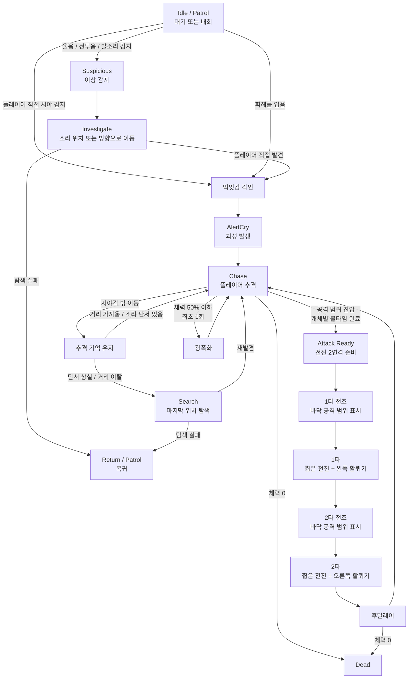

# P0.5 꿈식자 에너미 AI 및 컨셉 기획서 (v1.0.0)

> [!IMPORTANT]
> 이 문서는 검토 및 승인 전 단계의 최종 초안입니다.
> 기획자/PM의 검토 및 승인 후 이 배너를 제거하면 P0.5 확정 사양으로 인정합니다.

---

## 0. 기획 의도 (Design Intent)

- **목적**: 《침몽도시: 루시드 다이버》의 P0.5 기본 에너미인 꿈식자의 컨셉, AI 행동 구조, 감지 규칙, 전투 방식, 무리 반응 규칙을 정의하기 위한 기획서이다. P0.5 단계에서는 다양한 에너미를 여러 종 제작하기보다 기본 에너미 1종의 완성도를 높이는 것을 목표로 하며, 아이소메트릭 익스트랙션 환경에서 플레이어의 이동, 사격, 소음, 파밍, 탈출 판단을 압박하는 기본 위협체로 설계한다.
- **핵심 가치**: 꿈식자는 혼자 있을 때는 기본 전투를 학습시키는 근접형 에너미이며, 한 구역에 2~3마리 배치되었을 때는 소리, 탐색, 추격 기억, 전진형 공격을 통해 긴장감을 형성하는 침식체다. 플레이어의 정확한 좌표를 즉시 공유하지 않고, 소리와 이상 상황에 반응해 소리 발생 위치를 탐색한다.

---

## 1. 개요 (Overview)

| 항목 | 내용 |
|------|------|
| 기능명 | 꿈식자 에너미 AI 및 컨셉 |
| 대상 빌드 | P0.5 프로토타입 |
| 담당자 | 기획: 송예찬 / 개발: 송예찬 |
| 우선순위 | P0.5 |
| 상태 | 검토 대기 |
| 에너미 수 | 기본 에너미 1종 |
| 핵심 시스템 | 좁은 직접 인지, 넓은 소리 반응, 먹잇감 각인, 전진 2연격, 광폭화 |

---

## 1.5 P0 대비 확장 및 변경 명세 (P0 vs P0.5 Comparison)

P0 빌드 기준 문서([00_최종_P0_정의서.md](file:///c:/GitHubProjects/Document_LucidDiver/Document_LucidDiver/LucidDiver_Document/01_SSOT_최종_기준문서/00_최종_P0_정의서.md)) 및 시스템 구현 베이스라인 대비 P0.5의 핵심 확장/변경점은 다음과 같다.

| 기능 분류 | P0 기준 사양 (기존) | P0.5 확장 사양 (현재) | 변경 사유 및 기획 의도 |
| :--- | :--- | :--- | :--- |
| **체력 및 대미지** | - `enemyHP` (`int`, 최대 50) - 단일 대미지 1회 차감 | - `maxHp` (`float`, 최대 100.0) - 1타/2타 개별 대미지 적용 | - 소수점 대미지 연산 정밀화 - 전진 2연격 콤보 대미지 분리 |
| **행동 제어 (FSM)** | - `idle`, `detect`, `attack`, `hit`, `dead` (5개 상태) | - `Patrol`, `Suspicious`, `Investigate`, `AlertCry`, `Chase`, `AttackReady/Slash1/Slash2/Recovery`, `ChaseMemory`, `Search`, `Berserk`, `Dead` (14개 상태) | - 소리 조사, 각인 추격, 전조 2연격 및 광폭화 등 고도화된 전술 행동 묘사 |
| **타겟 탐색 및 인지** | - 정면 부채꼴 시야각 직접 탐지만 존재 - 시야 이탈 시 즉시 어그로 해제 | - 좁은 시야 직접 감지, 넓은 소리 감지, 후방/측면 근접 기척 인지 보정 | - 플레이어가 적 뒤를 빙글빙글 도는 꼼수 방지 - 소리 기반의 스텔스 플레이 및 구역 압박감 부여 |
| **무리 반응 규칙** | - 단독 또는 개별 반응 (주변 적 무반응) | - 한 개체의 괴성(`AlertCry`) 또는 소음을 주변 적들이 청각 감지해 소리 발생지로 단계적 합류 | - 군인처럼 전원의 실시간 좌표를 공유하지 않고, 굶주린 짐승처럼 울음/소리로 조사 접근하게 유도 |
| **전투 패턴** | - 공격 사거리 진입 시 즉시 1회성 제자리 공격 수행 | - 바닥 전조(Quad/Plane) 표시 후 직선 1타 및 방향 보정 2타 전진 연속 공격 (호밍 금지) | - 이동 사격을 하는 플레이어 압박 - 바닥 전조를 통해 플레이어에게 공정한 회피 및 반격 타이밍 제공 |
| **피격 및 경직** | - 피격 시 `hit` 상태로 즉시 전환 후 경직 애니메이션 재생 및 초기화 | - 피격 시 `HitReaction` / `CombatImpact` 소음을 발생시키고, 이동/선회 등의 로코모션 연출 중단을 개별 처리 | - 연격 및 광폭화 상태 중 피격으로 FSM이 강제 초기화되는 오동작 방지 및 공격 템포 유지 |

---

## 2. 상세 로직 및 프로세스 (Core Logic)

### 2.1 동작 플로우 (Flowchart)

### 2.2 규칙 및 조건 (Rules & Conditions)

#### 2.2.1 감지 및 인지 규칙 (Perception Rules)
- **직접 시야 감지**: 플레이어를 정확히 인지하여 `먹잇감 각인`을 활성화하는 조건으로, 감지 거리는 짧고 정면 기준 제한된 각도를 사용하며 Raycast로 벽 뒤 감지를 차단한다.
- **소리 감지**: 플레이어를 직접 추격하지 않고 이상 감지(`Suspicious`/`Investigate`) 상태로 전이시킨다. 소리의 성격(걷기, 달리기, 총격, 꿈식자 괴성, 피격/전투음 등. 스킬 소음은 P0.5 제외/확장 사양)에 따라 반응 범위가 달라지며, 플레이어의 좌표 대신 소리 발생지 좌표만을 제공하여 해당 방향을 탐색하게 한다.
- **근접 인지**: 플레이어가 꿈식자의 후방이나 측면에 있더라도, 일정 근접 반경(`proximityAwarenessRange` 이내)에 진입하면 기척을 인지하여 적 주변을 빙글빙글 돌며 어그로를 해제하는 꼼수를 차단한다.

#### 2.2.2 침식 울림 및 무리 반응 규칙 (Erosion Cry & Alert Rules)
- **침식 울림**: 플레이어를 최초 발견하거나 피격 시 괴성 (`Alert Cry`)을 유발하여 주변에 이상 상황(발생 위치, 방향, 반경)을 전파한다.
- **주변 개체 반응**: 울림을 들은 주변 개체는 소리 방향을 보고 짧게 움찔한 후 발생지로 이동하여 탐색을 진행하며, 플레이어를 직접 확인하기 전까지는 즉시 어그로가 끌리지 않는다.

#### 2.2.3 먹잇감 각인 및 추격 기억 규칙 (Target Locking & Chase Memory)
- **먹잇감 각인**: 플레이어 발견 또는 피해 시 대상이 각인되며, 일시적으로 시야를 벗어나거나 꿈식자의 뒤쪽으로 돌아가더라도 즉시 추격이 해제되지 않는다.
- **추격 유지**: `추격 유지 거리 이내`, `마지막 위치 추적 중`, `추가 소리 단서(발소리/사격음 등) 발생`, `근접 인지 범위 유지`, `지속 피해` 조건 중 하나라도 만족하면 추격을 지속한다.
- **추격 해제**: 일정 시간 직접 시야 상실, 추격 유지 거리 밖 이탈, 추가 소리 단서 부재, 마지막 위치 탐색 실패가 모두 누적되었을 때에만 추격을 해제하고 복귀한다.

#### 2.2.4 전투 및 공격 규칙 (Combat Rules)
- **공격 쿨타임**: 군집 단위로 공격권을 공유하지 않으며, 각 개체별로 완전히 독립적인 쿨타임을 관리하고 범위 진입 시 시도한다. (다만, 플레이 테스트에 따라 공격 겹침 보정은 QA 조정 항목으로 둔다.)
- **전진 2연격 (기본 공격)**: 플레이어 방향으로 1타(왼쪽 할퀴기) 및 2타(오른쪽 할퀴기)를 각각 짧은 전진과 바닥 전조 범위를 표시하며 연속으로 수행한다.
- **호밍 금지 및 2타 보정 제한**: 공격이 시작되면 전조 표시 방향으로만 전진(직선형 공격)하며, 플레이어 추적(호밍)은 차단된다. 단, 2타 시작 전 플레이어 위치에 맞춰 제한된 각도(최대 25도) 내에서 방향을 보정할 수 한다.
- **광폭화**: 체력이 50% 이하가 되면 개체별 최초 1회 발동하며, 몸이 뒤틀리고 왜곡 노이즈가 발생하는 연출과 함께 이동 속도(15~20% 증가), 전조 시간 단축, 전진 거리 증가, 후딜레이 감소 효과를 적용한다.

---

## 3. 데이터 명세 (Data Specification)

### 3.1 기본 스탯 및 스탯 보정 데이터
| 기획 명칭 | 변수명 | 타입 | 기본값 | 비고 |
|-----------|-------------|-----------------|--------|------|
| 체력 | `maxHp` | `float` | 100.0 | 에너미 최대 체력 |
| 이동 속도 일반 | `normalMoveSpeed` | `float` | 3.2 | 플레이어보다 느리게 설정 |
| 이동 속도 광폭 | `berserkMoveSpeed` | `float` | 3.8 | 약 18% 증가 |
| 시야 감지 거리 | `sightRange` | `float` | 5.5 | 직접 인지 범위 |
| 시야 감지 각도 | `sightAngle` | `float` | 100.0 | 전방 기준 |
| 근접 인지 반경 | `proximityAwarenessRange` | `float` | 1.8 | 후방/측면 근접 보정 |
| 광폭화 체력 임계값 | `berserkHpThreshold` | `float` | 0.5 | 체력 50% 이하 |

### 3.2 소리 감지 데이터
| 기획 명칭 | 변수명 | 타입 | 기본값 | 비고 |
|-----------|-------------|-----------------|--------|------|
| 걷기 소리 감지 범위 | `walkNoiseRange` | `float` | 2.5 | 조용한 이동 |
| 달리기 소리 감지 범위 | `runNoiseRange` | `float` | 6.0 | 빠른 이동 |
| 총격 소리 감지 범위 | `gunNoiseRange` | `float` | 16.0 | 구역 단위 반응 |
| 스킬 소리 감지 범위 [확장] | `skillNoiseRange` | `float` | 15.0 | [P0.5 제외 / 확장 사양] 루시드 파장 포함 |
| 괴성 전파 범위 | `alertCryRange` | `float` | 13.0 | 침식 울림 반경 |
| 소리 반응 딜레이 | `soundReactionDelay` | `float` | 0.4~1.2 | 개체별 랜덤 적용 |

### 3.3 추격 기억 데이터
| 기획 명칭 | 변수명 | 타입 | 기본값 | 비고 |
|-----------|-------------|-----------------|--------|------|
| 추격 유지 거리 | `chaseMemoryRange` | `float` | 11.0 | 이 거리 안에서는 시야각 밖이어도 추격 유지 |
| 최대 추격 거리 | `leashRange` | `float` | 17.0 | 이탈 시 복귀 판단 |
| 시야 상실 유예 시간 | `lostSightGraceTime` | `float` | 2.5 | 즉시 어그로 해제 방지 |
| 마지막 위치 탐색 시간 | `searchDuration` | `float` | 4.0 | 마지막 위치 주변 탐색 |
| 소리 기억 추가 시간 | `noiseMemoryAddTime` | `float` | 1.5 | 소리 단서 발생 시 추격 기억 연장 |

### 3.4 전진 2연격 및 광폭화 보정 데이터
| 기획 명칭 | 변수명 | 타입 | 기본값 | 비고 |
|-----------|-------------|-----------------|--------|------|
| 공격 시작 거리 | `attackStartRange` | `float` | 2.3 | 공격 가능 거리 |
| 1타 전조 시간 | `firstSlashTelegraphTime` | `float` | 0.35 | 1타 바닥 전조 표시 시간 |
| 2타 전조 시간 | `secondSlashTelegraphTime` | `float` | 0.25 | 2타 바닥 전조 표시 시간 |
| 1타 전진 거리 | `firstSlashLungeDistance` | `float` | 1.0 | 1타 이동 거리 |
| 2타 전진 거리 | `secondSlashLungeDistance` | `float` | 0.8 | 2타 이동 거리 |
| 1타 공격 폭 | `firstSlashWidth` | `float` | 1.2 | 바닥 전조 및 판정 폭 |
| 2타 공격 폭 | `secondSlashWidth` | `float` | 1.2 | 바닥 전조 및 판정 폭 |
| 1타 피해량 | `firstSlashDamage` | `float` | 5.0 | 1타 피해 |
| 2타 피해량 | `secondSlashDamage` | `float` | 6.0 | 2타 피해 |
| 연격 간격 | `comboInterval` | `float` | 0.15 | 1타 후 2타까지 간격 |
| 공격 후딜레이 | `attackRecoveryTime` | `float` | 0.65 | 공격 종료 후 딜레이 |
| 2타 방향 보정 각도 | `secondSlashTurnLimit` | `float` | 25.0 | 2타 전 보정 가능 각도 |
| 공격 쿨타임 | `attackCooldown` | `float` | 1.2 | 개체별 관리 |
| 광폭 이동 속도 배율 | `berserkMoveSpeedMultiplier` | `float` | 1.18 | 이동 속도 증가 배율 |
| 광폭 전조 시간 배율 | `berserkTelegraphMultiplier` | `float` | 0.8 | 전조 시간 감소 배율 |
| 광폭 전진 거리 배율 | `berserkLungeMultiplier` | `float` | 1.15 | 전진 거리 증가 배율 |
| 광폭 후딜레이 배율 | `berserkRecoveryMultiplier` | `float` | 0.85 | 후딜레이 감소 배율 |

---

## 4. UI/UX 및 아이소메트릭 연출 사양 (Presentation Rules)

아이소메트릭 환경의 시인성을 극대화하기 위해 꿈식자의 상태 변화를 직관적인 연출로 표현한다.

| 상황 | 애니메이션 및 이펙트 연출 | 사운드 연출 |
|------|---------------------------|-------------|
| **직접 발견** | 머리가 플레이어 방향으로 고정됨 | 날카로운 인지음 |
| **괴성 발생** | 몸을 펴고 파동 이펙트 방출 | 괴성 |
| **이상 감지** | 고개를 소리 방향으로 돌림 | 낮은 으르렁거림 |
| **탐색** | 느리게 걸으며 주변을 두리번거림 | 불규칙한 발소리 |
| **추격** | 자세를 낮추고 빠르게 이동 | 거친 호흡음 |
| **1타 전조** | 바닥에 짧은 화살표형 범위 표시 | 공격 준비음 |
| **1타 공격** | 짧게 전진하며 왼쪽 할퀴기 | 날카로운 긁힘 |
| **2타 전조** | 바닥에 두 번째 화살표형 범위 표시 | 짧은 재가속음 |
| **2타 공격** | 다시 전진하며 오른쪽 할퀴기 | 두 번째 긁힘 |
| **후딜레이** | 몸이 앞으로 쏠린 뒤 잠깐 멈춤 | 낮은 숨소리 |
| **광폭화** | 노이즈, 균열 발광, 몸 뒤틀림 | 날카로운 비명 |
| **추격 기억 유지** | 몸을 돌려 다시 플레이어 방향을 찾음 | 낮은 호흡음 |

### 4.1 바닥 전조 표시 상세
- **형태**: 화살표 방향과 함께 얇은 범위 영역이 보여야 공격 폭을 알기 쉽다. (예: `[꿈식자] ======>` 혹은 `▷▷▷▷▷`)
- **구현 제안**: P0.5 단계에서는 구현 난이도와 안전성을 위해 투명 텍스처를 바닥에 임시 배치하는 **Quad / Plane 프리팹 방식**을 우선 권장한다.

### 4.2 직접 인지 시야각 및 시야 반경 시각화 사양 (Vision Indicator)
- **목적**: 아이소메트릭 쿼터뷰 시점에서 플레이어가 꿈식자의 감지 영역을 명확히 파악하고 우회할 수 있도록 인게임에서 시각화 힌트를 제공한다.
- **주요 규칙**:
  - 꿈식자의 전방 정면 각도(`sightAngle`)와 직접 인지 거리(`sightRange`)를 결합하여 부채꼴 형태의 붉은 선형 범위 또는 반투명 영역으로 바닥에 출력한다.
  - 플레이어가 감지 범위 밖에서 조용히 움직일 때와 범위 안으로 들어설 때의 위험 감각을 시각적으로 전달한다.
  - 상태 변화(Idle ➡️ Suspicious/Investigate ➡️ Chase)에 따라 시각화 연출의 농도나 색상을 점진적으로 강화하여 경계 분위기를 조성한다.

---

## 5. 연동 시스템 (Dependencies)

| 연동 대상 | 관계 | 비고 |
|-----------|------|------|
| **Enemy State Machine** | Idle, Patrol, Chase, Attack 등 에너미 상태 관리 | 상태 관리 코어 시스템 |
| **Noise System** | 울음, 발소리, 전투음 감지 처리 | Suspicious / Investigate 전환 연동 |
| **Damage System** | 피격, 사망 처리 및 체력 50% 이하 체크 | 광폭화 발동 연동 |
| **Perception System** | 시야 감지, 근접 기척 감지 처리 | 최초 인지 및 재인지 판정 |
| **Chase Memory System** | 먹잇감 각인 및 추격 유지/해제 관리 | 시야각 바깥 움직임 어그로 처리 |
| **VFX System** | 바닥 전조 데칼 및 광폭화 이펙트 출력 | 시인성 확보용 시각효과 |
| **Sound Manager** | 상태별 사운드 재생 | 몰입감 확보용 음향효과 |
| **Photon PUN2** | 멀티플레이 동기화 | 추후 확장 고려 |

---

## 6. 주의 사항 및 제약

- **시야각 어그로 편법 차단**: 플레이어가 꿈식자의 시야각 바깥으로 단순 이동하거나 뒤쪽으로 도는 것만으로 어그로가 풀리지 않아야 한다. 반드시 추격 기억과 근접 인지 규칙을 활용해 유지한다.
- **소리 감지와 직접 추격의 독립성**: 소리를 감지했을 때는 플레이어 좌표로 즉시 달리지 않고 소리 발생 위치로 가 탐색하도록 설계한다.
- **공격 쿨타임 독립성**: 꿈식자는 군집 공유 쿨타임을 사용하지 않으며, 각 개체별로 완전히 독립적으로 쿨타임을 계산한다.
- **전조와 판정의 엄밀함**: 바닥에 표시된 전조 범위와 실제 피격 물리 판정(폭, 거리)은 정확히 일치하여 유저가 억울하게 맞지 않게 해야 한다.
- **광폭화 보정의 밸런스**: 광폭화는 기본 속성 강화일 뿐 새로운 보스 기믹이 아니므로, 유저가 대응 불가능할 수준으로 오버스펙화되지 않게 통제한다.

---

## 7. 전투 및 탐색 시나리오 예시 (Examples)

### 7.1 조용히 접근하는 경우
1. 플레이어가 꿈식자 구역에 진입한다.
2. 꿈식자 A, B, C는 각각 다른 위치에 배치되어 있다.
3. 플레이어가 시야각을 피하고 조용히 이동한다.
4. 직접 시야 범위가 좁기 때문에 모든 꿈식자가 즉시 반응하지 않는다.
5. 플레이어는 전투 없이 몽유물에 접근하거나 일부 개체만 상대할 수 있다.

### 7.2 소음을 낸 경우
1. 플레이어가 총격을 사용한다.
2. 총격 소리가 구역 전체에 퍼진다.
3. 꿈식자 A, B, C가 소리 발생 위치를 감지한다.
4. 이들은 플레이어의 현재 좌표를 아는 것이 아니라, 소리 발생 위치로 이동한다.
5. 이동 중 플레이어를 직접 발견한 개체만 추격에 합류한다.
6. 플레이어가 계속 소리를 내면 구역 전체가 점점 위험해진다.

### 7.3 한 개체에게 발각된 경우
1. 플레이어가 꿈식자 A의 직접 시야에 들어온다.
2. A는 플레이어를 먹잇감으로 각인한다.
3. A가 괴성을 지른다.
4. A는 플레이어를 추격한다.
5. B와 C는 괴성을 듣고 소리 위치로 이동한다.
6. B와 C는 플레이어를 직접 발견하기 전까지 정확 추격하지 않는다.

### 7.4 플레이어가 꿈식자 주위를 도는 경우
1. 꿈식자 A가 플레이어를 발견하고 추격을 시작한다.
2. 플레이어가 A의 시야각 밖으로 돌아간다.
3. A는 즉시 어그로를 해제하지 않는다.
4. A는 먹잇감 각인과 근접 인지 반경을 기준으로 플레이어를 계속 추적한다.
5. 플레이어가 충분히 멀어지고, 소리 단서도 없고, 마지막 위치 탐색까지 실패해야 추격이 해제된다.

---

## 📜 Revision History

| 날짜 | 버전 | 내용 | 작성자 |
|------|------|------|--------|
| 2026-07-01 | v1.0.0 | 꿈식자 에너미 AI 및 컨셉 기획서 초안 작성 | 송예찬 |
| 2026-07-01 | v1.0.0 | 별도 돌진 패턴 제거, 기본 공격을 바닥 전조 기반 전진 2연격으로 수정 | 송예찬 |
| 2026-07-01 | v1.0.0 | 군집 공유 쿨타임 제거, 좁은 직접 인지/넓은 소리 감지 구조 추가, 먹잇감 각인 및 추격 기억 규칙 추가 | 송예찬 |
