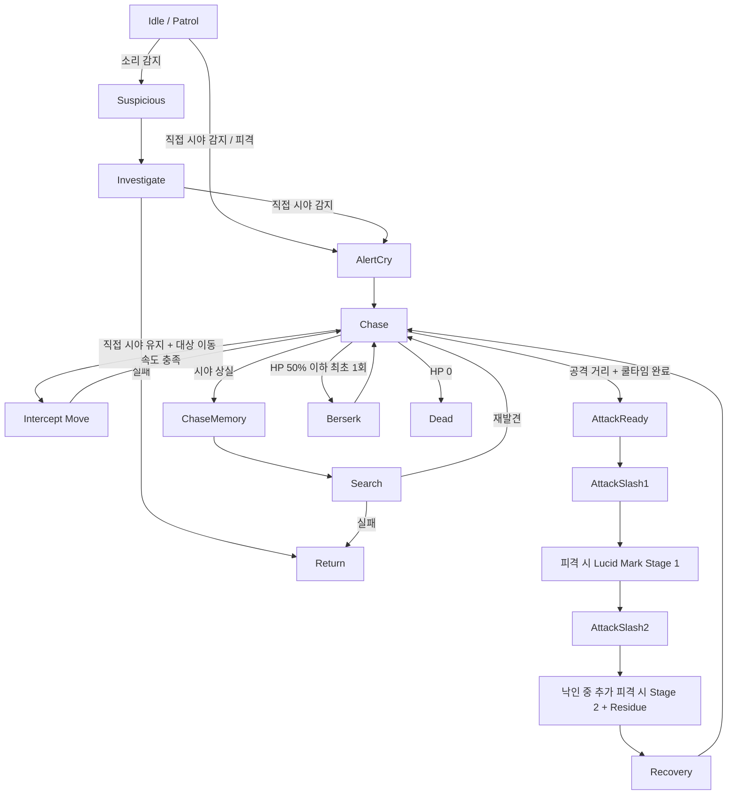
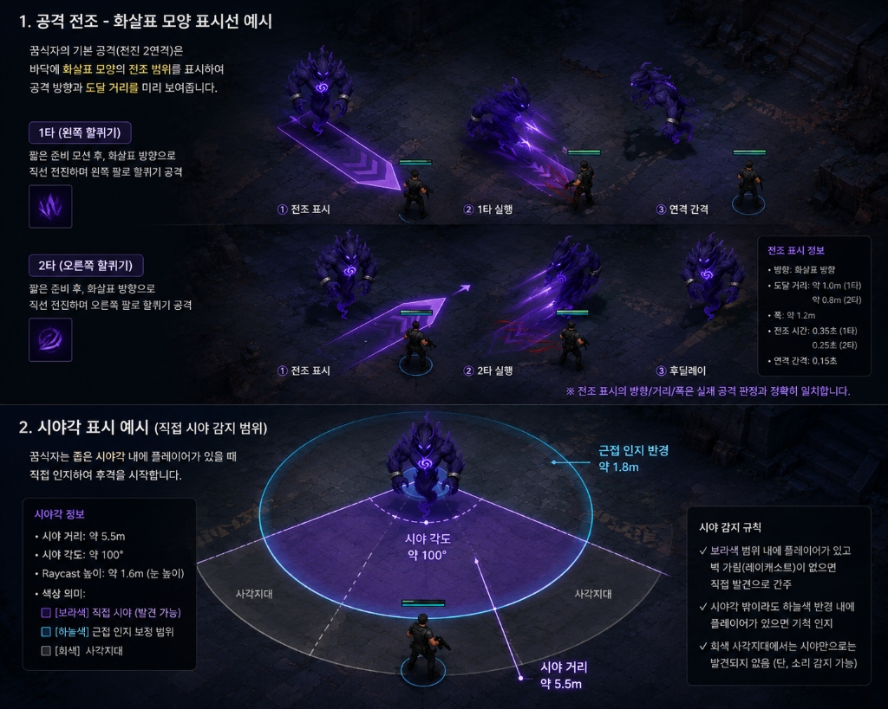

# P0.5 꿈식자 에너미 연동 명세서 (v1.0.1)

> [!IMPORTANT]
> 이 문서는 AI(Antigravity)가 작성한 초안입니다.
> 기획자/PM의 검토 및 승인 후 이 배너를 제거하면 '확정 사양'으로 인정됩니다.

---

## 0. 기획 의도 (Design Intent)

- **목적**: `꿈식자 에너미 AI 및 컨셉 기획서 (v1.0.1)`를 현재 프로젝트의 기본 에너미 구현에 실제로 연결하기 위해 필요한 기술 명세를 정의한다.
- **핵심 가치**: 기존의 단일 추적형 적 구조(`EnemyStatus`, `EnemyMovement`)를 모듈형 상태 머신 구조로 확장하여, `먹잇감 차단 이동`과 `루시드 낙인`까지 포함한 P0.5 사양을 구현 가능하게 만든다.

---

## 1. 개요 (Overview)

| 항목 | 내용 |
|------|------|
| 기능명 | 꿈식자 에너미 연동 명세 |
| 대상 빌드 | P0.5 프로토타입 |
| 우선순위 | P0.5 |
| 상태 | 검토 대기 |
| 연동 대상 | `Enemy.prefab`, `EnemyStatus`, `EnemyMovement`, `GlobalEventBus`, `PlayerWeapon`, `PlayerStatus`, `SpawnManager` 등 |

---

## 2. 상세 로직 및 프로세스 (Core Logic)

### 2.1 AI 상태 머신 플로우 (State Machine Flow)



### 2.2 규칙 및 조건 (Rules & Conditions)

#### 2.2.1 감지 및 인지 규칙 (Perception Rules)

| 규칙 ID | 설명 |
|---|---|
| `PER-001` | 시야 거리, 시야각, 장애물 가림 조건을 모두 충족할 때만 직접 인지한다. |
| `PER-002` | 소리 감지는 즉시 추격이 아니라 `Suspicious -> Investigate`로만 연결한다. |
| `PER-003` | 후방/측면이라도 `proximityAwarenessRange` 이내면 근접 기척을 인지할 수 있다. |

#### 2.2.2 먹잇감 차단 이동 규칙 (Intercept Rules)

| 규칙 ID | 설명 |
|---|---|
| `INT-001` | `Chase` 상태에서 직접 시야를 유지 중이고, 플레이어 이동 속도가 기준 이상일 때만 차단 이동 보정을 사용한다. |
| `INT-002` | 차단 이동 목표점은 `현재 위치 + 이동 벡터 * interceptPredictionTime` 기반으로 계산하되, 최대 오프셋 거리를 제한한다. |
| `INT-003` | 차단 이동은 짧은 미래 위치 예측만 허용하며, 조사 상태나 탐색 상태에서는 사용하지 않는다. |
| `INT-004` | 차단 이동은 예지처럼 보이지 않도록 갱신 주기와 보정량을 제한한다. |

#### 2.2.3 루시드 낙인 규칙 (Lucid Mark Rules)

| 규칙 ID | 설명 |
|---|---|
| `LMK-001` | 꿈식자의 공격에 피격된 플레이어는 `루시드 낙인 1단계` 상태가 된다. |
| `LMK-002` | 낙인 지속 중 추가 피격을 받으면 `루시드 낙인 2단계`로 강화된다. |
| `LMK-003` | 낙인 지속 중에는 꿈식자가 플레이어를 더 오래 기억하며, 추격 해제가 어려워진다. |
| `LMK-004` | 2단계 강화 시 피격 위치에 `루시드 잔향`이 생성되며, 주변 꿈식자는 이를 소리 단서처럼 조사한다. |
| `LMK-005` | 루시드 낙인은 이동 속도 감소, 긴 경직, 상호작용 강제 취소를 발생시키지 않는다. |
| `LMK-006` | 낙인 적용 시 화면 외곽을 어둡게 하는 비네팅(Vignette) 효과가 단계별로 차등 인가(1단계: 0.35, 2단계: 0.70)되어, 손전등 범위 외의 주변 시인성을 크게 제한한다. |

#### 2.2.4 전투 규칙 (Combat Rules)

| 규칙 ID | 설명 |
|---|---|
| `ATK-001` | 각 꿈식자는 독립적인 공격 쿨타임을 가진다. |
| `ATK-002` | 1타/2타는 전조 후 직선 전진 공격으로 수행되며, 2타만 제한된 각도 보정이 가능하다. |
| `ATK-003` | 루시드 낙인 적용 판정은 꿈식자 공격의 실제 피격 성공 시에만 발생한다. |
| `BRK-001` | HP 50% 이하에서 광폭화는 개체별 1회만 발동한다. |

---

## 3. 데이터 명세 (Data Specification)

### 3.1 기본 및 추격 데이터

| 분류 | 변수명 | 타입 | 설명 |
|---|---|---|---|
| 스탯 | `maxHp` | `float` | 최대 체력 |
| 이동 | `normalMoveSpeed` | `float` | 기본 이동 속도 |
| 인지 | `sightRange` | `float` | 직접 시야 거리 |
| 인지 | `sightAngle` | `float` | 직접 시야 각도 |
| 인지 | `proximityAwarenessRange` | `float` | 근접 인지 반경 |
| 추격 | `chaseMemoryRange` | `float` | 추격 유지 거리 |
| 추격 | `leashRange` | `float` | 최대 추격 거리 |
| 추격 | `lostSightGraceTime` | `float` | 시야 상실 유예 시간 |
| 추격 | `searchDuration` | `float` | 마지막 위치 탐색 시간 |
| 추격 | `noiseMemoryAddTime` | `float` | 추가 소리 단서 시 연장 시간 |

### 3.2 먹잇감 차단 이동 데이터

| 분류 | 변수명 | 타입 | 설명 |
|---|---|---|---|
| 차단 이동 | `interceptPredictionTime` | `float` | 미래 위치 예측 시간 |
| 차단 이동 | `maxInterceptOffsetDistance` | `float` | 최대 차단 오프셋 거리 |
| 차단 이동 | `interceptMinTargetSpeed` | `float` | 적용 최소 대상 속도 |
| 차단 이동 | `interceptUpdateInterval` | `float` | 차단 이동 갱신 주기 |
| 차단 이동 | `useInterceptOnlyWhenVisible` | `bool` | 직접 시야 유지 중에만 사용 여부 |

### 3.3 루시드 낙인 데이터

| 낙인 | `lucidMarkDuration` | `float` | 1단계 낙인 지속 시간 |
| 낙인 | `lucidMarkStage2Duration` | `float` | 2단계 낙인 지속 시간 |
| 낙인 | `lucidMarkMemoryBonusTime` | `float` | 추격 기억 추가 시간 |
| 낙인 | `lucidMarkLeashBonusDistance` | `float` | 최대 추격 거리 추가값 |
| 낙인 | `lucidMarkVignetteIntensityStage1` | `float` | 1단계 외곽 비네팅 시야 차단 강도 (기본값: 0.35) |
| 낙인 | `lucidMarkVignetteIntensityStage2` | `float` | 2단계 외곽 비네팅 시야 차단 강도 (기본값: 0.70) |
| 잔향 | `lucidResidueDuration` | `float` | 잔향 지속 시간 |
| 잔향 | `lucidResidueInvestigateRange` | `float` | 주변 적 조사 유도 반경 |

### 3.4 전투 및 광폭화 데이터

| 분류 | 변수명 | 타입 | 설명 |
|---|---|---|---|
| 공격 | `attackStartRange` | `float` | 공격 시작 거리 |
| 공격 | `attackCooldown` | `float` | 개체별 공격 쿨타임 |
| 공격 | `firstSlashDamage` | `float` | 1타 피해량 |
| 공격 | `secondSlashDamage` | `float` | 2타 피해량 |
| 공격 | `secondSlashTurnLimit` | `float` | 2타 방향 보정 한계 |
| 광폭 | `berserkHpThreshold` | `float` | 광폭화 발동 HP 비율 |

---

## 4. 연동 시스템 (Dependencies)

### 4.1 이벤트 시스템 및 소리 타입 명세 (`GlobalEventBus`)

```csharp
public enum NoiseType
{
    Walk,
    Run,
    Gunshot,
    EnemyAlertCry,
    HitReaction,
    CombatImpact,
    LucidResidue
}
```

#### 필수 연동 이벤트

| 이벤트명 | 발신 컴포넌트 | 수신 컴포넌트 | 페이로드 |
|---|---|---|---|
| `OnNoiseEmitted` | `PlayerMovement`, `PlayerWeapon`, `EnemyBrain`, `LucidResidueEmitter` | `EnemyNoiseListener` | `Vector3 position, NoiseType type, float range, GameObject source` |
| `OnEnemyAlertCry` | `EnemyBrain` | 주변 `EnemyBrain` | `int enemyId, Vector3 position, Vector3 forward, float range` |
| `OnEnemyStateChanged` | `EnemyBrain` | `EnemyPresentation` | `int enemyId, EnemyAiState prev, EnemyAiState next` |
| `OnLucidMarkApplied` | `EnemyCombat` | `PlayerLucidMarkReceiver`, UI/VFX | `int playerId, int stage, float duration` |
| `OnLucidMarkUpgraded` | `EnemyCombat` | `PlayerLucidMarkReceiver`, UI/VFX | `int playerId, int stage, float duration` |
| `OnLucidResidueSpawned` | `PlayerLucidMarkReceiver` 또는 `EnemyCombat` | `EnemyNoiseListener`, VFX | `Vector3 position, float duration, float range` |

### 4.2 컴포넌트 책임 분리 명세

| 컴포넌트명 | 책임 범위 | 비고 |
|---|---|---|
| `EnemyStatus` | HP, 사망, 광폭화 발동 조건 확인 | 기존 코드 확장 |
| `EnemyBrain` | FSM 상태 관리, 타이머, 차단 이동 사용 여부 판단 | 신규 생성 |
| `EnemyPerception` | 시야 범위, 시야각, 근접 인지 체크 | 신규 생성 |
| `EnemyNoiseListener` | `OnNoiseEmitted` 수신 및 조사 목표 갱신 | 신규 생성 |
| `EnemyChaseMemory` | 마지막 위치, 추격 유지/해제, 낙인 대상 보정 | 신규 생성 |
| `EnemyCombat` | 1타/2타 전조, 전진 공격, 루시드 낙인 적용 | 신규 생성 |
| `EnemyLocomotion` | NavMesh 이동, 회전, 차단 이동 목표점 접근 | 기존 `EnemyMovement` 축소 버전 |
| `EnemyPresentation` | 애니메이션, VFX, SFX 호출 | 신규 생성 |
| `PlayerLucidMarkReceiver` | 플레이어 낙인 단계, 지속 시간, 잔향 발생 처리 | 신규 생성 |
| `LucidResidueEmitter` | 잔향 시각효과 및 조사 단서 송신 | 신규 생성 또는 `PlayerLucidMarkReceiver` 내부 처리 |

### 4.3 런타임 식별자 바인딩 사양

- **`ID-001`**: 적 스폰 시 `GlobalRuntimeData.CountingEnemyData()` 반환 ID를 `EnemyStatus.objID` 및 `EntityIdentity.entityID`에 일관되게 바인딩한다.
- **`ID-002`**: 플레이어 루시드 낙인 대상 지정 시 플레이어 ID를 일관되게 사용한다.
- **`ID-003`**: UI와 디버그 시스템은 전달된 대상 ID가 일치할 때만 갱신한다.

---

## 5. UI/UX 및 프리팹 셋업



### 5.1 프리팹 구성 필수 컴포넌트 (`Enemy.prefab`)

- `Animator`, `NavMeshAgent`, `Collider`
- `EnemyStatus`, `EnemyBrain`, `EnemyPerception`, `EnemyNoiseListener`, `EnemyChaseMemory`, `EnemyCombat`, `EnemyPresentation`, `EntityIdentity`
- **공격 기준점 Transform**
- **AudioSource**
- **전조용 Quad / Plane 프리팹**

### 5.2 플레이어 측 추가 권장 요소

- `PlayerLucidMarkReceiver`
- 낙인 1단계 / 2단계 표시용 VFX 또는 UI 힌트
- 루시드 잔향용 짧은 잔재 프리팹

---

## 6. 주의 사항 및 제약

- **차단 이동의 공정성**: 차단 이동은 플레이어의 현재 좌표를 완전히 무시하는 예지형 이동이 되어서는 안 된다.
- **루시드 낙인의 역할 제한**: 낙인은 조작권 박탈 디버프가 아니라 반복 피격 압박 요소여야 한다.
- **잔향의 역할 제한**: 루시드 잔향은 조사 단서이며, 즉시 광역 경보나 확정 발각 장치가 아니다.
- **전조와 판정의 일치**: 전조 표시와 실제 공격 판정은 일치해야 한다.

---

## 7. QA 인수 기준 (Acceptance Criteria)

| ID | 인수 조건 |
|---|---|
| `QA-001` | 적은 시야 거리, 시야각, 장애물 가림 조건을 모두 충족할 때만 플레이어를 직접 감지한다. |
| `QA-002` | 먹잇감 차단 이동은 플레이어가 이동 중일 때만 짧게 작동하며, 과도한 예지처럼 보이지 않는다. |
| `QA-003` | 차단 이동 없이 단순 현재 위치만 추적하던 기존 체감보다 추격 품질이 개선된다. |
| `QA-004` | 꿈식자의 공격에 피격된 플레이어는 루시드 낙인 1단계를 부여받는다. |
| `QA-005` | 낙인 지속 중 추가 피격 시 2단계로 강화되고, 피격 위치에 루시드 잔향이 생성된다. |
| `QA-006` | 루시드 잔향은 주변 꿈식자를 조사 상태로 유도한다. |
| `QA-007` | 루시드 낙인은 이동 속도 감소, 긴 경직, 상호작용 강제 취소를 발생시키지 않는다. |
| `QA-008` | 낙인 대상은 평소보다 더 오래 추격되며, 추격 해제가 어려워진다. |
| `QA-009` | 동적으로 스폰된 적과 플레이어 ID가 이벤트 및 UI에 일관되게 반영된다. |
| `QA-010` | 루시드 낙인 1단계 및 2단계 중첩 시 화면 외곽 비네팅(어둠 왜곡) 강도가 설정 수치에 맞게 실시간 연동되어 스크린 시인성이 감소하는지 확인한다. |

---

## 📜 Revision History

| 날짜 | 버전 | 내용 | 작성자 |
|------|------|------|--------|
| 2026-07-01 | v1.0.0 | 꿈식자 에너미 연동 명세서 초판 작성 | 송예찬 |
| 2026-07-01 | v1.0.1 | 먹잇감 차단 이동 규칙 추가, 루시드 낙인 및 잔향 조사 시스템 추가 | AI(Antigravity) |
