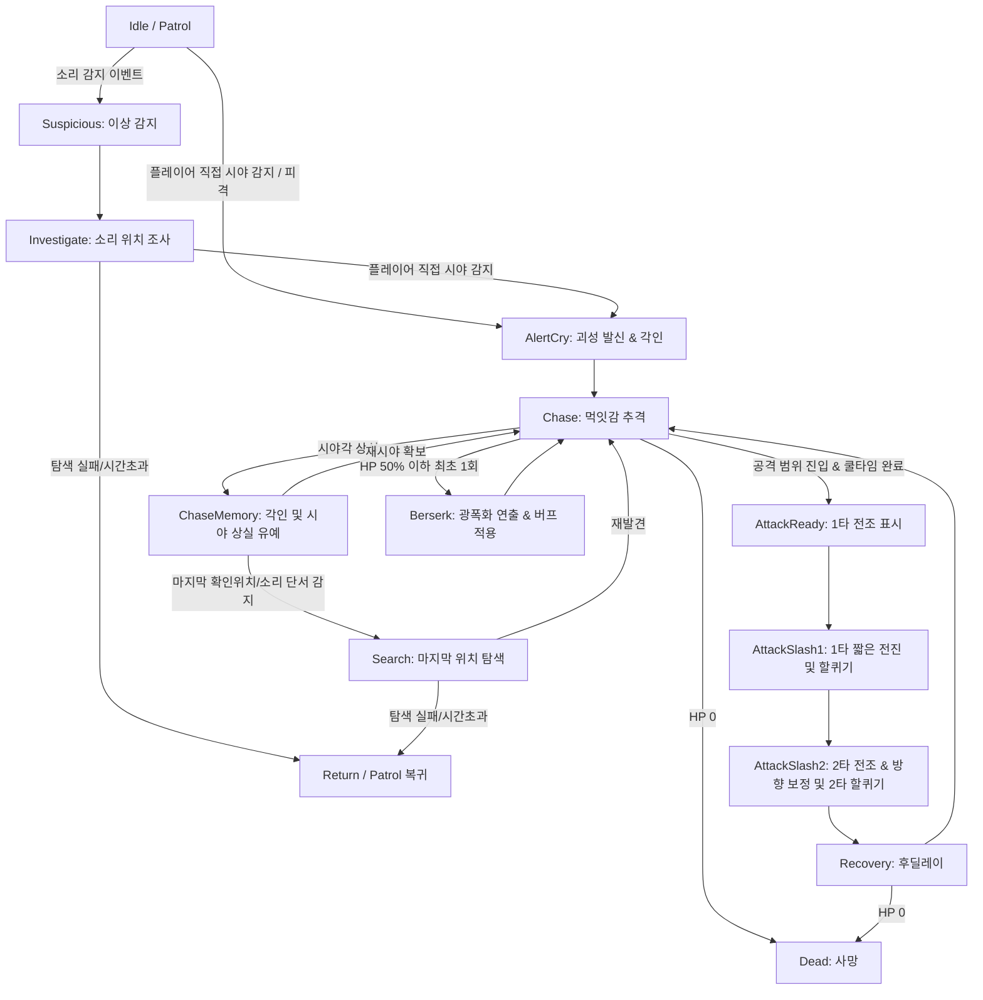

# P0.5 꿈식자 에너미 연동 명세서 (v1.0.0)

> [!IMPORTANT]
> 이 문서는 AI(Antigravity)가 작성한 초안입니다.
> 기획자/PM의 검토 및 승인 후 이 배너를 제거하면 '확정 사양'으로 인정됩니다.

---

## 0. 기획 의도 (Design Intent)

- **목적**: `꿈식자 에너미 AI 및 컨셉 기획서 (v1.0.0)`를 현재 프로젝트의 기본 에너미 구현에 실제로 연결하기 위해 필요한 기술 명세를 정의한다. 본 명세는 기획적 요구 사항을 개발자가 바로 작업 가능한 수준의 구현 단위로 구조화하는 데 초점을 맞춘다.
- **핵심 가치**: 기존의 단일 추적형 적 구조(`EnemyStatus`, `EnemyMovement`)를 모듈형 상태 머신 구조로 확장하여, `소리 감지`, `조사`, `먹잇감 각인`, `추격 기억`, `괴성 전파`, `전진 2연격`, `광폭화` 시스템을 유기적으로 연동한다.

---

## 1. 개요 (Overview)

| 항목 | 내용 |
|------|------|
| 기능명 | 꿈식자 에너미 연동 명세 |
| 대상 빌드 | P0.5 프로토타입 |
| 담당자 | 기획: 송예찬 / 개발: 송예찬 |
| 우선순위 | P0.5 |
| 상태 | 검토 대기 |
| 연동 대상 | `Enemy.prefab`, `EnemyStatus`, `EnemyMovement`, `GlobalEventBus`, `PlayerWeapon`, `SpawnManager` 등 |

---

## 1.5 P0 대비 확장 및 변경 명세 (P0 vs P0.5 Comparison)

P0 빌드 기준 문서([00_최종_P0_정의서.md](file:///c:/GitHubProjects/Document_LucidDiver/Document_LucidDiver/LucidDiver_Document/01_SSOT_최종_기준문서/00_최종_P0_정의서.md)) 및 시스템 구현 베이스라인 대비 P0.5의 핵심 확장/변경점은 다음과 같다.

| 기능 분류 | P0 기준 사양 (기존) | P0.5 확장 사양 (현재) | 변경 사유 및 기획 의도 |
| :--- | :--- | :--- | :--- |
| **체력 및 대미지** | - `enemyHP` (`int`, 최대 50)<br>- 단일 대미지 1회 차감 | - `maxHp` (`float`, 최대 100.0)<br>- 1타/2타 개별 대미지 적용 | - 소수점 대미지 연산 정밀화<br>- 전진 2연격 콤보 대미지 분리 |
| **행동 제어 (FSM)** | - `idle`, `detect`, `attack`, `hit`, `dead` (5개 상태) | - `Patrol`, `Suspicious`, `Investigate`, `AlertCry`, `Chase`, `AttackReady/Slash1/Slash2/Recovery`, `ChaseMemory`, `Search`, `Berserk`, `Dead` (14개 상태) | - 소리 조사, 각인 추격, 전조 2연격 및 광폭화 등 고도화된 전술 행동 묘사 |
| **타겟 탐색 및 인지** | - 정면 부채꼴 시야각 직접 탐지만 존재<br>- 시야 이탈 시 즉시 어그로 해제 | - 좁은 시야 직접 감지, 넓은 소리 감지, 후방/측면 근접 기척 인지 보정 | - 플레이어가 적 뒤를 빙글빙글 도는 꼼수 방지<br>- 소리 기반의 스텔스 플레이 및 구역 압박감 부여 |
| **무리 반응 규칙** | - 단독 또는 개별 반응 (주변 적 무반응) | - 한 개체의 괴성(`AlertCry`) 또는 소음을 주변 적들이 청각 감지해 소리 발생지로 단계적 합류 | - 군인처럼 전원의 실시간 좌표를 공유하지 않고, 굶주린 짐승처럼 울음/소리로 조사 접근하게 유도 |
| **전투 패턴** | - 공격 사거리 진입 시 즉시 1회성 제자리 공격 수행 | - 바닥 전조(Quad/Plane) 표시 후 직선 1타 및 방향 보정 2타 전진 연속 공격 (호밍 금지) | - 이동 사격을 하는 플레이어 압박<br>- 바닥 전조를 통해 플레이어에게 공정한 회피 및 반격 타이밍 제공 |
| **피격 및 경직** | - 피격 시 `hit` 상태로 즉시 전환 후 경직 애니메이션 재생 및 초기화 | - 피격 시 `HitReaction` / `CombatImpact` 소음을 발생시키고, 이동/선회 등의 로코모션 연출 중단을 개별 처리 | - 연격 및 광폭화 상태 중 피격으로 FSM이 강제 초기화되는 오동작 방지 및 공격 템포 유지 |

---

## 2. 상세 로직 및 프로세스 (Core Logic)

### 2.1 AI 상태 머신 플로우 (State Machine Flow)
꿈식자 AI 상태는 다음 구조로 전이되며, 각 상태의 진입 및 종료 기준을 준수해야 한다.



### 2.2 규칙 및 조건 (Rules & Conditions)

#### 2.2.1 감지 및 인지 규칙 (Perception Rules)
- **직접 시야 감지 (`PER-001`)**: 시야 범위, 시야각 내에 플레이어가 위치하고 Raycast 벽 가림 판정이 없을 시 즉시 플레이어를 각인하고 `AlertCry` 또는 `Chase` 상태로 전환한다.
- **소리 감지 (`PER-002`)**: 플레이어가 발생시킨 발소리, 사격음 등을 감지하면 (스킬 루시드 파장 소리는 P0.5 제외/확장 사양) 플레이어를 바로 추격하지 않고 `Suspicious -> Investigate`로 전환하여 소리 발생 위치를 직접 수사하게 한다.
- **근접 인지 (`PER-003`)**: 시야각 바깥 및 후방 영역이라도 `proximityAwarenessRange` 이내에 플레이어가 위치하면 기척을 감지하여, 적 주변을 단순 회전하며 어그로를 해제하는 행위를 방지한다.

#### 2.2.2 추격 및 군집 규칙 (Chase & Swarm Rules)
- **추격 유지 (`CHS-001` ~ `CHS-002`)**: 시야를 상실하더라도 즉시 추격을 풀지 않고 `lostSightGraceTime` 동안 기억을 유지하며, 마지막으로 발견된 좌표 및 추가 소리 단서를 기반으로 `Search` 상태를 수행한다.
- **추격 해제 (`CHS-003`)**: 시야 상실 유예 시간, 마지막 위치 탐색 시간, 소리 기억 추가 시간이 모두 소진되고 플레이어가 `leashRange` 밖으로 완전히 이탈하면 어그로를 풀고 복귀한다.
- **괴성 및 무리 전파 (`GRP-001` ~ `GRP-003`)**: 최초 발견 또는 피해 시 발생하는 꿈식자의 울음소리는 `alertCryRange` 반경 내의 다른 꿈식자들에게 소리 감지 이벤트로 전파된다.

#### 2.2.3 전투 및 공격 규칙 (Combat Rules)
- **공격 독립성 (`ATK-001`)**: 군집 전체 공격 공유 쿨타임을 사용하지 않으며, 각 개체별로 `attackCooldown`을 완전 독립 계산한다.
- **전진 2연격 (`ATK-002`)**: 1타(왼쪽 할퀴기) 및 2타(오른쪽 할퀴기) 공격 시 바닥에 전조 범위를 표시하며, 표시된 전조 범위 방향 및 길이대로만 직선 전진(Lunge) 공격을 실행한다. 2타 개시 전에는 최대 25도 범위 내에서 플레이어 방향 보정을 허용하되, 공격 도중 유도(호밍) 기능은 엄격히 배제한다.
- **광폭화 (`BRK-001`)**: 체력 비율이 50% 이하가 되면 개체별로 1회만 발동하며, 전조 시간 단축, 이동 속도 향상, 전진 거리 배율 등의 광폭화 버프를 인가한다.

---

## 3. 데이터 명세 (Data Specification)

꿈식자의 설정 매개변수를 데이터 자산(`DreamEaterConfig` ScriptableObject) 또는 직렬화 필드로 분리한다.

| 분류 | 기획 명칭 | 변수명 (Key) | 타입 (Base Type) | 설명 |
|------|-----------|-------------|-----------------|------|
| **식별** | 고유 에너미 ID | `enemyId` | `int` | 런타임에 동적으로 매핑할 고유 ID |
| **스탯** | 최대 체력 | `maxHp` | `float` | 에너미 최대 체력 |
| **스탯** | 기본 공격 피해 | `baseAttackDamage` | `float` | 기본 할퀴기 공격 피해 |
| **이동** | 일반 이동 속도 | `normalMoveSpeed` | `float` | 일반 상태에서의 순찰 및 추격 속도 |
| **이동** | 광폭화 이동 배율 | `berserkMoveSpeedMultiplier` | `float` | 광폭화 시 이동 배율 |
| **인지** | 직접 시야 거리 | `sightRange` | `float` | 직접 시야 감지 범위 |
| **인지** | 직접 시야 각도 | `sightAngle` | `float` | 직접 시야 감지 각도 (정면 기준) |
| **인지** | Raycast 눈높이 | `eyeHeight` | `float` | 벽 가림 검사용 Raycast 시작 오프셋 |
| **인지** | 근접 인지 반경 | `proximityAwarenessRange` | `float` | 후방/측면 기척 감지 보정 반경 |
| **소리** | 걷기 소리 감지 범위 | `walkNoiseRange` | `float` | 플레이어 걷기 소음 반응 반경 (기본값: 2.5) |
| **소리** | 달리기 소리 감지 범위 | `runNoiseRange` | `float` | 플레이어 달리기 소음 반응 반경 (기본값: 6.0) |
| **소리** | 총격 소리 감지 범위 | `gunNoiseRange` | `float` | 플레이어 사격 소음 반응 반경 (기본값: 16.0) |
| **소리** | 스킬 소리 감지 범위 [확장] | `skillNoiseRange` | `float` | [P0.5 제외 / 확장 사양] 플레이어 스킬 소음 반응 반경 (기본값: 15.0) |
| **소리** | 괴성 전파 범위 | `alertCryRange` | `float` | 침식 울림 전파 반경 (기본값: 13.0) |
| **소리** | 최소 반응 지연 | `soundReactionDelayMin` | `float` | 소리 감지 후 이동 시작까지의 최소 딜레이 |
| **소리** | 최대 반응 지연 | `soundReactionDelayMax` | `float` | 소리 감지 후 이동 시작까지의 최대 딜레이 |
| **추격** | 시야 상실 유지 거리 | `chaseMemoryRange` | `float` | 시야 상실 후 기억을 유지할 거리 |
| **추격** | 최대 추격 거리 | `leashRange` | `float` | 어그로 해제 및 복귀 한계 거리 |
| **추격** | 시야 상실 유예 시간 | `lostSightGraceTime` | `float` | 시야 상실 후 어그로 유지 버퍼 시간 |
| **추격** | 마지막 위치 탐색 시간 | `searchDuration` | `float` | 마지막 발견 위치 탐색 유지 시간 |
| **추격** | 소리 기억 추가 시간 | `noiseMemoryAddTime` | `float` | 탐색 중 추가 소리 감지 시 어그로 연장 시간 |
| **공격** | 공격 시작 거리 | `attackStartRange` | `float` | 전진 2연격 준비 진입 거리 |
| **공격** | 개체별 쿨타임 | `attackCooldown` | `float` | 개체별 전진 2연격 내부 쿨타임 |
| **공격** | 1타 전조 시간 | `firstSlashTelegraphTime` | `float` | 1타 바닥 전조 활성화 시간 |
| **공격** | 2타 전조 시간 | `secondSlashTelegraphTime` | `float` | 2타 바닥 전조 활성화 시간 |
| **공격** | 1타 전진 거리 | `firstSlashLungeDistance` | `float` | 1타 전진 길이 |
| **공격** | 2타 전진 거리 | `secondSlashLungeDistance` | `float` | 2타 전진 길이 |
| **공격** | 1타 판정 폭 | `firstSlashWidth` | `float` | 1타 공격 판정의 가로 폭 |
| **공격** | 2타 판정 폭 | `secondSlashWidth` | `float` | 2타 공격 판정의 가로 폭 |
| **공격** | 1타 피해량 | `firstSlashDamage` | `float` | 1타 공격 데미지 |
| **공격** | 2타 피해량 | `secondSlashDamage` | `float` | 2타 공격 데미지 |
| **공격** | 연격 간격 | `comboInterval` | `float` | 1타 후 2타가 발동하기까지의 딜레이 |
| **공격** | 공격 후딜레이 | `attackRecoveryTime` | `float` | 2연격 완료 후 후딜레이 시간 |
| **공격** | 2타 방향 보정 한계 | `secondSlashTurnLimit` | `float` | 2타 전 회전각 한계 (최대 25도) |
| **광폭** | 발동 HP 비율 | `berserkHpThreshold` | `float` | 광폭화가 적용되는 체력 비율 (0.5) |
| **광폭** | 전조 시간 배율 | `berserkTelegraphMultiplier` | `float` | 광폭화 시 전조 딜레이 단축 배율 |
| **광폭** | 전진 거리 배율 | `berserkLungeMultiplier` | `float` | 광폭화 시 전진 거리 증가 배율 |
| **광폭** | 후딜 배율 | `berserkRecoveryMultiplier` | `float` | 광폭화 시 후딜레이 단축 배율 |

---

## 4. 연동 시스템 (Dependencies)

### 4.1 이벤트 시스템 및 소리 타입 명세 (`GlobalEventBus`)
현재 `GlobalEventBus`를 확장하여 소리 타입과 이벤트를 추가로 구현한다.

```csharp
public enum NoiseType
{
    Walk,
    Run,
    Gunshot,
    Skill, // [P0.5 제외 / 확장 사양]
    EnemyAlertCry,
    HitReaction,
    CombatImpact
}
```

#### 필수 연동 이벤트
| 이벤트명 | 발신 컴포넌트 | 수신 컴포넌트 | 페이로드 |
|---|---|---|---|
| `OnNoiseEmitted` | `PlayerMovement`, `PlayerWeapon`, `EnemyBrain` | `EnemyNoiseListener` | `Vector3 position, NoiseType type, float range, GameObject source` |
| `OnEnemyAlertCry` | `EnemyBrain` | 주변 `EnemyBrain` 리스너 | `int enemyId, Vector3 position, Vector3 forward, float range` |
| `OnEnemyTargetLocked` | `EnemyBrain` | UI, 디버그 시스템 | `int enemyId, GameObject target` |
| `OnEnemyTargetLost` | `EnemyBrain` | UI, 디버그 시스템 | `int enemyId, Vector3 lastKnownPosition` |
| `OnEnemyStateChanged` | `EnemyBrain` | `EnemyPresentation` (애니메이션) | `int enemyId, EnemyAiState prev, EnemyAiState next` |
| `OnEnemyBerserkStarted` | `EnemyStatus` | VFX, SFX, UI | `int enemyId` |
| `OnEnemyAttackTelegraph` | `EnemyCombat` | VFX (전조 데칼 시스템) | `int enemyId, AttackPhase phase, Vector3 origin, Vector3 direction, float length, float width, float duration` |

### 4.2 컴포넌트 책임 분리 명세
기존 비대해진 `EnemyMovement`의 책임을 단일 책임 원칙에 따라 분리한다.

| 컴포넌트명 | 책임 범위 | 비고 |
|---|---|---|
| `EnemyStatus` | HP 관리, 피격 및 사망 제어, 광폭화 발동 조건 확인 | 기존 코드 확장 |
| `EnemyBrain` | FSM 상태 관리 및 타이머 제어, 어그로 각인 상태 결정 | 신규 생성 |
| `EnemyPerception` | 시야 범위 및 시야각 체크, 근접 기척 인지 감지 | 신규 생성 |
| `EnemyNoiseListener` | `OnNoiseEmitted` 이벤트 수신 및 조사 대상 위치 갱신 | 신규 생성 |
| `EnemyChaseMemory` | 마지막 플레이어 위치 정보, 유예 및 탐색 타이머 관리 | 신규 생성 |
| `EnemyCombat` | 1타/2타 전조 데칼 생성, 전진 공격 실행, 피격 판정 수행 | 신규 생성 |
| `EnemyPresentation` | 상태 전이에 맞춰 애니메이터 파라미터 제어 및 VFX/SFX 호출 | 신규 생성 |
| `EnemyLocomotion` | `NavMeshAgent`를 이용한 정지, 회전, 순찰 이동 처리 | 기존 `EnemyMovement` 축소 버전 |

### 4.3 런타임 식별자 바인딩 사양
- **`ID-001`**: `SpawnManager`를 통해 적 스폰 시 `GlobalRuntimeData.CountingEnemyData()`에서 반환받은 고유 런타임 ID를 `EnemyStatus.objID` 및 `EntityIdentity.entityID`에 일관되게 바인딩한다.
- **`ID-002`**: 디버그 로그 출력 및 이벤트 버스 발행자 정보로 해당 고유 ID를 통일하여 사용해야 한다.
- **`ID-003`**: UI 체력 게이지 등은 전달된 적 ID가 자신이 타겟팅하는 ID와 일치할 때만 화면에 갱신을 적용한다.

---

## 5. UI/UX 및 프리팹/애니메이터 셋업


### 5.1 프리팹 구성 필수 컴포넌트 (`Enemy.prefab`)
- `Animator`, `NavMeshAgent`, `Collider`
- `EnemyStatus`, `EnemyBrain`, `EnemyPerception`, `EnemyNoiseListener`, `EnemyChaseMemory`, `EnemyCombat`, `EnemyPresentation`, `EntityIdentity`
- **공격 기준점 Transform**: 전조 데칼 및 공격 판정(Lunge)이 시작될 물리 오프셋 위치
- **AudioSource**: 괴성, 추격, 공격 오디오 출력을 위해 부착
- **전조용 Quad / Plane 프리팹**: 머티리얼을 가진 1타 및 2타 바닥 가이드 가시화용 에셋 바인딩

### 5.2 애니메이터 파라미터 설정 (옵션 B 준수)
애니메이션 상태 전이는 단순 트리거형 구조를 이용하여 안정성을 극대화한다.
- `isWalk` (`bool`) : 이동 속도가 있을 때 참
- `isAttack1` (`trigger`) : 1타 전조 및 공격 실행 시 트리거
- `isAttack2` (`trigger`) : 2타 전조 및 공격 실행 시 트리거
- `isAlert` (`trigger`) : 발견 괴성 연출 시 트리거
- `isInvestigate` (`bool`) : 소리 조사 중 참
- `isBerserk` (`bool`) : 체력 50% 이하 광폭 상태 진입 시 참
- `isDead` (`trigger`) : 사망 트리거

### 5.3 직접 인지 시야각 및 시야 반경 시각화 사양

#### 5.3.1 적용 가능 여부
- 가능하다.
- 현재 프로젝트의 [VisionGizmo.cs](file:///c:/GitHubProjects/UnityProject_LucidDiver/Assets/02_Scripts/System/VisionGizmo.cs)는 Scene 뷰용 Gizmo이므로 게임 화면에는 표시되지 않는다.
- 따라서 런타임에서 직접 인지의 "시야각 및 시야 반경"을 보여주려면 별도의 시각화 컴포넌트가 필요하다.

#### 5.3.2 표현 방식
- **주표시**: 적 전방 하단에 바닥을 향해 투사되는 반투명 붉은색 부채꼴 범위 데칼 또는 LineRenderer를 이용한 외곽선 표시.
- **보조 연출**: 필요 시 약한 붉은 `Spot Light` 병행.
- 이 시각화의 목적은 플레이어에게 꿈식자의 정면 시야각(`sightAngle`)과 실제 감지 거리(`sightRange`)를 명확하게 노출하여, 발각 위험 범위를 사전에 피할 수 있는 정보를 제공하는 것이다.

#### 5.3.3 신규 스크립트 구성안
- `EnemyVisionIndicator.cs`: 런타임에서 직접 인지 "시야각 및 시야 반경" 부채꼴 범위를 바닥에 표시.

#### 5.3.4 연동 기준 데이터
- `EnemyMovement.cs`의 `SightAngle` (시야각)
- `EnemyMovement.cs`의 `SightRange` (시야 반경 / 감지 거리)
- `EnemyMovement.cs`의 `EyeHeight` (눈높이)
- 적의 현재 전방 방향 `transform.forward`

#### 5.3.5 표현 규칙
- **색상**: 반투명 붉은색 범위 또는 선형.
- **위치**: 적 전방 하단 바닥에 정렬.
- **각도 및 거리**: 시각화의 호(Arc) 각도는 `sightAngle`, 반경은 실제 감지 거리인 `sightRange`와 정밀하게 일치시킨다.
- **상태 연동**: 평상시(Idle)에는 약한 불투명도로 표시되며, 조사(Investigate)나 추격(Chase) 상태로 전환 시 색상의 채도 또는 밝기가 강해지는 등 시인성을 점진적으로 높인다.

#### 5.3.6 구현 옵션
- **옵션 A (권장)**: `LineRenderer` 또는 부채꼴 `Mesh`를 동적으로 생성하여 바닥에 배치. 실제 `sightAngle`과 `sightRange`를 그대로 부채꼴 아크(Arc)의 반경과 사이각으로 연동하여 실시간 피격 판정과의 완벽한 싱크를 보장한다.
- **옵션 B**: `Spot Light`를 사용하여 `Spot Angle = sightAngle`, `Range = sightRange`로 세팅하여 투사. (단, 바닥 지형 고저차나 그림자 설정에 따라 시야각 외곽선이 흐릿해질 수 있음.)

---

## 6. 주의 사항 및 제약

- **시야각 어그로 꼼수 차단**: 플레이어가 적의 등 뒤로 가거나 주변을 빙글빙글 도는 행위만으로는 추격이 취소되지 않아야 한다. `proximityAwarenessRange` 내 기척 인지 및 `lostSightGraceTime` 버퍼가 엄격히 작동해야 한다.
- **소리 감지 방향 탐색 보장**: 소리 이벤트를 수신한 경우 플레이어의 동적 좌표를 추적하는 것이 아닌 소리가 난 원점 좌표로만 NavMesh 경로를 재설정(`Investigate`)해야 한다.
- **전조와 판정의 엄밀함**: 바닥에 생성된 Quad/Plane 전조 형태(가로 폭, 세로 전진 거리)와 실제 물리 충돌 검출(`OverlapBox` 등) 범위가 한 치의 오차 없이 정확히 일치하여 사용자가 억울함을 느끼지 않도록 한다.
- **광폭화 보정 한계**: 광폭화는 기존 패턴의 속도/거리 배율 강화일 뿐이므로, 회피가 아예 불가능할 정도의 무한 전조 단축이나 호밍 기능을 적용하는 등 밸런스를 해쳐서는 안 된다.
- **직접 인지 시야각 힌트 정합성**: 직접 인지 힌트 표시를 도입할 경우, `sightAngle` 및 `sightRange` 연출은 실제 감지 데이터 범위와 반드시 일치시켜야 한다.

---

## 7. QA 인수 기준 (Acceptance Criteria)

| ID | 인수 조건 |
|---|---|
| `QA-001` | 적은 시야 거리, 시야각, 장애물 가림(Raycast) 조건을 모두 충족할 때에만 플레이어를 직접 감지한다. |
| `QA-002` | 소음을 유발했을 때, 꿈식자가 플레이어의 실시간 좌표가 아닌 소리 발생 좌표로만 이동 및 수사하는지 확인한다. |
| `QA-003` | 플레이어가 적의 시야각 바깥으로 이동해도 즉시 어그로가 해제되지 않고 유예 시간 동안 추격 상태를 유지한다. |
| `QA-004` | 군집 배치 상황에서 한 마리가 괴성을 지르면, 주변 꿈식자가 시야 밖에서도 소리 발생지로 이동하는지 확인한다. |
| `QA-005` | 2연격 공격 시 1타는 시작 방향으로 돌진하고, 2타 전 25도 범위 내에서만 플레이어 위치를 보정해 발동한다. |
| `QA-006` | 바닥 전조 표시가 지형에 묻히지 않고 정확히 식별되며, 실제 물리 타격 판정과 일치하는지 확인한다. |
| `QA-007` | 체력이 50% 이하로 떨어지면 왜곡 연출과 함께 1회만 광폭화 모드에 돌입한다. |
| `QA-008` | 동적으로 스폰된 적의 ID가 `GlobalRuntimeData` 및 체력 UI 상에서 온전히 1대1로 일치하여 갱신된다. |
| `QA-009` | 직접 인지 힌트의 퍼지는 폭과 길이가 실제 `sightAngle` 및 `sightRange`와 시각적으로 완벽히 일치하는지 확인한다. |
| `QA-010` | 런타임 게임 뷰에서 에너미의 시야 반경과 각도가 정밀하게 표시되는지 확인한다. |

---

## 📜 Revision History

| 날짜 | 버전 | 내용 | 작성자 |
|------|------|------|--------|
| 2026-07-01 | v1.0.0 | - 꿈식자 에너미 연동 명세서 초판 작성<br>- 기존 EnemyStatus 및 EnemyMovement와의 연동 사양 정의<br>- AI 상태머신 설계 및 이벤트 버스 사양 반영 | 송예찬 |
| 2026-07-01 | v1.0.0 | - 직접 인지 범위의 런타임 시각화 사양 추가 및 실제 감지 각도/반경(sightRange)의 일치 연동 설계 반영 | AI(Antigravity) |
