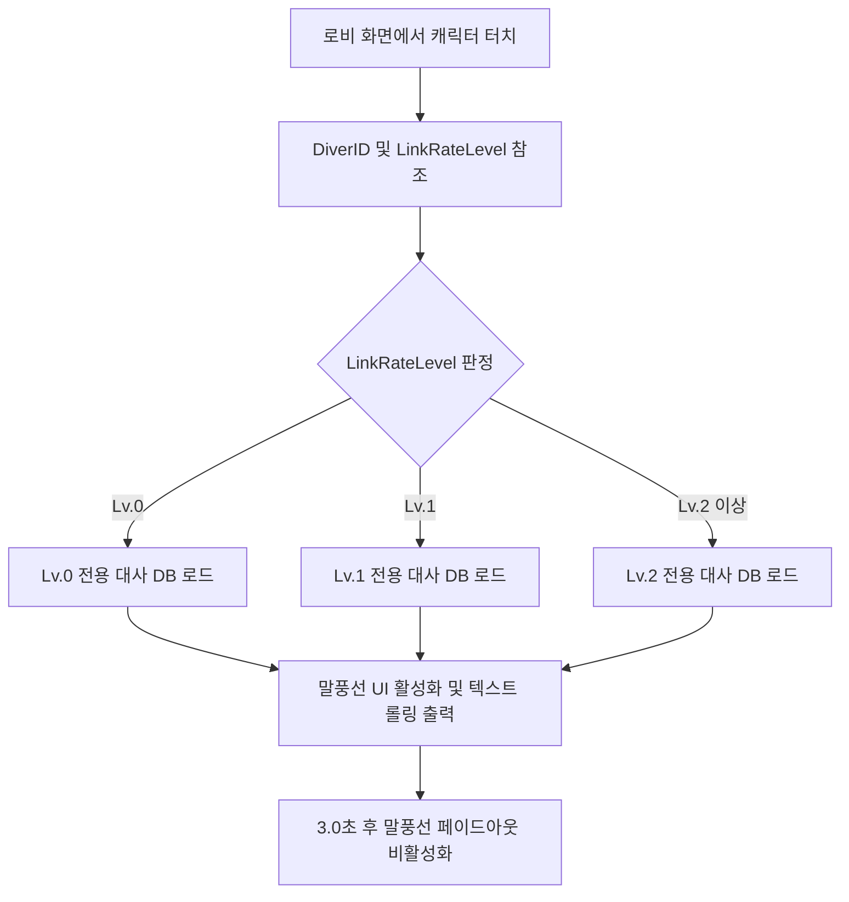

> [!IMPORTANT]
> 이 문서는 AI(Antigravity)가 작성한 초안입니다.
> 기획자/PM의 검토 및 승인 후 이 배너를 제거하면 '확정 사양'으로 인정됩니다.

# 로비_상호작용_시스템_기획서

## 0. 기획 의도 (Design Intent)
* **목표**: 로비 연출의 기술적 과부하를 줄이면서 캐릭터 애착 콘텐츠인 동조율 성장에 다른 대사 피드백을 직관적으로 연출한다.
* **핵심 가치**: 통짜 WebP 루프 애니메이션 위에 플레이어 동조율별 텍스트 리액션을 연결하여 서브컬처 교감 연출을 달성한다.

---

## 1. 개요 (Overview)

| 항목 | 내용 |
| :--- | :--- |
| **기능명** | 로비 WebP 루프 및 동조율 단계별 리액션 시스템 |
| **담당자** | 기획: 우성혁, 장수영 / 개발: 강다영 |
| **우선순위** | P1 (필수) |
| **상태** | 기획 중 (초안) |

---

## 2. 상세 시스템 명세

### 2.1 로비 WebP 루프 애니메이션 출력
* **렌더링 방식**: 
  * 로비 메인 화면 중앙에 배치되는 다이버 캐릭터는 Live2D 리깅 제어 대신 **대기 상태(Idle)를 통짜 루프 영상 파일(.webp)**로 제작하여 UI 이미지 컴포넌트에 출력한다.
  * WebP 파일은 투명 배경을 유지하며 로비 배경 이미지 위에 레이어로 얹어 렌더링한다.
* **파일 명명 규칙**: `Lobby_Idle_[DiverID].webp` (예: `Lobby_Idle_ChaeRin.webp`)

---

### 2.2 동조율 단계별 터치 리액션

* **동작 조건**: 플레이어가 로비에 배치된 캐릭터 영역(Hitbox Collider)을 마우스 클릭할 시 트리거된다.
* **대사 매핑**:
  * 캐릭터 터치 시 `SaveCharacterData.linkRateLevel (int)` 수치를 확인한다.
  * 각 레벨 단계(`0` ~ `2`)에 매핑된 리액션 대사 3종 중 1종을 무작위(Random) 선택하여 캐릭터 인근의 말풍선 UI에 표출한다.

---

### 2.3 비주얼노벨식 컷신 시스템
* **진입점**: 로비 복귀 후 `다이버/기록` 메뉴에서 해금된 심상 기록을 유저가 수동 클릭할 때 진입한다.
* **화면 구성**:
  * **전체 화면 일러스트(CG)**: 시나리오에 할당된 2D 배경/이벤트 일러스트 출력.
  * **대화창 패널**: 화면 하단에 반투명 대화창 UI, 발화자 이름, 대사 텍스트 출력.
* **기능 스펙**:
  * **텍스트 스피드**: 대사는 초당 25자 속도로 순차 출력(Typing Effect)된다. 마우스 클릭 시 즉시 100% 표출로 전환된다.
  * **백로그(Backlog) 기능**: 마우스 스크롤 휠을 올리거나 [Log] 버튼 터치 시 이전 대화 텍스트 이력을 역순 스크롤 형태로 조회할 수 있다.

---

## 3. 데이터 명세 (Data Specification)

### 3.1 동조율 단계별 대사 매핑 데이터 테이블
엑셀 시트에 기재되어 JSON으로 변환될 대사 구조 정의이다.

| 변수명 (Key) | 타입 | 설명 | 기본값 |
| :--- | :--- | :--- | :--- |
| `diverID` | `string` | 다이버 식별 고유 코드 | `CH_01` |
| `linkRateLevel` | `int` | 대사 출력을 위한 동조율 레벨 제한 | `0` |
| `reactionID` | `string` | 개별 대사 식별 코드 | `RE_001` |
| `dialogueText` | `string` | 말풍선에 표출될 대사 텍스트 원문 | `(대사 텍스트)` |

---

## 4. UI/UX 흐름 (UI/UX Flow)

### 4.1 터치 및 말풍선 노출 구조
* **터치 영역**: 캐릭터의 가로/세로 전신을 커버하는 투명 사각 히트박스 영역.
* **말풍선 인터랙션**:
  1. 캐릭터 클릭 ➡️ 말풍선 UI 페이드인(0.2초) 등장.
  2. 말풍선 텍스트 표출 및 대사 오디오 출력.
  3. 말풍선 노출 상태 유지(3.0초) 후 페이드아웃(0.5초) 처리.
  4. 말풍선 노출 중 캐릭터 재클릭 시, 기존 말풍선 내용이 즉시 갱신되며 노출 타이머(3.0초)가 초기화된다.

---

## 📜 Revision History

| 날짜 | 버전 | 내용 | 작성자 |
| :--- | :--- | :--- | :--- |
| 2026-07-10 | v1.0.0 | - 로비 상호작용 WebP 루핑 렌더링 명세 기획 - 동조율 레벨 연동형 터치 대사 매핑 규칙 설계 - 비주얼노벨식 컷신 UI 프레임워크 기능 명세 초안 작성 | Antigravity |
