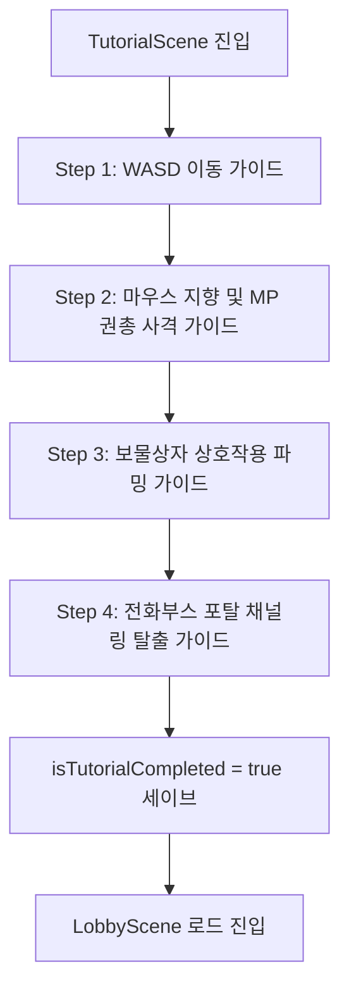

> [!IMPORTANT]
> 이 문서는 AI(Antigravity)가 작성한 초안입니다.
> 기획자/PM의 검토 및 승인 후 이 배너를 제거하면 '확정 사양'으로 인정됩니다.

# 튜토리얼_기획서

## 0. 기획 의도 (Design Intent)
* **목표**: 플레이어가 게임을 처음 접했을 때, 이동/사격/파밍/탈출로 구성되는 코어 루프를 안전한 환경에서 단계적으로 습득하게 한다.
* **핵심 가치**: 탄창이 없고 MP 소모만으로 사격하는 독자적인 권총 시스템 및 시야 차단(손전등) 룰을 유저에게 각인시킨다.

---

## 1. 개요 (Overview)

| 항목 | 내용 |
| :--- | :--- |
| **기능명** | 인게임 기초 튜토리얼 및 안내 시스템 |
| **담당자** | 기획: 우성혁, 장수영 / 개발: 강다영 |
| **우선순위** | P1 (필수) |
| **상태** | 기획 중 (초안) |

---

## 2. 상세 시스템 명세

### 2.1 진입 조건 및 씬 전환 제어
* **트리거**: 최초 기동 인트로 컷씬(`IntroCutsceneScene`) 재생 완료 혹은 스킵 버튼 입력을 통해 인트로가 마무리되는 시점에 연동된다.
* **세이브 변수 검증**:
  * 로컬 세이브 데이터의 `SaveData.isTutorialCompleted (bool)` 값을 판정한다.
  * `false`: 로비 씬 진입을 바이패스하고 곧장 튜토리얼 씬(`TutorialScene`)을 로드하여 실행한다.
  * `true`: 기존 세이브 유저이므로 튜토리얼을 스킵하고 즉시 `LobbyScene`으로 강제 로드한다.
  * *세이브 갱신 시점*: 튜토리얼의 마지막 단계인 '포탈 탈출 완료'에 성공하여 씬 전환이 일어나는 시점에 `isTutorialCompleted` 값을 `true`로 저장 처리한다.

---

### 2.2 단계별 가이드 시나리오

#### 📌 Step 1: 이동 및 회피 학습
* **상황**: 조명이 극히 제한된 실내 마트 창고(일자형 안전 구역)에서 시작한다.
* **가이드 안내**: 화면 중앙 상단에 조작 안내 팝업 메시지 출력.
  * `"WASD 키를 사용하여 캐릭터를 이동시키십시오."`
  * `"Shift 키를 누르면 진행 방향으로 구르기(대시)를 사용하여 장애물을 돌파할 수 있습니다."`
* **완료 조건**: 지정된 목표 반경 위치로 캐릭터가 이동 완료하면 다음 단계로 전이된다.

#### 📌 Step 2: 손전등 및 MP 권총 격발 학습
* **상황**: 창고 문이 열리고 어두운 복도로 진입한다. 플레이어 전방 5m 지점에 표적용 몬스터 1마리 배치(비선공 상태).
* **가이드 안내**:
  * `"마우스 커서 방향으로 캐릭터의 시야(손전등)가 회전합니다. 빛이 비치는 곳만 적이 보입니다."`
  * `"마우스 왼쪽 클릭으로 권총을 사격하십시오. 사격 시 MP(마나)가 소모됩니다."`
  * `"MP가 모두 소모되면 마나가 자연 회복될 때까지 사격할 수 없습니다. 화면 하단의 MP 게이지를 관리하십시오."`
* **완료 조건**: 배치된 표적용 몬스터를 조준 격발하여 HP를 0으로 만들고 소멸시키면 즉시 완료된다.

#### 📌 Step 3: 상호작용 및 파밍 학습
* **상황**: 몬스터 사살 지점 바로 뒤에 일반 나무상자 오브젝트 1개 노출.
* **가이드 안내**:
  * `"상자 오브젝트 근처로 다가가 F키를 누르면 상호작용하여 아이템을 루팅할 수 있습니다."`
* **완료 조건**: 상자 오픈 연출이 끝나고 상자 내부 아티팩트 아이템 획득 처리가 플레이어 인벤토리에 정상 반영되면 다음 단계로 이행된다.

#### 📌 Step 4: 포탈 탈출 및 루프 완료
* **상황**: 복도 끝에 불이 켜진 공중전화부스(탈출구 포탈) 활성화.
* **가이드 안내**:
  * `"전화부스 포탈 근처에서 F키를 눌러 탈출 채널링을 시작하십시오."`
  * `"우측 탈출 게이지가 가득 찰 때까지 포탈 범위 내에서 버텨야 하며, 피격되거나 이탈 시 취소됩니다."`
* **완료 조건**: 채널링 게이지를 채워 탈출 성공 시, 전체 세션 정산 보상 연출 출력 후 `isTutorialCompleted` 세이브 데이터를 변경하고 로비 씬으로 복귀한다.

---

### 2.3 예외 처리
* **플레이어 사망**: 튜토리얼 씬에서 만에 하나 플레이어가 사망할 경우, 사망 패널티(아티팩트 유실 등)를 적용하지 않으며 현재 단계에서 체력을 100% 리필하고 재시작(Respawn)시킨다.

---

## 3. 데이터 명세 (Data Specification)

### 3.1 세이브 및 진행 관리 데이터

| 기획 명칭 | 변수명 | 타입 | 설명 | 기본값 |
| :--- | :--- | :--- | :--- | :--- |
| 튜토리얼 완료 플래그 | `isTutorialCompleted` | `bool` | 인게임 튜토리얼 종료 여부 기록 | `false` |
| 튜토리얼 진행 단계 | `currentTutorialStep` | `int` | 현재 진행 중인 튜토리얼 Step (1~4) | `1` |

---

## 4. UI/UX 흐름 (UI/UX Flow)

* **조작 가이드 키 노출**: 텍스트 가이드 내 단축키 키(`W`, `A`, `S`, `D`, `Shift`, `F`, `L-Click`)는 별도의 특수 강조 색상 및 테두리 프레임을 씌워 출력한다.
* **이동 목표 포인트 하이라이트**: 이동해야 할 위치의 지면에 부채꼴 빔 형태의 연출 조명을 투사하여 공간적으로 가이드를 보조한다.

---

## 📜 Revision History

| 날짜 | 버전 | 내용 | 작성자 |
| :--- | :--- | :--- | :--- |
| 2026-07-10 | v1.0.0 | - 최초 씬 진입 제어 및 세이브 플래그 바인딩 룰 명세 - 이동, MP 권총 사격, 파밍 상호작용, 포탈 채널링 탈출 시나리오 4개 단계 구성 - 사망 예외 처리 규칙 작성 완료 | Antigravity |
