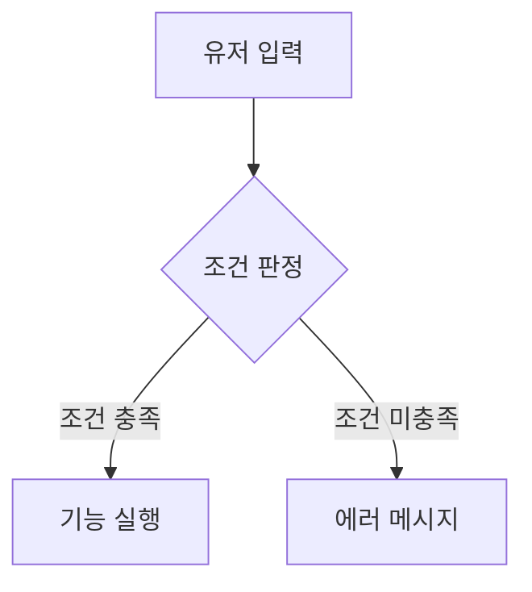

# 📝 기획서 작성 표준 가이드라인 (Spec Writing Guide)

> 이 가이드는 기획 문서의 일관성을 유지하고, 개발/디자인 파트와의 효율적인 소통을 위해 수립된 작성 지침입니다.

---

## 1. 기획서 표준 목차

모든 기획서는 다음 구조를 기본으로 하며, 섹션 넘버링(`## 0`, `## 1`...)을 명확히 수행합니다.

### 0. 기획 의도 (Design Intent) — **필수**
- **목적**: 이 기능을 왜 만드는지, 어떤 유저 경험을 목표로 하는지
- **핵심 가치**: 이 기능의 존재 이유를 한 줄로

### 1. 개요 (Overview) — **필수**
- 기능명, 담당자, 우선순위, 현재 상태를 표로 정리

### 2. 상세 로직 및 프로세스 (Core Logic) — **필수**
- **트리거**: 기능이 시작되는 조건
- **시퀀스**: 단계별 동작 흐름 (서술형 또는 Mermaid 다이어그램)
- **예외 처리**: 비정상 상황에 대한 대응 로직

### 3. 데이터 명세 (Data Specification) — **필수**
- 시스템에 기록될 데이터를 표 형태로 정의
- 기술 프로젝트의 경우 자료형(int, bool, string 등)을 명시

### 4. UI/UX 흐름 — **선택**
- 화면 구성이 있는 기능의 경우에만 작성
- 진입점, UI 요소, 인터랙션 흐름

### 5. 연동 시스템 (Dependencies) — **선택**
- 이 기능이 의존하는 다른 시스템과의 관계

### 6. 주의 사항 및 제약 — **선택**
- 알려진 제약, 성능 고려, 향후 확장 계획

### 📜 Revision History — **필수**
- 문서 최하단에 항상 유지

---

## 2. 데이터 명세 표준

### 기본 양식
| No. | 필드명 | 타입 | 설명 | 기본값 |
|-----|--------|------|------|--------|
| 1 | [field] | [type] | [설명] | [default] |

### 기술 프로젝트용 확장 양식
기술 프로젝트(Unity, React 등)에서는 아래 양식을 권장합니다:

| 기획 명칭 | 변수명 (Key) | 타입 (Base Type) | 비고 |
|-----------|-------------|-----------------|------|
| 현재 일차 | `dayState` | `int` | 1~5 범위 |
| 로그인 상태 | `isLoggedIn` | `bool` | 세션 유지 판정 |

---

## 3. 작성 규칙 및 에티켓

1. **괄호 메모 활용**: 설계 의도나 톤에 대한 부가 설명은 `( )`를 사용
2. **마크다운 준수**: 불렛 포인트(`-`), 인라인 코드(`` ` ``), 굵게(`**`)를 적극 활용
3. **이미지 캡션**: 참조용 이미지 하단에 반드시 설명 캡션 추가
4. **논리 흐름 시각화**: 복잡한 조건문이나 분기는 `Mermaid` 다이어그램을 활용

### Mermaid 다이어그램 예시


---

## 4. AI와 협업 시 유의사항

- AI에게 기획서 작성을 요청할 때 **이 가이드를 참고하라고 명시**하면 품질이 크게 향상됩니다:
  ```
  @[SPEC_WRITING_GUIDE.md] 이 가이드를 따라서 [기능명] 기획서를 작성해줘.
  ```
- AI 초안에는 `[!IMPORTANT]` 배너가 자동 삽입됩니다.
- PM 검수 후 배너를 제거하면 확정 사양으로 인정됩니다.

---

## 📜 Revision History

| 날짜 | 버전 | 내용 | 작성자 |
|------|------|------|--------|
| 2026-04-29 | v1.0 | - 실전 프로젝트 기획서 작성 가이드 기반 범용 템플릿 초판 작성<br>- 표준 목차, 데이터 명세 양식, 작성 에티켓 정의 | Antigravity |
