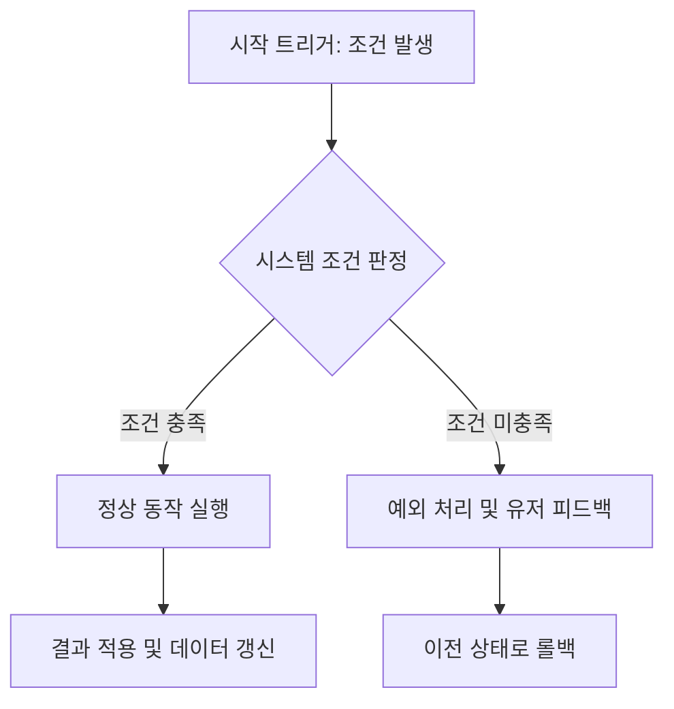

# 📋 [기능/시스템명] 기획 명세서 (Notion Optimized Template)

> **[Notion 사용 팁]**
> *   이 문서는 마크다운 양식으로 작성되었으며, 노션(Notion)에 그대로 **가져오기(Import)** 하거나 **복사-붙여넣기(Ctrl+V)** 시 노션의 전용 블록으로 깔끔하게 자동 변환됩니다.
> *   `>` 인용 블록은 Notion으로 붙여넣은 뒤 해당 블록을 선택하고 **`Ctrl+Shift+7`**을 누르면 시각적인 **콜아웃(Callout)** 블록으로 즉시 전환할 수 있습니다.
> *   하단의 리소스 발주는 접기/펼치기가 가능한 **토글(Toggle) 목록**으로 자동 변환됩니다.

---

## 📌 Notion Properties (노션 DB 속성 연동 표)
*노션의 기획서 데이터베이스에 문서를 Import한 뒤, 아래 항목을 데이터베이스 속성(Properties)으로 설정 및 매핑하는 데 사용합니다.*

| 속성 분류 | 지정 값 (선택/입력) | 비고 |
| :--- | :--- | :--- |
| **기능/시스템명 (Title)** | [기능/시스템명 입력] | 예: 드림 포지드 무장 시스템 |
| **상태 (Status)** | ⬜ 기획 대기 / 🟦 기획 중 / 🟨 검토 요청 / 🟧 개발 대기 / 🟥 개발 중 / 🟪 QA 중 / 🟩 완료 | 노션 Select 속성 |
| **우선순위 (Priority)** | 🔴 P0 (필수) / 🟡 P1 (중요) / 🟢 P2 (보통) | 노션 Select 속성 |
| **기획 담당자 (Assignee)** | @[기획자 이름] | 노션 사람(Person) 속성 |
| **개발 담당자 (Developer)** | @[개발자 이름] | 노션 사람(Person) 속성 |
| **아트 담당자 (Artist)** | @[아티스트 이름] | 노션 사람(Person) 속성 |
| **관련 시스템 (Relation)** | [연동 기획서명 링크 또는 관계형 DB 지정] | 노션 Relation 속성 |
| **마일스톤 (Milestone)** | [Sprint 1 / Milestone A 등] | 프로젝트 일정 관리 연동 |
| **최종 수정일 (Date)** | @오늘  | 실시간 업데이트 날짜 반영 |

---

## 0. 기획 의도 (Design Intent)
> 💡 **Tip**: 노션에서 이 영역은 콜아웃 블록으로 변환하여 기획의 핵심 목적을 눈에 띄게 배치하세요.

*이 기능/시스템을 왜 만드는지, 유저에게 어떤 경험적 피드백을 제공하려는지 기술합니다.*

*   **목적 (Goal)**: 
    *   [이 기능이 개발을 통해 궁극적으로 해결하고자 하는 문제나 목표를 기재합니다.]
    *   *(예: 현실 장비와 꿈속 기물의 극명한 대비를 통해 유저에게 즉흥적인 액션 파밍과 활용의 재미를 전달함)*
*   **핵심 가치 (Core Value)**: 
    *   [이 기능이 존재해야 하는 단 하나의 명확한 이유를 1줄 요약으로 기재합니다.]
    *   *(예: 획득한 기물에 따라 플레이스타일이 실시간으로 바뀌는 기괴하고 흥미로운 액션성 제공)*
*   **성공 지표 (Success Metrics)**:
    *   [이 기획의 성공 여부를 정량적/정성적으로 판단할 기준을 정의합니다.]
    *   *(예: 세션당 최소 3회 이상 다른 기물로의 무장 스왑 유도, 기물 획득에 따른 전투 유지력 변화 체감)*

---

## 1. 개요 (Overview)
*기능의 대략적인 정의와 침몽도시: 루시드 다이버의 핵심 루프(진입 -> 파밍 -> 보스전 -> 탈출)에서 차지하는 역할을 서술합니다.*

*   **기능 요약**: [시스템을 직관적으로 이해할 수 있는 한 줄 요약]
*   **핵심 루프 연동**: 
    1. **진입 단계**: [세션 진입 시 적용되는 상태 또는 세팅]
    2. **파밍 단계**: [필드 탐사 중 해당 시스템이 작동하는 방식 및 획득 방식]
    3. **보스전 단계**: [보스 공략 시 기믹으로 작용하거나 전투 효율에 미치는 영향]
    4. **탈출 단계**: [탈출 조건 충족을 돕거나, 탈출 성공/실패 시 데이터 소실 여부 등]

---

## 2. 상세 로직 및 프로세스 (Core Logic)
*기능의 구체적인 작동 원리와 비즈니스 로직을 명세합니다. 모호성을 제거하여 개발자가 코딩할 수 있는 수준으로 상세히 작성합니다.*

### 2.1 동작 플로우 (Flowchart)
*기능의 전체 시퀀스를 다이어그램으로 도식화합니다. (노션에 임포트 시 Mermaid 다이어그램 블록으로 즉시 렌더링됩니다)*

### 2.2 규칙 및 공식 (Rules & Formula)
*작동 조건, 계산 공식, 제약 조건 등을 상세 불렛 형태로 나열합니다.*

*   **작동 트리거(Trigger)**:
    *   언제, 어떤 키 입력이나 이벤트에 의해 시스템이 동작하는가? (예: `F` 키를 통한 기물 상호작용)
*   **상태 변환 규칙**:
    *   동작 전후의 객체 상태 변화 기술.
*   **계산 공식 및 수치 벨런스**:
    *   `최종 데미지 = (기본 피해량 + 시너지 가중치) * (1 - 적의 방어율)`
    *   수치가 점진적으로 변화할 때의 등차/등비 공식을 기재합니다.

### 2.3 네트워크 동기화 사양 (Photon PUN2 Sync)
*멀티플레이 환경을 고려하여 마스터 클라이언트와 일반 클라이언트 간의 데이터 동기화 룰을 정의합니다.*

*   **방장(Master Client) 연산 및 통제 데이터**:
    *   [예: 기물 획득 시 맵 상에서 오브젝트 파괴 및 소유권 획득 처리 결정권]
*   **로컬 클라이언트(Client) 예측 및 렌더링 데이터**:
    *   [예: 로컬 타격 모션 연출 및 타격 이펙트의 실시간 가시화]
*   **네트워크 패킷(RPC/Custom Properties) 전달 주기 및 조건**:
    *   매 프레임 동기화가 불필요한 이벤트성 데이터는 RPC(Remote Procedure Call)로 전달 처리하도록 명시.

### 2.4 예외 처리 및 엣지 케이스 (Exception Handling)
*발생 가능한 오동작 및 버그를 사전에 방지하기 위한 예외 처리 기준을 작성합니다.*

*   **통신 장애/지연 상황**:
    *   플레이어가 기물을 획득하는 순간 네트워크 연결 상태가 불안정해지거나 끊겼을 때의 롤백 또는 대기 연출.
*   **동시 조작 이슈**:
    *   두 플레이어가 완전히 동시에 동일한 기물에 대고 상호작용(`F`) 키를 입력했을 때의 우선순위 판정 규칙.
*   **한계 상태 초과**:
    *   인벤토리가 가득 차 있거나, 쿨타임 도중 조작이 들어올 때 UI 경고 메시지 출력 방식.

---

## 3. 데이터 명세 (Data Specification)
*C# 스크립트, ScriptableObject, JSON 또는 데이터 테이블에 입력될 변수의 사양을 완벽히 규정합니다.*

### 3.1 변수 정의 및 타입 (Variable Spec)

| 기획 명칭 | 변수명 (Key) | 타입 (Base Type) | 기본값 | 비고 (허용 범위 및 참조 소스) |
| :--- | :--- | :--- | :--- | :--- |
| **고유 식별 ID** | `systemId` | `string` | `""` | 중복 불가능한 고유 키값 (예: `SYS_ATTACK_01`) |
| **우선 등급** | `grade` | `enum` | `Grade.Normal` | `Normal`, `Rare`, `Epic`, `Legendary` |
| **쿨타임** | `cooldownTime` | `float` | `0.0f` | 단위: 초 (0.0 이상 300.0 이하) |
| **동기화 상태 여부** | `isSynced` | `bool` | `false` | PUN2 연동 활성화 플래그 |

---

## 4. UI/UX 및 인터랙션 흐름 (UI/UX Flow)
*플레이어가 보게 될 화면과 조작에 따른 피드백 연출을 서술합니다.*

*   **진입점 및 트리거 UI**: 
    *   [UI가 화면에 등장하는 조건과 팝업 연출 설명]
*   **주요 UI 요소 구성**:
    *   [화면에 고정 노출되는 아이콘, 프로그레스 바, 텍스트 레이아웃 정보]
*   **피드백 연출 (Feedback & Polish)**:
    *   **VFX**: [동작 성공 시 발산되는 스파크, 궤적 등의 시각 이펙트]
    *   **SFX**: [사운드 키 매핑 정보 및 효과음 설명]
    *   **햅틱/카메라**: [컨트롤러 진동 세기, 카메라 쉐이크 강도 등]

---

## 5. 리소스 및 에셋 발주서 (Asset Requests)
> 💡 **Tip**: 노션에서 이 영역은 접이식 토글(Toggle) 블록으로 자동 인식되므로, 아트/사운드 작업자에게 링크를 주어 협업할 때 화면을 깔끔하게 유지할 수 있습니다.

🎨 [토글] 그래픽 리소스 (2D Spine / URP 3D 에셋) 요구사항

### 1. 2D Spine 애니메이션 & Sprite 리소스
*   **필요 리소스명**: [예: 드림 포지드 우산 장착 시의 캐릭터 모션]
*   **필수 모션 목록**:
    *   `Idle`: 우산을 어깨에 걸치고 서 있는 기본 대기 모션
    *   `Run`: 우산을 앞으로 뻗고 달리는 모션
    *   `Attack_01 ~ 03`: 우산을 찌르고 휘두르는 3단 공격 애니메이션
    *   `Skill`: 우산을 활짝 펼쳐 전방을 방어하는 특수 액티브 모션
*   **아트 컨셉 참고**: [컨셉 문서나 이미지 링크 첨부]

### 2. 3D 레벨 환경 및 프롭 에셋
*   **에셋명**: [예: 격벽 및 공중전화부스]
*   **콜라이더 사양**: Mesh Collider 정밀 적용 요망 / 단순 Box Collider 대체 가능 여부 명시
*   **라이팅/URP 텍스처**: 어두운 침몽도시에 어울리도록 에미시브(Emissive) 맵이 포함되어 발광 효과를 낼 수 있어야 함

🎵 [토글] 사운드 및 이펙트 (SFX / BGM) 요구사항

### 1. 효과음 (SFX) 발주 리스트
*   **기물 획득음 (`SFX_GET_ITEM`)**: 청아하면서도 끝부분에 약간의 기이한 노이즈가 섞인 소리 (1.5초 내외)
*   **기물 파괴음 (`SFX_DESTROY_ITEM`)**: 무기가 산산조각 나며 유리가 깨지는 듯한 연출음
*   **특수 스킬 시전음 (`SFX_SKILL_CAST`)**: 전방에 에너지 보호막이 펼쳐지며 우웅- 하는 험(Hum) 노이즈 발생음

### 2. 배경음 (BGM) 연출
*   **상황 조건**: 해당 기물을 장비하고 보스전에 돌입 시, 보스 BGM 트랙의 특정 악기(드럼 또는 신디사이저 레이어)가 음소거 해제되며 템포가 빠르게 들리도록 연동 필요

---

## 6. QA 검증 및 테스트 케이스 (QA Checklists)
> 💡 **Tip**: 노션에 붙여넣기 시 체크박스(To-do List) 블록으로 즉시 변환되어, 구현 후 기획 테스트에 바로 활용할 수 있습니다.

*   [ ] **기본 동작**: 기물에 가까이 다가가 `F` 키를 누르면 무장 슬롯에 정상 등록되는가?
*   [ ] **모션 전환**: 기물 장착과 동시에 캐릭터의 2D Spine 애니메이션과 공격 스프라이트가 기물 규격에 맞춰 실시간으로 전환되는가?
*   [ ] **네트워크 동기화**: 마스터 클라이언트와 일반 클라이언트가 동일한 세션에서 기물을 장착/사용할 때, 서로 상대방의 무기 교체 및 공격 모션이 PUN2를 통해 딜레이 없이 100% 동기화되는가?
*   [ ] **내구도 소모**: 무기 공격 시 정해진 수치만큼 내구도가 정상 차감되며, 0이 되었을 때 즉시 파괴 연출과 함께 기본 무기로 자동 교체되는가?
*   [ ] **예외 시나리오 (Disconnected)**: 기물 획득 동작 도중 랜선을 뽑았을 때, 게임이 크래시되지 않고 로컬 데이터가 안전하게 보존된 상태로 메인 화면으로 이탈하는가?

---

## 📜 Revision History
*이 문서의 버전 관리 및 변경 이력을 기재합니다. 변경 사항은 한 줄 요약이 아닌 불렛 포인트를 사용하여 상세히 작성합니다.*

| 날짜 | 버전 | 변경 사항 및 수정 내용 | 작성자 |
| :--- | :--- | :--- | :--- |
| [2026-06-12] | v1.0 | *   《침몽도시: 루시드 다이버》 전용 노션 가져오기 최적화 종합 기획 템플릿 초판 설계 및 수립 | Antigravity |
