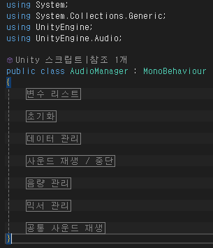
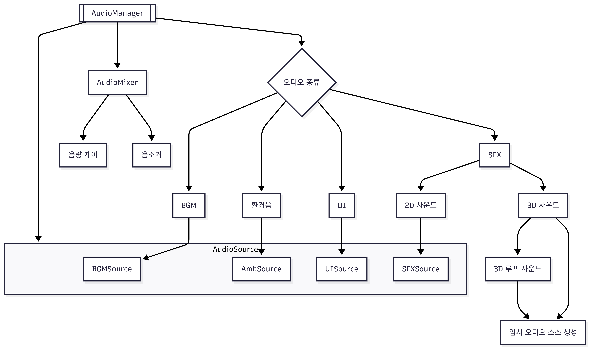
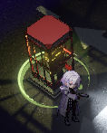
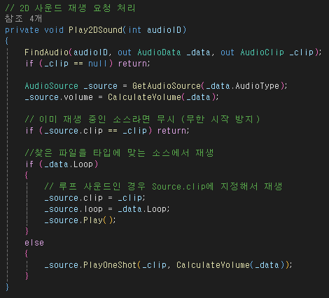
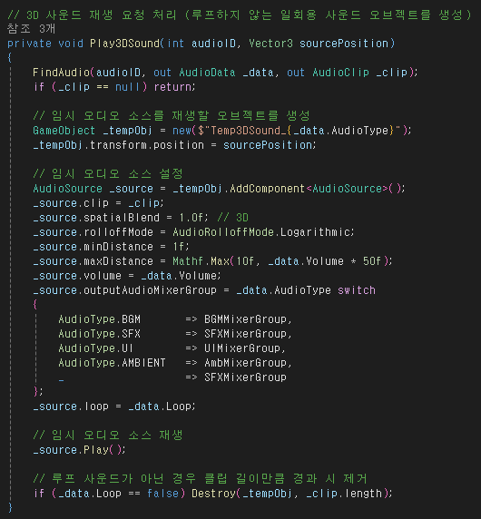
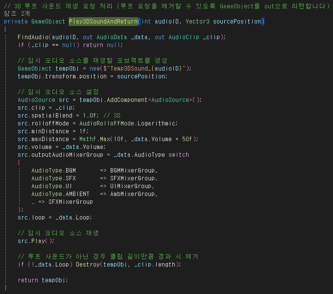
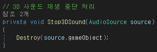
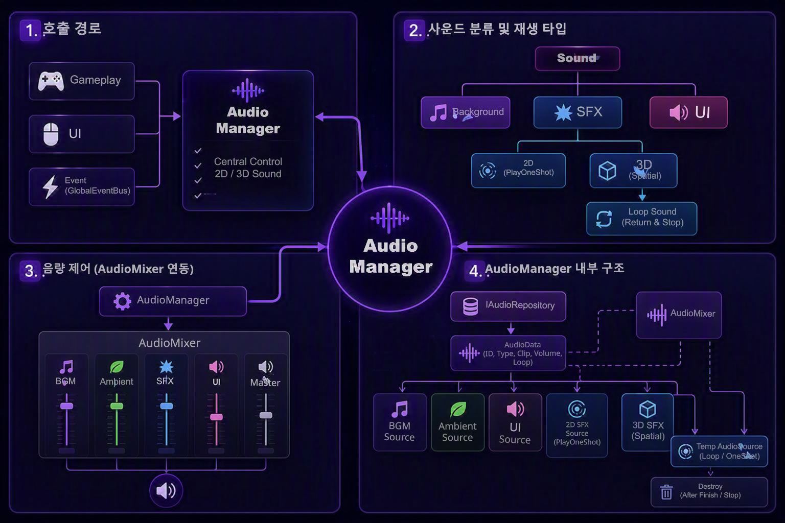

# 최종 발표 웹 — 우성혁 (CD)

> 이 문서는 본인이 최종 발표에서 실제로 설명할 내용을 작성하는 문서입니다.
>
> 작업 전체를 나열하지 말고,
> `../team_summaries/[CD]우성혁_작업물_요약.md`를 참고하여
> 가장 보여주고 싶은 대표 작업 1개와 보조 작업 1개를 선택해 주세요.
>
> 웹 코드는 직접 수정하지 않아도 됩니다.
> 아래 내용을 작성하면 발표 웹에 반영됩니다.

---

## 0. 기본 정보

**이름**: 우성혁

**직군**: CD (Content Designer / 시스템 명세화 & 오디오 구현)

**예상 발표 시간**:

- [ ] 1분
- [x] 2분
- [ ] 3분
- [ ] 기타:

**실제 발표할 범위**: 중앙 집중식 오디오 아키텍처(`AudioManager` + `IAudioRepository`)

---

## 1. 발표 핵심 메시지

### 발표가 끝난 뒤 청중이 기억해야 할 한 문장

> "게임의 모든 사운드를 하나의 AudioManager에서 통합 관리하여, 2D·3D 사운드와 음량 제어를 일관된 구조로 구현했습니다."

---

## 2. 대표 작업 선택

### 대표 작업

**작업명**: 중앙 집중식 오디오 아키텍처 & AudioMixer 통합 제어 (`AudioManager.cs` + `IAudioRepository`)

**이 작업을 대표 사례로 선택한 이유**: 게임 내 모든 사운드 리소스를 단일 매니저에서 관리할 수 있도록 하여, 다중 오디오 소스 동시 재생 시 발생할 수 있는 문제를 해결하고 3D 사운드와 UI 사운드를 일관된 구조로 제어할 수 있는 시스템을 구축했기 때문입니다.

**이 작업에서 본인이 맡은 정확한 범위**:
- `AudioManager.cs` 전체 구현 및 `IAudioRepository` 인터페이스 설계
- `AudioMixer` 파라미터 연동
- 상태 체크 시 환경음 및 BGM 동일 클립 무한 재시작 방지 로직
- 버튼 상호작용 상태(작동 가능/작동 불가능/캐릭터 상호작용)에 따른 UI 사운드 규격화
- 적 피격 시 즉시 격발되는 전용 타격음 SFX 매핑
- 3D 위치 기반 SFX 거리 감쇄 및 AudioSource 수명 관리 연출 시스템

### 보조 작업 — 선택

**작업명**: 에너미 시야 감지 시스템으로 인한 그림자(Shadow) 렌더러의 애니메이션 동기화 버그 리팩토링

**선택 이유**: 에너미 캐릭터의 그림자 출력을 위해 도입한 이중 렌더러 애니메이션 동기화 코드와 시야 감지 시스템 사이에서 발생하는 기능 충돌을 기술적으로 확인하여 해결한 사례.

**발표에 꼭 필요한가?**

- [ ] 반드시 필요
- [×] 시간이 있으면
- [ ] 제외 가능

---

## 3. 대표 작업 설명

### 3.1 완성 결과

무엇을 만들었고 실제 게임에서 어떻게 작동하는지 작성해 주세요.

**작성**: SFX·BGM 리소스를 단일 진입점(`AudioManager.cs`)으로 통합 관리하는 중앙 집중식 오디오 시스템을 완성했습니다. 게임 내에서 버튼 클릭 등 UI 사운드, 적 타격음을 포함한 효과음, 그리고 배경음과 환경음이 각각의 `AudioMixer` 채널을 통해 독립적으로 조절되며, 씬 전환 및 플레이어 상태 변화 중에도 BGM이나 환경음이 끊기거나 중복 재시작되는 상황을 최소화하여 자연스럽게 이어지도록 스크립트를 작성했습니다.

### 3.2 작업 목표

이 작업을 통해 어떤 플레이 경험 또는 개발 목표를 달성하려 했나요?

**작성**: 사운드 호출이 각 스크립트에 분산되어 관리하기 어려워지는 사태를 예방하기 위해 단일 `AudioManager`로 일원화하여,
① 어느 씬에서든 GlobalEventBus 구조를 통해 동일한 API로 사운드 호출을 가능하게 하고,
② 상태 변화 및 씬 전환 시 BGM 및 환경음 클립 무한 재시작을 방지하는 클립 필터링 기능을 AudioManager에 내장하며,
③ FMOD 미설치 환경에서도 Unity 내장 `AudioSource`로 자동 Fallback되는 안전망 확보를 목표로 했습니다.

### 3.3 핵심 문제 또는 제약

가장 중요했던 문제나 제약을 하나만 작성해 주세요.

문제가 아니라 새로운 기능 제작이라면,
구현 과정에서 중요했던 조건이나 설계 기준을 작성해 주세요.

**작성**: `AudioManager` 구현 시 BGM과 환경 사운드를 동시에 재생하고 상황에 따라 어느 한쪽만 변경하여 나머지는 유지하는 것이 가능하도록, `AudioMixer`를 다수 배치해 각 사운드 종류마다 별도로 배분할 수 있게 하는 구조로 구축해야 했습니다. 또한 루프 구조를 요구하지 않는 단발성 SFX의 경우에는 AudioSource에 등록된 clip을 재생하는 Play() 방식이 아닌, 클립을 일회성으로 재생하는 PlayOneShot() 방식을 사용하여, 매번 새로운 오디오 소스를 할당하지 않고도 안전하게 여러 사운드를 동시에 출력할 수 있도록 설계했습니다.

### 3.4 사용 기술과 선택 이유

어떤 기술을 사용했는지만 나열하지 말고,
왜 그 방법을 선택했는지 작성해 주세요.

**사용 기술**:
- `AudioMixer` (파라미터: `"AmbVolume"`, BGM, SFX, UI, Master) + Unity 내장 `AudioSource`
- `IAudioRepository` 인터페이스 + `LocalJsonAudioRepository` 리포지토리 + `AudioManager` 서비스

**선택 이유**:
- `AudioMixer`는 런타임 중 각 `AudioSource`마다 다른 채널을 연결하고, 각 채널마다 독립된 볼륨 조절이 가능한 구조를 외부 FMOD 설치 없이도 구현할 수 있기 때문에 선택했습니다.
- `IAudioRepository` 인터페이스를 `LocalJsonAudioRepository`에 연결하는 경로를 통해 Assembly Definition 체계에 따른 컴파일 분리 구조에 알맞은 오디오 데이터 연결 구조를 구축할 수 있었습니다.

### 3.5 구현 결과

기존과 비교해 무엇이 달라졌나요?

**작성**:
- **이전**: 사운드 호출 코드가 구현되지 않아 오디오 재생 기능이 없었음.
- **이후**: 단일 `AudioManager` API로 사운드 통합 관리, BGM 무한 재시작 차단, 환경음/BGM/SFX/마스터 독립 조절 슬라이더 연동

### 3.6 남은 한계 또는 개선점

**작성**: 현재 SFX에 단일 AudioSource를 사용하고 있어, 추후 개발 확장 시 동시 다발 전투 상황에서 SFX 루프를 여러 개 재생해야 할 경우 소스 부족이 발생할 수 있습니다. 향후 동적 풀 확장 또는 우선순위 기반 스케줄링 도입이 필요합니다.

---

## 4. 발표 장면 순서

### Scene 1. 첫 화면

**무엇을 보여줄까요?**

- [ ] 최종 결과 영상
- [ ] 문제 상황
- [ ] 게임 플레이
- [ ] 이미지
- [ ] 구조도
- [×] 코드
- [ ] 기타:

**사용 파일**:
- [×] 코드 스니펫
- [ ] 스크린샷
- [ ] 비디오



**이때 말할 내용**: "단일 `AudioManager` API에서 전체 사운드를 통합 관리하고, 환경음/BGM/SFX/UI로 구분되는 각 사운드를 독립적으로 제어할 수 있는 음량 연동 구조를 구현하였습니다."

---

### Scene 2. 작업 목표와 문제

**무엇을 보여줄까요?**

- [ ] 최종 결과 영상
- [ ] 문제 상황
- [ ] 게임 플레이
- [ ] 이미지
- [×] 구조도
- [ ] 코드
- [ ] 기타:

**화면에 보여줄 내용**: `AudioManager.cs` 설계 흐름도



**이때 말할 내용**: "사운드 리소스의 상황별 재생 처리 및 음량 관리를 단일 매니저 스크립트에서 통합할 수 있도록 설계하는 것이 목표였습니다. 이 과정에서 2D 및 3D 사운드를 어떻게 구분해 재생할 것인지를 주요 문제로 설정했습니다."

---

### Scene 3. 기술적 판단

**무엇을 보여줄까요?**

- [ ] 최종 결과 영상
- [ ] 문제 상황
- [ ] 게임 플레이
- [×] 이미지
- [ ] 구조도
- [×] 코드
- [ ] 기타:

**화면에 보여줄 내용**: `Play2DSound` 및 `Play3DSound` 코드 스니펫 + `EscapeSuccess-Play2DSound` 및 `Weapon-Play3DSound` 이미지
| Play2DSound | Play3DSound |
| --- | --- |
|  |  |
| Play2DSound<br>예시: 탈출 성공 판정 시 | Play3DSound<br>예시: 기본 공격 사격 시 - 기본 공격 발사 위치 |
|  |  |

**이때 말할 내용**: "사운드 종류별 전용 AudioSource를 사용하고, `Play2DSound`에서는 PlayOneShot()을 호출, `Play3DSound` 메서드에서는 지정된 위치에 일시적인 Audiosource를 생성하게 함으로써 동시 다발적인 사운드 재생이 가능하도록 구현하였습니다."

---

### Scene 4. 결과 비교 또는 검증

**무엇을 보여줄까요?**

- [ ] 최종 결과 영상
- [ ] 문제 상황
- [×] 게임 플레이
- [ ] 이미지
- [ ] 구조도
- [×] 코드
- [ ] 기타:

**화면에 보여줄 내용**: `Play3DSoundAndReturn` 및 `Stop3DSound` 코드 스니펫 + `Grenade_Play3DSoundAndReturn` 비디오





**이때 말할 내용**: "이어서, 소음 디코이 오브젝트를 생성하는 스킬 같이 3D 사운드 소스에 루프 처리가 필요한 경우에 대한 오브젝트 반환 코드까지 작성하여 오디오 출력 처리 구조를 완성하였습니다."

---

### Scene 5. 마무리

**마지막에 보여줄 화면**: 오디오 아키텍처 전체 구조 요약 슬라이드



**마무리 문장**: "보이지 않는 곳에서 게임의 소리를 안정적으로 제어하는 것, 그것이 제 역할이었습니다."

---

## 5. 원하는 웹 연출

필요한 항목에 체크해 주세요.

- [ ] 영상 자동 재생
- [×] 클릭 후 영상 재생
- [ ] 설명 순차 등장
- [ ] Before / After 비교
- [ ] 이미지 확대
- [ ] 영상 위 오버레이 표시
- [ ] FSM 또는 단계별 강조
- [ ] 코드와 실행 결과 동시 표시
- [×] 버튼 클릭으로 상태 전환
- [ ] 맵 경로 애니메이션
- [ ] 오디오 비교 재생
- [ ] 일반 영상 재생만 필요
- [ ] 기타

### 구체적인 연출 요청

> 예:
> 플레이어가 감지 범위에 들어가면
> FSM 다이어그램의 Idle이 Chase로 바뀌는 모습을 영상과 동시에 보여주세요.

**작성**: 
- Scene 4에서 `Play3DSoundAndReturn` 메소드 코드 스니펫 이미지를 버튼으로 설정 → 버튼 클릭 시 코드 스니펫 이미지 위치에 Grenade_Play3DSoundAndReturn 영상이 오버레이되어 출력 → Grenade_Play3DSoundAndReturn 영상 재생 종료 후 오버레이되었던 영상이 비활성화되고 코드 스니펫 이미지가 다시 전면에 출력됨

---

## 6. 제출 에셋

| 순서 | 종류 | 파일명 | 보여주는 내용 | 준비 상태 |
|---:|---|---|---|---|
| 1 | 코드 | `AudioManager.cs` 구조 | `AudioManager` 클래스 전체를 region 접기를 통해 요약 | 이미지 첨부<br>[web\presentation\assets\[CD]우성혁\images\AudioManager_Snippet_Regions.png] |
| 2 | 구조도 | `AudioManager` 구조도 | 사운드 종류 및 재생 타입에 따른 분류 구조도 | 이미지 첨부<br>[web\presentation\assets\[CD]우성혁\images\AudioManager_Chart.png] |
| 3 | 코드 | `AudioManager.cs` 스니펫 | `Play2DSound` 메소드 | 이미지 첨부<br>[web\presentation\assets\[CD]우성혁\images\AudioManager_Snippet_Play2DSound.png]<br>코드 출력만으로 충분한 경우 하단 '코드 스니펫 제시' 문단 참조 |
| 4 | 코드 | `AudioManager.cs` 스니펫 | `Play3DSound` 메소드 | 이미지 첨부<br>[web\presentation\assets\[CD]우성혁\images\AudioManager_Snippet_Play3DSound.png]<br>코드 출력만으로 충분한 경우 하단 '코드 스니펫 제시' 문단 참조 |
| 5 | 코드 | `AudioManager.cs` 스니펫 | `Play3DSoundAndReturn` 및 `Stop3DSound` 메소드 | 이미지 첨부<br>[web\presentation\assets\[CD]우성혁\images\AudioManager_Snippet_Play3DSoundAndReturn.png]<br>[web\presentation\assets\[CD]우성혁\images\AudioManager_Snippet_Stop3DSound.png]<br>코드 출력만으로 충분한 경우 하단 '코드 스니펫 제시' 문단 참조 |
| 6 | 이미지 | `EscapeSuccess-Play2DSound` | Play2DSound 메소드 실행 예시: 탈출 성공 판정 시 | 이미지 첨부 |
| 7 | 이미지 | `Weapon-Play3DSound` | Play3DSound 메소드 실행 예시: 기본 공격 사격 시 - 기본 공격 발사 위치 | 이미지 첨부 |

### 구조도 예시
```Mermaid
graph TD
    A[[AudioManager]] --> B{오디오 종류} --> C1[BGM]
    B --> C4[SFX] --> D1[2D 사운드]
    C4 --> D2[3D 사운드] --> E[3D 루프 사운드]
    B --> C3[UI]
    B --> C2[환경음]
    A --> F[AudioMixer] --> G[음량 제어]
    F --> H[음소거]
    C1 --> I1
    C2 --> I2
    C3 --> I3
    D1 --> I4
    A ---> I
    D2 --> J[임시 오디오 소스 생성]
    E --> J
    subgraph I[AudioSource]
    I1[BGMSource]
    I2[AmbSource]
    I3[UISource]
    I4[SFXSource]
    end
```

### 코드 스니펫 제시
```C#
// 2D 사운드 재생 요청 처리
private void Play2DSound(int audioID)
{
    FindAudio(audioID, out AudioData _data, out AudioClip _clip);
    if (_clip == null) return;

    AudioSource _source = GetAudioSource(_data.AudioType);
    _source.volume = CalculateVolume(_data);

    // 이미 재생 중인 소스라면 무시 (무한 시작 방지)
    if (_source.clip == _clip) return;

    //찾은 파일을 타입에 맞는 소스에서 재생
    if (_data.Loop)
    {
        // 루프 사운드인 경우 Source.clip에 지정해서 재생
        _source.clip = _clip;
        _source.loop = _data.Loop;
        _source.Play();
    }
    else
    {
        _source.PlayOneShot(_clip, CalculateVolume(_data));
    }
}

// 3D 사운드 재생 요청 처리 (루프하지 않는 일회용 사운드 오브젝트를 생성)
private void Play3DSound(int audioID, Vector3 sourcePosition)
{
    FindAudio(audioID, out AudioData _data, out AudioClip _clip);
    if (_clip == null) return;

    // 임시 오디오 소스를 재생할 오브젝트를 생성
    GameObject _tempObj = new($"Temp3DSound_{_data.AudioType}");
    _tempObj.transform.position = sourcePosition;

    // 임시 오디오 소스 설정
    AudioSource _source = _tempObj.AddComponent<AudioSource>();
    _source.clip = _clip;
    _source.spatialBlend = 1.0f; // 3D
    _source.rolloffMode = AudioRolloffMode.Logarithmic;
    _source.minDistance = 1f;
    _source.maxDistance = Mathf.Max(10f, _data.Volume * 50f);
    _source.volume = _data.Volume;
    _source.outputAudioMixerGroup = _data.AudioType switch
    {
        AudioType.BGM       => BGMMixerGroup,
        AudioType.SFX       => SFXMixerGroup,
        AudioType.UI        => UIMixerGroup,
        AudioType.AMBIENT   => AmbMixerGroup,
        _                   => SFXMixerGroup
    };
    _source.loop = _data.Loop;

    // 임시 오디오 소스 재생
    _source.Play();

    // 루프 사운드가 아닌 경우 클립 길이만큼 경과 시 제거
    if (_data.Loop == false) Destroy(_tempObj, _clip.length);
}

// 3D 루프 사운드 재생 요청 처리 (루프 요청을 제거할 수 있도록 GameObject를 out으로 리턴합니다)
private GameObject Play3DSoundAndReturn(int audioID, Vector3 sourcePosition)
{
    FindAudio(audioID, out AudioData _data, out AudioClip _clip);
    if (_clip == null) return null;

    // 임시 오디오 소스를 재생할 오브젝트를 생성
    GameObject tempObj = new($"Temp3DSound_{audioID}");
    tempObj.transform.position = sourcePosition;

    // 임시 오디오 소스 설정
    AudioSource src = tempObj.AddComponent<AudioSource>();
    src.clip = _clip;
    src.spatialBlend = 1.0f; // 3D
    src.rolloffMode = AudioRolloffMode.Logarithmic;
    src.minDistance = 1f;
    src.maxDistance = Mathf.Max(10f, _data.Volume * 50f);
    src.volume = _data.Volume;
    src.outputAudioMixerGroup = _data.AudioType switch
    {
        AudioType.BGM       => BGMMixerGroup,
        AudioType.SFX       => SFXMixerGroup,
        AudioType.UI        => UIMixerGroup,
        AudioType.AMBIENT   => AmbMixerGroup,
        _ => SFXMixerGroup
    };
    src.loop = _data.Loop;

    // 임시 오디오 소스 재생
    src.Play();

    // 루프 사운드가 아닌 경우 클립 길이만큼 경과 시 제거
    if (!_data.Loop) Destroy(tempObj, _clip.length);

    return tempObj;
}

...

// 3D 사운드 재생 중단 처리
private void Stop3DSound(AudioSource source)
{
    Destroy(source.gameObject);
}
```

### 직접 녹화가 필요한 장면

**작성**: Grenade_Play3DSoundAndReturn.mp4 - 플레이어 캐릭터가 스킬을 사용하여 생성된 디코이가 정해진 지속 시간 동안 유지되며 SFX를 재생한 후 소멸하는 영상 (에디터 Play 모드 녹화)
[web\presentation\assets\[CD]우성혁\videos\Grenade_Play3DSoundAndReturn.mp4]

---

## 7. 발표 대본 초안

### 시작

**작성**: 안녕하세요, CD 우성혁입니다. 저는 루시드 다이버의 오디오 시스템 아키텍처를 담당하여, 하나의 AudioManager 스크립트로 모든 사운드 리소스를 관리할 수 있도록 구현했습니다.

### 완성 결과 설명

**작성**: 먼저 구현 결과입니다.

BGM, 환경음, 효과음, UI 사운드를 단일 AudioManager를 통해 호출하도록 구성했습니다. 또한 각 사운드를 독립적인 AudioSource와 AudioMixer에 분리하여 개별적으로 음량을 조절할 수 있도록 설계했습니다.

이를 통해 게임 어디에서든 동일한 방식으로 사운드를 호출 및 제어할 수 있는 구조를 구현했습니다.

### 목표와 문제

**작성**: 이번 작업의 목표는 사운드 리소스의 재생과 음량 관리를 하나의 매니저에서 통합 처리하는 것이었습니다.

특히 UI 클릭음처럼 위치 정보가 필요 없는 2D 사운드와, 폭발이나 적의 위치처럼 공간감을 표현해야 하는 3D 사운드는 재생 방식이 서로 다르기 때문에, 이를 하나의 인터페이스 안에서 일관되게 사용할 수 있도록 설계하는 것이 중요한 문제였습니다.

### 기술적 판단

**작성**: 이를 위해 사운드 종류별로 전용 AudioSource를 사용하도록 구성했습니다.

2D 사운드는 PlayOneShot()을 사용하여 여러 효과음이 동시에 재생될 수 있도록 구현했습니다.

3D 사운드는 필요한 위치에 임시 AudioSource를 생성하여 공간감을 표현하도록 구현했습니다.

이 중 루프가 필요한 3D 사운드는 생성된 AudioSource를 반환하도록 설계하여, 필요 시 Stop3DSound()를 이용해 직접 종료할 수 있도록 구현했습니다.

### 결과

**작성**: 이와 같은 구조를 통해, UI에서 단발 재생되는 2D 사운드부터 반복 재생이 필요한 공간 사운드까지 모두 동일한 AudioManager 시스템 안에서 처리할 수 있는 구조를 완성했습니다.

### 마무리

**작성**: 이번 작업을 통해 게임의 모든 사운드를 하나의 구조로 통합하여 유지보수성과 확장성을 높였습니다.

보이지 않는 곳에서 게임의 소리를 안정적으로 제어하는 것, 그것이 제 역할이었습니다.

---

## 8. 다른 발표자와의 연결

### 앞 발표에서 이어받을 내용

**작성**:

### 다음 발표로 넘길 내용

**작성**:

### 인계 문장

**작성**:

---

## 9. 발표 시간 조절

### 반드시 포함

- `AudioManager` 아키텍처 개요

### 시간이 있으면 포함

- 에너미 그림자 렌더러 애니메이션 연결 끊김 버그 수정

### 제외

- 

---

## 10. 확인이 필요한 내용

- [×] 대표 작업이 정확히 내 담당인지 확인 필요
- [ ] 구현 완료 여부 확인 필요
- [×] 사용할 영상 촬영 필요
- [×] 다른 발표자와 내용 중복 확인 필요
- [×] 발표 시간 확인 필요
- [ ] 기타:

---

## 11. 최종 체크

- [ ] 작업 전체를 나열하지 않았다.
- [ ] 대표 작업을 1~2개로 줄였다.
- [ ] 완성 결과를 먼저 보여준다.
- [ ] 기술 사용 이유를 설명했다.
- [ ] 실제 구현과 계획을 구분했다.
- [ ] 사용할 에셋을 작성했다.
- [ ] 원하는 웹 연출을 구체적으로 작성했다.
- [ ] 제한 시간 안에 발표 가능하다.

---

## 12. 직군별 보조 질문 (CD 우성혁)

발표 내용을 구체화하기 위해 아래 질문을 활용해 보세요.

1. **가장 구조적으로 의미 있었던 시스템은 무엇인가?**
   - 작성: `IAudioRepository` 인터페이스 기반 `AudioManager` 아키텍처. 구현체 교체(FMOD ↔ 내장 AudioSource)가 가능한 구조가 가장 설계적으로 의미 있었음.
2. **기존 방식의 어떤 한계를 해결했나?**
   - 작성: 
3. **기술 선택이 유지보수나 확장성에 어떤 영향을 줬나?**
   - 작성: `AudioMixer` 파라미터 기반 볼륨 제어를 통해 채널 추가 시 코드 수정 최소화 및 모듈화로 효율적인 보정이 가능해짐.
4. **코드보다 실제 동작으로 보여줄 수 있는 부분은 무엇인가?**
   - 작성: 
5. **오디오, 에너미, 정산 중 하나를 대표 작업으로 고른다면 무엇인가?**
   - 작성: **오디오 아키텍처**.
